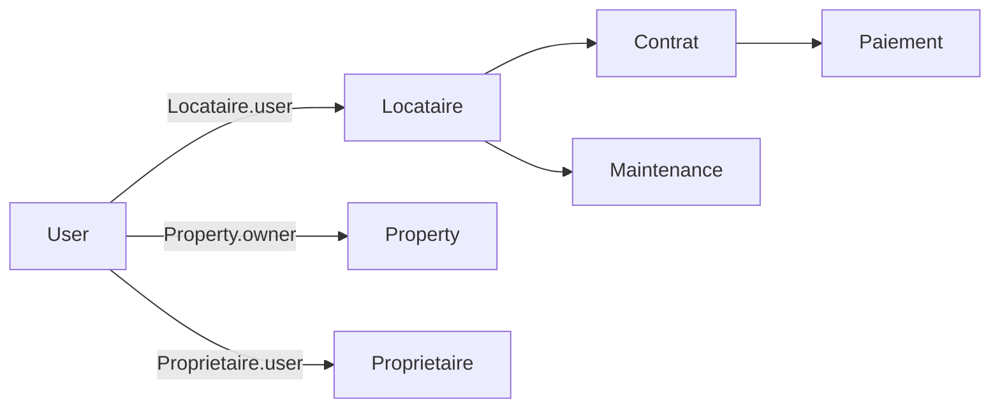
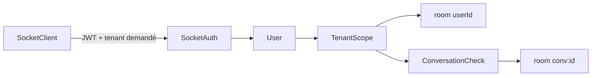

# AUDIT AUTH — ÉTAT INITIAL

Date : 2026-08-13  
Branche : `main`  
HEAD initial : `5a87cb4307d09ed7d10681dcdeaa7bd7f14c6ebc`

## Utilisateurs

`User.role` contient exactement : `User`, `Client`, `Proprietaire`, `Collaborateur`, `Secretaire`, `GestionnaireImmobilier`, `CommunityManager`, `Communicant`, `Admin`, `Prestataire`. Le rôle par défaut est `Client`. `User` est l'identité IAM; `Proprietaire.user` et `Locataire.user` sont des liens optionnels/uniques vers leurs fiches métier. `Property.owner` référence directement `User` et ne remplace pas la fiche `Proprietaire`.

## Modes de connexion réellement implémentés

- Email/mot de passe : inscription différée dans `PendingRegistration`, email de vérification, création `User`, JWT; login direct après vérification.
- Google : NextAuth obtient l'ID token, `/api/auth/google` le vérifie avec Google, lie/crée le `User` et émet le JWT applicatif. `/api/auth/google-token` est un pont interne protégé par secret partagé.
- Activation locataire : token d'invitation ou demande de rattachement, mais l'authentification finale reste le JWT du `User` et la résolution se fait par `Locataire.user`.
- Reset mot de passe : token aléatoire hashé, durée 10 minutes, incrément de `tokenVersion`, nouveau JWT.

Absents comme flux utilisables : username/password, Apple, Facebook, OTP, magic link, refresh token applicatif, remember-me. `authProvider: phone` existe dans le schéma et un bouton téléphone est affiché, mais aucun endpoint d'authentification téléphone n'est implémenté.

## JWT et sessions

JWT `jsonwebtoken`, algorithme implicite de la bibliothèque (HMAC par défaut), payload `{ id, tokenVersion, iat, exp }`, durée `JWT_EXPIRES_IN` ou 90 jours. Ni rôle ni tenant ne sont figés dans le token : ils sont relus sur `User` et le tenant est résolu par memberships/contexte effectif. `protect` vérifie signature, expiration, existence du User, `tokenVersion`, changement de mot de passe et statut actif. Le frontend conserve JWT et snapshot user dans `localStorage`; NextAuth conserve en plus sa session cookie pour Google. Axios attache `Authorization` et, pour un PlatformOperator, `X-Platform-Tenant-Id`; un 401 nettoie le stockage et redirige.

## Rôles et permissions

Groupes canoniques trouvés dans `server/utils/roles.js` : `STAFF_ALL`, `STAFF_DOC`, `STAFF_IMMO`, `STAFF_CM`, `STAFF_COMM`, `ROLES_ESTIMATION`, `ROLES_ALTIMMO`, `ROLES_CM`, `ROLES_GL`, `ROLES_PAIEMENTS`, `ROLES_DOCS`, `ROLES_LITIGES`, `ROLES_MODERATION`. Les permissions réelles combinent `protect`, `restrictTo`, tenant/capability et ownership dans contrôleurs/services. Le dashboard accepte les six rôles staff et redirige Client/Proprietaire/Prestataire.

| Domaine | Client | Proprietaire | GestionnaireImmobilier | Secretaire | CommunityManager | Admin |
|---|---:|---:|---:|---:|---:|---:|
| Bien public | oui | oui | oui | oui | oui | oui |
| Créer son bien | non | oui | staff | non | staff | oui |
| Modérer Property | non | non | oui | non | oui | oui |
| Visite personnelle | oui | owner view | staff | staff | staff | oui |
| Contrat/GL staff | non | owner routes | oui | lecture/doc | non | oui |
| Paiement GL staff | non | personnel | non | oui | non | oui |
| Documents staff | non | privé lié | oui | oui | non | oui |

`Collaborateur` conserve les accès legacy complets; `Communicant` accède surtout messages/RDV; `Prestataire` n'a pas de périmètre staff générique.

## Tenant et ownership

Le pipeline privé attendu est JWT → `User` courant → tenant demandé/résolu → rôle/capacité → ownership/attribution de ressource. Les routes sensibles utilisent `requireTenantScope`, `assertResourceTenant`, services de scope et contrôles par ressource. Les suites adversariales existantes couvrent Property, Contrat, documents, organisation, CRM, hôtel et finance. Le portail locataire part bien de `req.user`, puis résout `Locataire.user`; il ne fait pas confiance à un `locataireId` frontend pour l'identité.

## Pages et protections frontend

L'inventaire trouve 142 pages statiques au build précédent, regroupées en public/auth, espace client, `/mes-biens`, `/espace-locataire`, `/dashboard` staff/admin et plateformes hôtel/organisation. `dashboard/layout.jsx` protège globalement les descendants par session locale et rôle staff. `ProtectedRoute` vérifie seulement l'authentification; `RoleProtectedRoute` vérifie une liste de rôles. `OwnerRoute` est présent mais ne redirige ni ne refuse actuellement : il rend toujours ses enfants après chargement.

## API et Socket.IO

`server.js` monte les routeurs sous `/api`; 500+ déclarations `router.*` ont été inventoriées. L'instance Axios principale est centralisée dans `client/lib/services/api.js`, avec quelques lectures directes de `localStorage` dans des services legacy. Socket.IO exige le JWT, relit User/statut/tokenVersion, résout un tenant actif et n'autorise une room conversation qu'au participant ou au staff inbox du même tenant. `typing` exige que le socket ait déjà rejoint la room.

## Diagrammes initiaux

```mermaid
flowchart LR
  Browser --> Login[Login / Google]
  Login --> AuthAPI[/api/auth]
  AuthAPI --> Mongo[(User / PendingRegistration)]
  Mongo --> JWT
  JWT --> AuthContext
  AuthContext --> Axios
  Axios --> Protect
  Protect --> Tenant
  Tenant --> Role[Role / capability]
  Role --> Owner[Ownership]
  Owner --> Resource
```





## Bugs et priorités initiales

- **P0 confirmé — élévation de privilèges à l'inscription :** `/signup` accepte tout `role` du payload et le persiste dans `PendingRegistration`, dont le schéma n'a aucun enum. Après vérification, ce rôle est recopié dans `User`. Un appel public peut donc demander `Admin` ou un rôle staff.
- **P0/P1 confirmé — émission de JWT à un compte désactivé :** `login`, `googleToken` et `googleGetToken` ne vérifient pas uniformément `isActive/status` avant d'émettre un token. `protect` refusera ensuite ce token, mais la connexion répond à tort succès et expose une session incohérente.
- **P1/P2 probable — liaison Google par email :** un compte local existant est lié automatiquement au `sub` Google sur égalité d'email vérifié; acceptable seulement si le fournisseur garantit l'email, mais l'unicité de `googleId` n'est pas déclarée dans le schéma.
- **P2 confirmé — auth optionnelle divergente :** la version de `authController.optionalAuth` vérifie tokenVersion/passwordChangedAt mais pas status; celle du middleware vérifie seulement `isActive`, sans tokenVersion/passwordChangedAt/status complet.
- **P3 confirmé — `OwnerRoute` inopérant :** le composant calcule token/rôles mais ne bloque ni ne redirige.
- **P3 — session frontend :** snapshot `user` localStorage peut être périmé jusqu'à une requête 401; aucun mécanisme multi-tab explicite (`storage`/BroadcastChannel) n'a encore été trouvé.
- **P4 — dette :** double auth NextAuth + JWT/localStorage, deux implémentations optionalAuth, bouton téléphone sans flux backend, routes/imports legacy.

Aucune correction n'a été appliquée avant la production de ce document.
