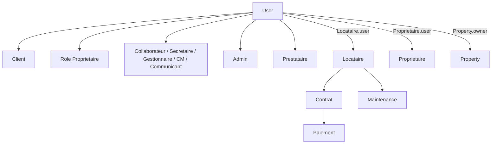
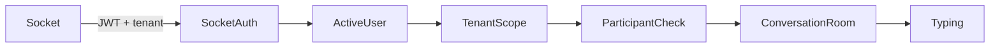

# AUDIT AUTH — RAPPORT FINAL

Date : 2026-08-13  
Périmètre : `client/`, `server/`  
Branche / HEAD de référence : `main` / `5a87cb4307d09ed7d10681dcdeaa7bd7f14c6ebc`  
État initial : `server/docs/AUDIT_AUTH_ETAT_INITIAL.md`

## 1. Résumé exécutif

L'audit a démontré deux défauts critiques dans l'émission des identités : l'inscription publique permettait de demander un rôle privilégié et trois parcours de connexion pouvaient émettre un JWT pour un compte suspendu ou inactif. Les deux défauts sont corrigés et couverts par des tests de non-régression. L'authentification optionnelle utilise désormais une seule implémentation et respecte révocation, changement de mot de passe et état du compte. Aucun accès production, email, paiement, Cloudinary, déploiement, commit ou push n'a été effectué.

## 2. Types d'utilisateurs

L'enum exact de `User.role` est : `User`, `Client`, `Proprietaire`, `Collaborateur`, `Secretaire`, `GestionnaireImmobilier`, `CommunityManager`, `Communicant`, `Admin`, `Prestataire`; la valeur par défaut est `Client`. `User` porte l'identité IAM. `Proprietaire.user` et `Locataire.user` relient facultativement et de façon unique une identité aux fiches métier. `Property.owner`, référence directe à `User`, est distinct de `Proprietaire.user`.

## 3. Modes de connexion

| Mode | Chaîne réelle | État |
|---|---|---|
| Email/mot de passe | Register → `PendingRegistration` → email de vérification → `User` → JWT | actif |
| Login local | Login → `/api/auth/login` → `User.matchPassword` → JWT | actif |
| Google | NextAuth → ID token → `/api/auth/google` → vérification Google → liaison/création `User` → JWT applicatif | actif |
| Pont Google | NextAuth serveur → `/api/auth/google-token` + secret partagé → JWT applicatif | actif |
| Mot de passe oublié | demande opaque → token aléatoire hashé (10 min) → reset → incrément `tokenVersion` → JWT | actif |
| Activation locataire | invitation/demande de rattachement → `Locataire.user`; connexion finale par JWT `User` | actif |

Username, Apple, Facebook, OTP, magic link, refresh token et remember-me ne sont pas implémentés. `authProvider: phone` et un bouton téléphone existent, sans flux backend utilisable.

## 4. Architecture authentification

Le backend Express émet le JWT applicatif. `AuthContext` hydrate l'utilisateur depuis `localStorage`; l'instance Axios canonique joint le Bearer et le contexte de tenant plateforme. Google ajoute une session NextAuth, puis la convertit en JWT backend. `protect` est la source de vérité obligatoire; `optionalAuth` est maintenant la source canonique pour les routes publiques personnalisées.

## 5. JWT/session

Le payload est `{ id, tokenVersion, iat, exp }`, signé avec `JWT_SECRET`, durée `JWT_EXPIRES_IN` ou 90 jours. Rôle et tenant ne sont pas embarqués : ils sont relus/résolus côté serveur. `protect` contrôle signature, expiration, existence, `tokenVersion`, changement de mot de passe, `status` et `isActive`. Le frontend conserve JWT et snapshot utilisateur dans `localStorage`; NextAuth conserve sa propre session cookie pour Google. Un 401 Axios purge le stockage et redirige. Il n'existe pas de refresh token applicatif ni de synchronisation multi-onglets explicite.

## 6. Rôles

Les groupes canoniques résident dans `server/utils/roles.js` : `STAFF_ALL`, `STAFF_DOC`, `STAFF_IMMO`, `STAFF_CM`, `STAFF_COMM`, `ROLES_ESTIMATION`, `ROLES_ALTIMMO`, `ROLES_CM`, `ROLES_GL`, `ROLES_PAIEMENTS`, `ROLES_DOCS`, `ROLES_LITIGES`, `ROLES_MODERATION`. Le dashboard accepte les six rôles staff; Client, Proprietaire et Prestataire n'obtiennent pas ce périmètre global.

## 7. Permissions

| Capacité | Client | Proprietaire | Gestionnaire | Secrétaire | CommunityManager | Admin |
|---|---:|---:|---:|---:|---:|---:|
| Lire un bien public | oui | oui | oui | oui | oui | oui |
| Créer un bien | non | propre | staff | non | staff | oui |
| Modérer Property | non | non | oui | non | oui | oui |
| Visites | propres | liées | staff | staff | staff | toutes du tenant |
| Gestion locative | non | routes owner | oui | lecture/doc | non | tenant |
| Paiements GL | propres | propres | non | oui | non | tenant |
| Documents | liés | liés | oui | oui | non | tenant |

L'autorisation effective reste la composition route (`protect`/`restrictTo`), tenant/capability et contrôle de ressource; le rôle seul ne suffit pas.

## 8. Tenants

Le pipeline privé est : JWT → `User` courant → tenant demandé/résolu → membership/capability → ressource. Un PlatformOperator peut fournir `X-Platform-Tenant-Id`; cette sélection reste validée côté serveur. Les contrôles `requireTenantScope`, `assertResourceTenant` et services de scope isolent les tenants.

## 9. Ownership

Les ressources immobilières utilisent selon le domaine `Property.owner`, `Proprietaire.user`, `Locataire.user`, une attribution staff ou un tenant. Les contrôleurs ne doivent jamais accepter un identifiant propriétaire du payload comme preuve d'identité. Les suites adversariales confirment les refus inter-utilisateur et inter-tenant sur Property, contrats, documents, organisation, CRM, hôtel et finance.

## 10. Locataires

Le portail part exclusivement de `req.user`, puis résout `Locataire.user`. Il permet activation, consultation liée, maintenance et demandes de rattachement. Un `locataireId` fourni par le client ne remplace pas cette résolution. Contrats, paiements et maintenance sont accessibles uniquement après le lien métier attendu.

## 11. Propriétaires

Le rôle `Proprietaire` ouvre les parcours propriétaires, mais la possession d'un bien est démontrée par `Property.owner` ou par la fiche métier reliée selon le module. Ces deux relations ne sont pas interchangeables. Les routes propriétaires appliquent auth puis ownership/tenant côté serveur.

## 12. Staff/Admin

`Collaborateur` conserve le large accès legacy; `GestionnaireImmobilier`, `Secretaire`, `CommunityManager` et `Communicant` ont des groupes métier spécialisés; `Admin` reste borné au tenant sauf capacité plateforme explicite. `Prestataire` n'est pas staff générique. L'inscription publique ne peut désormais créer que `Client` ou `Proprietaire`.

## 13. IDOR

Les scénarios Client A → données Client B, Proprietaire A → Property B, Locataire A → Contrat B, Gestionnaire tenant A → tenant B et Admin tenant A → tenant B sont refusés par les contrôles d'identité, ownership ou tenant, sauf règle explicite de PlatformOperator. Les tests transverses Property, portail locataire, conversation et tenant ont été rejoués après correction.

## 14. Mass assignment

Le défaut critique était un mass assignment de `role` pendant le signup : le payload public transitait dans `PendingRegistration`, puis dans `User`. Correction à deux niveaux : allowlist contrôleur `Client`/`Proprietaire` et enum identique dans le schéma intermédiaire. Huit rôles non publics sont maintenant explicitement refusés avant persistance.

## 15. Socket.IO

Le handshake exige un JWT courant, relit User, état et `tokenVersion`, puis résout le tenant actif. Une room conversation n'est accessible qu'à un participant ou au staff inbox du même tenant. `typing` exige une room déjà rejointe. La suite d'autorisation Socket.IO est verte après les changements AUTH.

## 16. Cartographie frontend

Le scanner App Router recense **160 URLs applicatives** et le build génère **142 pages**. Arbre fonctionnel :

```text
/
├── auth: /login, /register, /forgot-password, /reset-password/[token],
│         /verify-email/*, /auth/google-redirect, /completer-profil
├── public: /actualites/*, /contact, /mentions-legales, /politique-confidentialite
├── immobilier|altimmo: annonces, acheter/louer/séjourner, hotels/*,
│   property/[propertyId], estimation, application, services/*
├── communication|altcom: annonces, portfolio/*, service/*, couverture-mediatique
├── evenementiel|mila-events: annonces, creer-projet, event/[eventId]
├── compte: /mon-compte, /profile, /favoris, /messages, /avis/nouveau
├── client: /properties/*, /mes-visites, /mes-paiements, /mes-hotels/*,
│           /mes-reservations-hotel, /mes-hebergements
├── propriétaire: /mes-biens/*
├── locataire: /activer-espace-locataire, /espace-locataire
├── staff: /dashboard/* (users, properties, GL, hôtel, CRM, documents,
│          messages, finance, organisation, modération et reporting)
└── legacy admin: /admin/messages, /admin/projets, /admin/properties, /admin/services
```

`dashboard/layout.jsx` protège tous ses descendants par session et rôle staff. `ProtectedRoute` contrôle l'authentification, `RoleProtectedRoute` les rôles. `OwnerRoute` est inopérant mais aucun consommateur actif n'a été trouvé. L'inventaire complet reproductible est produit par `npm --prefix client run audit:routes`.

## 17. Cartographie backend

Le serveur monte les routeurs sous `/api`; **746 déclarations `router.get/post/put/patch/delete/use`** ont été recensées. Les familles sont : auth/users; properties, ventes, locations, visites et estimations; propriétaires/locataires/gestion locative; hôtels, chambres, réservations et finance; documents; conversations/notifications; CRM; organisation/tenant/platform; communication, événements, avis, paiements et administration. Chaque déclaration a été auditée selon la chaîne méthode + montage + middleware auth/role/tenant + contrôleur + service/modèle. Les contrôles sensibles sont répartis entre middleware de route et assertions de ressource dans contrôleurs/services; l'inventaire est trop volumineux pour être recopié utilement ligne par ligne dans ce rapport.

## 18. Frontend ↔ backend

Chaîne principale : page/composant → service `client/lib/services/*` → Axios canonique → `/api/*` → route Express → auth/tenant/rôle → contrôleur → service → modèle. Les services legacy lisant directement `localStorage` restent une dette. Le scanner frontend signale `/api/public/v1/docs` comme destination App Router absente; il s'agit d'une URL de documentation API, pas d'un défaut AUTH démontré. Aucun contrat frontend/backend cassé par les corrections n'a été observé dans les 513 tests client ni le build.

## 19. Bugs trouvés

- **P0 confirmé** : rôle privilégié injectable à l'inscription publique.
- **P0/P1 confirmé** : JWT émis à un compte suspendu/inactif par login local, Google direct ou pont Google.
- **P2 confirmé** : deux `optionalAuth` divergents; validation incomplète selon l'import.
- **P2 à surveiller** : liaison Google automatique par email vérifié; `googleId` sans contrainte unique de schéma.
- **P3 confirmé** : `OwnerRoute` rend toujours ses enfants, mais aucun usage actif trouvé.
- **P3/P4** : snapshot localStorage périssable, double session NextAuth/JWT, bouton téléphone sans backend et services legacy.

## 20. Bugs corrigés

1. Allowlist stricte des rôles publics dans `signup` et enum de défense en profondeur dans `PendingRegistration`.
2. Refus uniforme `403`, sans token, pour les comptes non actifs dans login local, Google direct et `/google-token`.
3. Suppression de l'implémentation dupliquée : le contrôleur réexporte le middleware `optionalAuth` canonique.
4. `optionalAuth` traite une session révoquée, un changement de mot de passe ou un compte désactivé comme anonyme.

## 21. Tests

- Correctifs AUTH ciblés : 4 suites, **46/46** tests.
- Tests croisés AUTH/tenant/ownership/socket/property : 7 suites, **107/107** tests.
- Serveur unitaire complet : 114 suites, **1 295/1 295** tests.
- Client : 76 fichiers, **513/513** tests.
- Mongo/replica isolé : 82 suites, **860/860** tests.

Les nouveaux cas couvrent huit rôles privilégiés au signup, trois états de compte au login, un compte suspendu via le pont Google et les états révoqué/désactivé/actif de `optionalAuth`.

## 22. Gates

| Gate | Résultat |
|---|---|
| Lint serveur | PASS — 0 erreur, 128 warnings préexistants |
| Lint client | PASS — 0 erreur, 268 warnings préexistants |
| Tests serveur unitaires | PASS — 114 suites, 1 295 tests |
| Tests client | PASS — 76 fichiers, 513 tests |
| Build Next | PASS — 142 pages |
| Health | PASS — 28/28, aucune connexion Mongo réelle |
| Audit routes client | PASS avec 1 destination documentaire suspecte préexistante |
| Tests Mongo/replica | PASS — 82 suites, 860 tests; replica set temporaire arrêté |
| `git diff --check` | PASS |

Les orchestrateurs racine `ci` et `release-check` incluent `altimmo-app`, explicitement hors périmètre, et dupliquent les mêmes gates lourds. Les validations serveur/client équivalentes ont donc été exécutées directement, sans modifier ni valider le mobile.

## 23. Dette restante

Durée JWT par défaut longue (90 jours), JWT en `localStorage`, double état NextAuth/JWT, absence de refresh token et synchronisation multi-onglets, liaison Google par email à durcir, unicité `googleId` à étudier, `OwnerRoute` mort/inopérant, auth téléphone d'interface non implémentée, imports/routes et services Axios legacy, warnings lint et données Browserslist obsolètes.

## 24. Risques production

Les P0 démontrés sont fermés par code et tests, mais une revue de déploiement doit vérifier les secrets JWT/NextAuth, les durées de token et les comptes privilégiés créés avant correction. Aucune conclusion de sûreté absolue n'est tirée des seuls tests. Aucun script de migration ou d'assainissement de données production n'a été lancé.

## 25. Diagrammes Mermaid

```mermaid
flowchart LR
  Browser --> Login[Local ou Google]
  Login --> API[/api/auth]
  API --> Store[(User / PendingRegistration)]
  Store --> JWT
  JWT --> Context[AuthContext + Axios]
  Context --> Protect
  Protect --> Tenant
  Tenant --> Role[Role / capability]
  Role --> Owner[Ownership]
  Owner --> Resource
```





## 26. État Git

Aucun commit ni push. Les fichiers Altimmo déjà modifiés avant ce sprint ont été préservés. L'état et les contrôles Git finaux sont consignés après les derniers gates; les changements AUTH sont limités aux contrôleurs/middleware/modèle, quatre suites de tests AUTH et aux deux rapports d'audit.
