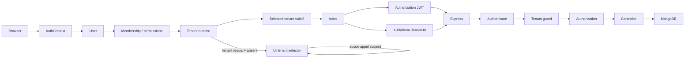

# AUDIT AUTH RUNTIME TENANT — RAPPORT FINAL

Date : 2026-08-13 — branche `main` — HEAD `da3dfb7c4cc84040f327c2becb35a551b07328c2`.

## 1. Résumé exécutif

Les 403 provenaient d'un PlatformOperator authentifié resté en « Vue plateforme » pendant que le dashboard lançait des routes strictement tenant-scoped. La sélection vivait dans un composant tardif et une clé locale globale, hors du cycle AuthContext. Un runtime tenant central valide désormais la sélection avant l'injection Axios; le dashboard attend ce runtime et ne monte aucun contenu scoped sans tenant. Le backend reste strict et inchangé.

Le fichier annoncé à environ 2 178 lignes n'était pas joint. L'analyse exhaustive porte sur le seul log accessible de 53 lignes; tout comptage global est donc **NON CONFIRMÉ**. Ce log démontre séparément un problème CORS du déploiement observé et deux blocages CSP overbridgenet.

## 2. Cause racine des 403

Pour un opérateur actif, `resolveEffectiveTenantContext` retourne `platform_operator_unscoped` sans header. `requireTenantScope` répond alors 403 avec le message exact observé. Avant correction, `AuthContext.loading=false` suffisait à rendre le dashboard; `PlatformOperatorContextSwitcher` chargeait statut et tenants indépendamment, après que `DashboardHome` et les badges avaient démarré leurs appels. Le tenant était donc **absent**, non invalide ou simplement mal orthographié. Une ancienne valeur pouvait aussi être injectée avant validation.

## 3. Endpoints concernés

| Endpoint | Appelant | Rôle | Tenant requis | Résultat sans sélection |
|---|---|---|---:|---|
| `/api/users` | DashboardHome, UsersPanel, organisation, messagerie interne | Admin | oui | 403 |
| `/api/action-logs/recent` | DashboardHome | Admin | oui | 403 |
| `/api/conversations/count/unread` | badges dashboard | utilisateur authentifié | oui | 403 |

Les trois appels doivent rester tenant-scoped. Aucun accès Admin global n'a été ajouté.

## 4. Architecture tenant avant

```text
AuthContext(user prêt)
├── DashboardHome/useDashboardBadges → requêtes immédiates
└── Sidebar switcher → statut opérateur → tenants → localStorage
Axios → lit directement platformOperatorTenantId → header sur toute requête
```

## 5. Architecture tenant après

`PlatformTenantRuntimeProvider`, placé sous AuthContext, charge l'identité opérateur puis la liste canonique. Il restaure uniquement `{userId, tenantId}` si l'identité correspond et si l'ID figure encore dans la liste autorisée. Ensuite seulement une valeur validée en mémoire devient injectable. La clé legacy est supprimée.

## 6. AuthContext

AuthContext demeure source de l'identité et du token. Le runtime expose séparément `tenantLoading`, `tenantReady`, `tenantRequired`, `selectedTenantId`, opérateur et tenants. Logout et restauration auth invalide nettoient les deux clés tenant. Un 401 Axios nettoie aussi token, utilisateur, sélection et valeur injectée en mémoire.

## 7. Axios

L'intercepteur ne lit plus une valeur tenant brute depuis `localStorage`. Il joint `X-Platform-Tenant-Id` uniquement après `setValidatedPlatformTenant`. Il n'envoie jamais `undefined`, `null` ou la clé legacy. Cela supprime aussi l'envoi prématuré du header sur les pages publiques, cause du CORS démontré dans le log disponible. Le serveur courant autorise déjà ce header; l'erreur observée implique vraisemblablement une version déployée antérieure ou un preflight servi ailleurs, ce qui reste **NON CONFIRMÉ** sans accès runtime production.

## 8. Dashboard

Le layout attend auth + runtime tenant. Un opérateur sans sélection voit un écran de sélection et aucun `children` tenant-scoped. Les sept badges sont désactivés tant que le tenant requis n'est pas choisi. Les utilisateurs ordinaires ne sont pas bloqués : leur tenant est résolu côté backend par membership unique/explicite selon l'architecture existante.

## 9. `/api/users`

L'appel Admin reste conditionné par le rôle, puis par le montage effectif du contenu après sélection. Backend : protect → Admin → requireTenantScope → liste bornée à `tenantScopeUserIds`.

## 10. `/api/action-logs/recent`

Même correction de timing. L'endpoint reste Admin et tenant-scoped; aucun mode plateforme implicite n'est créé.

## 11. `/api/conversations/count/unread`

La conversation porte un tenant et l'accès aux rooms est contrôlé. Le compteur est donc légitimement scoped. Le polling des badges attend maintenant le contexte. Le socket staff reçoit `platformTenantId`; changer de tenant provoque le démontage/reconnexion et abandonne les rooms précédentes.

## 12. Sécurité backend

`requireTenantScope` n'a pas été modifié. Tenant absent, inexistant ou non autorisé reste refusé. La sélection opérateur est relue dans Mongo; la sélection membre est comparée aux memberships. Les assertions de tenant ressource restent actives.

## 13. Tests cross-tenant

Les suites ciblées conversation + vulnérabilités Platform Admin passent : 2 suites, 22 tests. Elles couvrent auth, scopes et refus adversariaux. Le gate Mongo complet est consigné en section 21.

## 14. Reload / logout / changement user

Le reload restaure seulement une sélection encore listée et liée au même user ID. Une sélection liée à User A est supprimée pour User B. Tenant absent de la liste : supprimé. Logout, auth corrompue et 401 : nettoyage. Aucun héritage silencieux n'est accepté.

## 15. Changement tenant

Le sélecteur appelle la source runtime unique, remplace la valeur validée, puis recharge la page selon la convention existante. Les futures requêtes portent le nouveau tenant et les anciens composants/caches sont démontés. Le socket staff se reconnecte avec le nouvel ID.

## 16. Socket.IO

Le serveur vérifie JWT, compte, opérateur/membership et tenant, puis limite les conversations au tenant actif. La messagerie staff transmet maintenant la sélection validée. Les sockets publics/client non liés au switcher conservent leur résolution normale.

## 17. CSP overbridgenet

Aucune référence à `overbridgenet` ou `jsv8/offer` n'existe dans `client/` ou `server/`. Les traces `content.js`, `SlashCommand`, script opaque et `VM...` ne démontrent pas une origine applicative. La CSP bloque correctement le domaine; elle n'a pas été modifiée.

## 18. Bugs corrigés

- Race AuthContext/dashboard/sélecteur opérateur.
- Header tenant issu d'une valeur locale non validée.
- Sélection persistée non liée à l'utilisateur.
- Absence de nettoyage tenant sur logout/401/session corrompue.
- Appels badges et enfants scoped en vue plateforme sans tenant.
- Socket staff non reconnecté explicitement avec le tenant sélectionné.
- Header tenant envoyé inutilement aux routes publiques avant initialisation.

## 19. Dette restante

Le changement de tenant utilise encore un reload complet. Le runtime ne généralise pas une classification explicite de chaque endpoint Axios (inutile pour la correction démontrée, puisque seule une valeur validée est injectée). D'autres sockets frontend ne consomment pas le sélecteur opérateur, mais ils ne sont pas utilisés par ce dashboard staff. Le journal complet annoncé doit être fourni pour certifier ses volumes/catégories.

## 20. Tests

- Nouveau runtime frontend : absence de header, sélection, switch, reload, tenant non autorisé et changement d'utilisateur.
- Frontend ciblé : 10/10.
- Backend tenant ciblé : 22/22.
- Frontend complet : 77 fichiers, 518/518.
- Serveur unitaire : 114 suites, 1 295/1 295.

## 21. Gates qualité

| Gate | Résultat |
|---|---|
| Lint client | PASS — 0 erreur, 269 warnings |
| Lint serveur | PASS — 0 erreur, 128 warnings |
| Build Next | PASS — 142 pages |
| Tests client | PASS — 518 tests |
| Tests serveur unitaires | PASS — 1 295 tests |
| Health | PASS — 28/28 |
| Mongo/replica | PASS — 82 suites, 860 tests; replica set temporaire arrêté |
| `git diff --check` | PASS |

`verify`, `ci` et `release-check` racine incluent `altimmo-app`, hors périmètre et interdit de modification par la mission. Leurs validations serveur/client ont été exécutées directement; le mobile n'a pas été touché.

## 22. Git

Aucun commit, push ou déploiement. Les changements Altimmo et AUTH-1 sont présents dans le HEAD `Update Altimmo 20`; aucun fichier `altimmo-app` n'est modifié.


