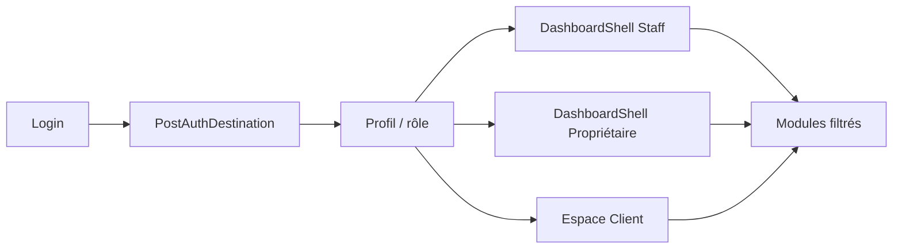
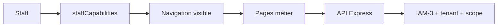
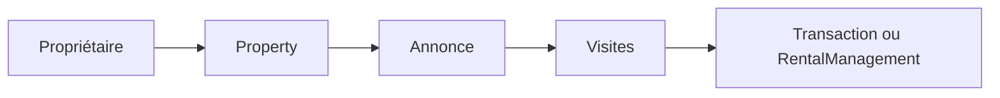
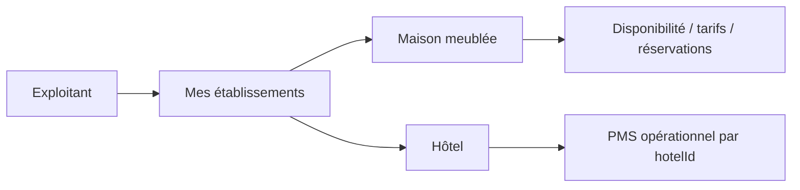
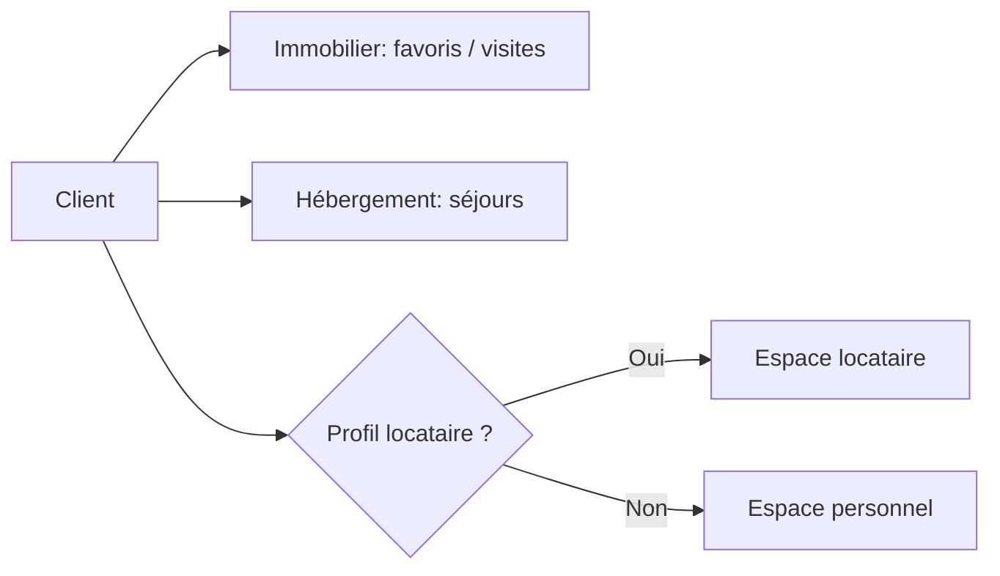

# DASH-1 — Architecture et expérience des dashboards par profil

Date : 2026-08-14  
Branche/HEAD : `main` / `0cebcd5bbd180ff8a7814139a0f4a42dade9d2ba`  
Périmètre : client web et documentation; backend IAM inchangé; aucun déploiement.

## 1. Résumé exécutif

DASH-1 remplace l’overview Staff indifférenciée par des vues métier Secrétaire, Gestionnaire immobilier et Community Manager, conserve l’overview globale réelle pour Admin/Collaborateur legacy, crée `/mon-espace` pour Client et spécialise la destination d’un exploitant pur vers `/mes-hotels` lorsque les profils effectifs sont présents dans l’identité retournée. La navigation continue de dériver les modules IAM-3 depuis `staffCapabilities.js`; le backend reste l’unique sécurité normative.

## 2. Architecture dashboard avant

Tous les rôles Staff entraient dans `/dashboard` et montaient `DashboardHome`, qui lançait un `Promise.all` global sur statistiques, devis, événements, alertes paiements, utilisateurs et logs. Les propriétaires partageaient déjà un shell convenable entre patrimoine et exploitation. Les Clients disposaient de pages isolées mais d’aucune overview.

## 3. Architecture après

`/dashboard` est désormais un dispatcher : Admin et Collaborateur legacy conservent `GlobalDashboardHome`; Secrétaire, Gestionnaire et Community Manager reçoivent `RoleDashboardOverview`, configuré par `dashboardProfiles.js` puis filtré par capabilities. `/mon-espace` monte `ClientOverview`. Les shells staff et propriétaire existants sont réutilisés.

## 4. Routage post-auth

- Admin, Collaborateur, Secrétaire, Gestionnaire, Community Manager, Communicant → `/dashboard`.
- Propriétaire immobilier ou multi-profil → `/mes-biens`.
- Propriétaire avec seul profil `exploitant_etablissement`, si ce profil est fourni au login → `/mes-hotels`.
- Client → `/mon-espace`.
- User/Prestataire/role inconnu → `/`.

Login, inscription et vérification continuent d’utiliser la fonction centrale `getPostAuthDestination`. Si le payload de login ne contient pas les profils effectifs, un Propriétaire conserve le fallback compatible `/mes-biens` puis le sélecteur de contexte du shell; l’enrichissement systématique de tous les payloads est **NON CONFIRMÉ**.

## 5. Dashboard Admin

Admin reçoit `/dashboard` avec les agrégats globaux provenant des API existantes. Sa sidebar couvre l’administration, Altimmo, GL, hôtellerie, Altcom, Mila Events, documents, paiements, messages et contrôles de plateforme. DASH-1 ajoute les entrées manquantes `Finance hôtelière` et `Notifications`. Admin ne contourne ni tenant, ownership, scope hôtelier ni intégrité.

## 6. Dashboard Secrétaire

L’overview n’appelle plus les agrégats Altimmo/Mila/Users. Elle expose uniquement Documents, Paiements, Contrats et Locataires, chacun validé par `hasStaffCapability`. Maintenance, visites, Altcom, événements et gestion utilisateurs sont absents de l’overview métier.

## 7. Dashboard Gestionnaire

L’overview opérationnelle expose Biens en gestion, Baux, Visites, Maintenance, Préavis et Locataires. Les domaines Documents et Paiements ne sont pas proposés comme modules principaux, conformément à IAM-3.

## 8. Dashboard Community Manager

L’overview expose Altcom, Mila Events et Marketing. Elle ne charge plus les statistiques immobilières, utilisateurs, paiements ou documents privés. Les routes effectives restent `/dashboard/altcom`, `/dashboard/events` et `/dashboard/altcom/marketing`.

## 9. Dashboard Propriétaire immobilier

Le dashboard canonique reste `/mes-biens`, avec patrimoine, ventes, locations, rendez-vous, paiements autorisés et liens vers les parcours existants de mise en gestion. Les statuts viennent toujours des modèles/services existants; aucun enum frontend concurrent n’a été créé.

## 10. Dashboard Propriétaire hébergement

Le contexte exploitation du shell propriétaire regroupe `/mes-hotels`, `/mes-hebergements` et `/mes-hotels/reservations`. Un propriétaire multi-profil change de contexte via le sélecteur `DashboardContextSwitcher`; ce sélecteur de profil n’est pas un sélecteur tenant.

## 11. Maison meublée

La route canonique `/mes-hebergements` gère les hébergements non hôteliers, disponibilité, tarifs et cycle de publication via les APIs ownership existantes. DASH-1 n’ajoute pas d’outils PMS sans source métier. Un cockpit quotidien complet maison meublée reste **NON CONFIRMÉ**.

## 12. Hôtel

`/mes-hotels` liste les établissements accessibles. Le choix d’un établissement conduit aux routes paramétrées `/dashboard/hotels/[hotelId]/**` pour catégories, tarifs, chambres, inventaire et staff. Les vues globales réservations/chambres/housekeeping/maintenance restent accessibles au staff habilité. Hôtel et tenant restent deux scopes distincts.

## 13. Client

`/mon-espace` réunit Favoris, Mes visites, Mes séjours, Messages, Notifications/compte et Profil dans une vue responsive avec états de chargement. Aucun KPI fictif ni nouvelle API n’est introduit.

## 14. Client/Locataire

Lorsque `isLocataireProfile` est vrai, l’overview Client affiche un accès explicite à `/espace-locataire`. L’identité locataire continue d’être résolue côté serveur depuis l’utilisateur connecté; aucun second compte ni identifiant locataire fourni par le navigateur n’est requis.

## 15. Navigation

Le shell staff conserve sa sidebar accessible et responsive; le shell propriétaire conserve sa navigation filtrée par profils. Les nouveaux overviews utilisent des cartes-liens à cible réelle. Les menus Admin/Staff ne sont jamais montés dans `/mon-espace`.

## 16. Capabilities

`dashboardProfiles.js` décrit le besoin métier, puis `getVisibleProfileModules` appelle la projection IAM-3 via `hasStaffCapability`. Les capacités contrôlent la visibilité des modules Staff. Les gardes Express `requireCapability*`, tenant, ownership et ABAC restent la vraie autorisation.

## 17. APIs

Aucun endpoint n’a été ajouté. Admin réutilise `/dashboard/stats`, devis, événements, alertes, utilisateurs et logs. Les overviews spécialisées utilisent des liens sans déclencher d’API secondaire, supprimant les 403 et le blocage global initial. Les pages métier continuent d’appeler leurs services existants.

## 18. UX

Hiérarchie retenue : identité métier, modules actionnables, rappel de sécurité. Les cartes ont des descriptions explicites, cibles existantes, focus visible et hauteur tactile minimale. Les états Client chargement/non-authentifié sont traités. Aucun rebranding global n’a été effectué.

## 19. Responsive

Les grilles passent de 1 à 2 puis 3 colonnes selon la largeur. Les shells existants conservent drawer mobile, Escape, focus, `aria-expanded`, `aria-controls` et `inert`. Les tests de navigation responsive existants restent verts.

## 20. Performance

Les trois profils Staff spécialisés ne lancent plus le `Promise.all` global de six familles de requêtes. Chaque module charge ses données uniquement après navigation. Admin conserve les agrégats réels nécessaires à sa vue globale. Aucun polling ni `limit=500` n’a été ajouté.

## 21. Socket.IO

Aucun code Socket.IO n’a été modifié. Les notifications/messages conservent leur synchronisation tenant existante. Aucun scope établissement temps réel nouveau n’a été inventé; son exhaustivité est **NON CONFIRMÉE**.

## 22. Bugs trouvés

- P1 : overviews Secrétaire/Gestionnaire/Community identiques et appels hors métier;
- P1 : Client renvoyé au site public;
- P1 : exploitant pur envoyé au patrimoine malgré son profil établissement disponible;
- P2 : Admin sans liens finance hôtelière/notifications dans la sidebar;
- P3 : navigation interne redondante et erreur globale dans l’ancien accueil;
- P4 : aliases hôteliers et vestiges React Router.

## 23. Bugs corrigés

Les trois overviews Staff sont spécialisées, le Client dispose d’une destination et d’un accueil canonique, le portail locataire est découvrable, l’exploitant pur est routable vers ses établissements et les deux modules Admin manquants sont navigables. L’ancien accueil global reste uniquement là où il est cohérent.

## 24. Routes legacy

- Canonique : `/dashboard`, `/dashboard/etablissements`, `/dashboard/hotels/[hotelId]/**`, `/mes-biens`, `/mes-hotels`, `/mes-hebergements`, `/mon-espace`, `/espace-locataire`.
- Alias actifs : `/dashboard/hotels`, `/dashboard/etablissements/[hotelId]`, `/communication/**`, `/evenementiel/**`.
- Legacy actif : pages hôtelières globales `/dashboard/hotel-*` encore utilisées.
- Legacy non monté : ancien `DashboardLayout.jsx` et `DashboardPage.jsx` React Router.

Aucune route n’a été supprimée ou redirigée aveuglément.

## 25. Tests

- DASH/routing/navigation ciblés : 6 fichiers, 32 tests PASS.
- Client complet : 81/81 fichiers, 539/539 tests PASS (baseline 79/533).
- Serveur complet : 116/116 suites, 1319/1319 tests PASS.
- IAM-3 isolé : 8/8 suites, 184/184 tests PASS.
- Mongo complet direct : 82/82 suites, 861/861 tests PASS.

Un premier IAM ciblé lancé en concurrence avec serveur et Mongo a échoué sur 1 test; le serveur complet passait et le rejeu strict hors concurrence est passé 184/184. Aucune assertion, retry ou suite n’a été modifiée pour masquer ce signal.

## 26. Gates

- lint serveur : PASS, 0 erreur, 110 avertissements;
- lint client : PASS, 0 erreur, 269 avertissements;
- build Next : PASS, 143 routes après ajout de `/mon-espace`;
- health : 28/28;
- verify serveur/client : PASS;
- `ci` : 12/12 validations PASS;
- `release-check` : 12/12 validations PASS, verdict prêt pour release, sans déploiement;
- `git diff --check` : PASS.

## 27. Dette restante

Créer de vrais endpoints d’agrégats par capability si des KPIs spécialisés sont requis; enrichir systématiquement les payloads auth avec les profils effectifs; compléter le cockpit maison meublée; auditer les boutons internes non couverts par IAM-3; rationaliser les aliases après télémétrie; harmoniser `noindex` des rares pages privées legacy.

## 28. Risques

La projection frontend reste dupliquée avec le backend et doit rester non normative. Le fallback Propriétaire vers `/mes-biens` persiste si les profils ne sont pas présents au moment exact du routage. Collaborateur/Communicant conservent volontairement leur expérience legacy. Les avertissements lint et de toolchain sont non bloquants mais constituent une dette.

## 29. Diagrammes

### Architecture globale

### Staff

### Propriétaire immobilier

### Hébergement

### Client

## 30. État Git

Travail effectué sur `main` au HEAD inchangé `0cebcd5bbd180ff8a7814139a0f4a42dade9d2ba`. Les modifications concernent uniquement le client web, ses tests et les deux rapports DASH-1. `git diff --check` passe et `git diff --name-only -- altimmo-app` est vide. Aucun `git add`, commit, push, déploiement, accès production, Cloudinary réel, email réel ou paiement réel n’a été effectué.

### Réponses à la condition de fin

- Admin : `/dashboard`, overview globale et modules complets sous gardes.
- Secrétaire : `/dashboard`, overview Documents/Paiements/Contrats/Locataires.
- Gestionnaire : `/dashboard`, overview GL/Baux/Visites/Maintenance/Préavis/Locataires.
- Community Manager : `/dashboard`, overview Altcom/Mila/Marketing.
- Propriétaire immobilier : `/mes-biens`.
- Propriétaire hébergement : `/mes-hotels` pour exploitant pur connu, sinon switch depuis le shell propriétaire.
- Maison meublée/hôtel : ressources et routes distinctes `/mes-hebergements` et `/mes-hotels`; jamais des tenants distincts par défaut.
- Changement d’établissement : portefeuille puis routes paramétrées par `hotelId`.
- Client : `/mon-espace`.
- Client/Locataire : carte conditionnelle vers `/espace-locataire`.
- Visibilité Staff : capabilities frontend; sécurité réelle : IAM-3 backend.
- Routes canoniques/legacy : section 24.
- Routes Next : 143, cohérentes après l’ajout d’une route privée.
- Build : vert.
- Mongo : complètement vert, y compris dans `ci` et `release-check`.
