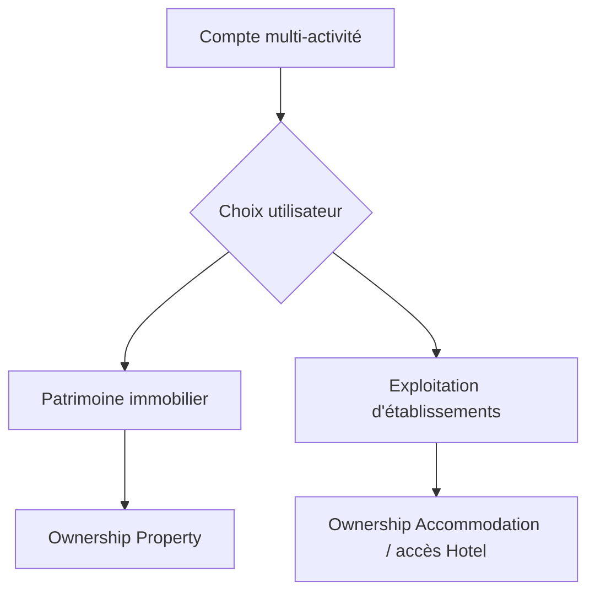

# DASH-2 — Rapport final dashboards propriétaires

Date : 2026-08-14  
Branche/HEAD de référence : `main` / `0cebcd5bbd180ff8a7814139a0f4a42dade9d2ba`  
Périmètre : Web propriétaire uniquement; backend métier, JWT et application mobile inchangés.

## 1. Résumé exécutif

DASH-2 est implémenté et certifié. Le propriétaire arrive désormais sur un résolveur canonique qui attend les profils métier effectifs issus des ressources, redirige les mono-activités et présente un choix explicite aux comptes multi-activité. `/mes-biens` expose des statuts cohérents avec les champs existants; `/mes-hotels` devient un portefeuille d'établissements couvrant hôtels et maisons meublées. Aucun KPI, rôle, tenant ou droit n'a été inventé.

## 2. Architecture avant

Le rôle `Proprietaire` était dirigé immédiatement vers `/mes-biens`, avant la résolution asynchrone des profils effectifs. Le shell propriétaire était déjà partagé, mais le portefeuille d'exploitation ne listait que les hôtels et les compteurs immobiliers étaient ambigus.

```mermaid
flowchart LR
  A[Login propriétaire] --> B[/mes-biens par défaut]
  B --> C[Profils effectifs chargés après coup]
  C --> D[Navigation filtrée]
```

## 3. Architecture après

`/mon-espace-proprietaire` est le sas unique. Il attend `businessProfiles`, lesquels proviennent du résolveur backend fondé sur les ressources réelles, puis choisit une destination sans modifier l'autorisation serveur.

```mermaid
flowchart TD
  A[Login propriétaire] --> B[/mon-espace-proprietaire]
  B --> C{Profils effectifs résolus}
  C -->|Immobilier seul| D[/mes-biens]
  C -->|Établissement seul| E[/mes-hotels]
  C -->|Deux profils| F[Choix explicite]
  C -->|Aucun| G[Empty state sûr]
  F --> D
  F --> E
```

## 4. Routage propriétaire

`getPostAuthDestination` dirige toujours le rôle `Proprietaire` vers le sas. Le sas gère l'absence d'authentification, les rôles non propriétaires, l'état de chargement, les profils mono/multi et l'absence de ressource. La page est privée et `noindex`.

## 5. Résolution profils

La source canonique reste `GET /api/user-business-profiles/:userId`. Le backend ajoute en lecture seule les profils dérivés de `Property.owner`, `Accommodation`/`Hotel.manager` et `HotelStaffAssignment`. Le JWT et le payload d'authentification ne deviennent pas une seconde source de vérité.

## 6. Propriétaire immobilier

L'univers immobilier reste `/mes-biens`. Il agrège la liste des biens et les dossiers de gestion locative déjà autorisés, puis réutilise les cockpits, visites, paiements et actions existants.

```mermaid
flowchart LR
  A[/mes-biens] --> B[my-properties]
  A --> C[rental-management owner/my]
  B --> D[Projection statut UI]
  C --> D
  D --> E[Carte et compteurs]
  A --> F[Portfolio backend]
```

## 7. Cycle du bien

Une projection UI pure classe, par priorité, `archivé`, `vendu`, `occupé`, `en gestion`, `publié`, `validé`, `en validation`, `brouillon`. Elle lit uniquement `assetCycle`, `availability`, `statusAdmin`, `isPublished` et les champs RentalManagement existants. Elle ne crée aucun enum serveur. Une chronologie exhaustive création/soumission/validation reste **NON CONFIRMÉE**, les dates nécessaires n'étant pas uniformément disponibles.

## 8. Mise en gestion

Les demandes et transitions RentalManagement existantes sont conservées. `managementActivated` projette l'état « En gestion » tant qu'un état terminal ou une occupation ne le surclasse pas. Aucun workflow backend n'a été contourné.

## 9. Portfolio immobilier

Les cartes locales affichent total, publiés/validés et occupés/en validation. Le dashboard patrimonial backend existant reste la référence pour total, vacance/occupation, valeur, rentabilité, coûts et alertes de maintenance. Aucun agrégat visites ou transactions non fiable n'a été ajouté.

## 10. Propriétaire hébergement

L'univers d'exploitation reste `/mes-hotels`, renommé visuellement « Mes établissements ». Il charge en parallèle les hôtels et les accommodations du propriétaire.

```mermaid
flowchart LR
  A[/mes-hotels] --> B[hotels/mine]
  A --> C[accommodations/mine]
  B --> D[Cartes hôtels et opérations]
  C --> E[Maisons meublées non-hôtel]
  D --> F[Portfolio établissements]
  E --> F
```

## 11. Portfolio hébergement

Le portefeuille affiche les totaux établissements, maisons meublées et hôtels. Il ne fabrique pas de chiffre d'affaires, taux d'occupation, arrivée ou départ sans agrégat backend fiable.

## 12. Maison meublée

Les accommodations dont `accommodationType !== hotel` sont présentées avec titre, ville, publication et complétude, puis renvoient vers `/mes-hebergements` pour la gestion détaillée. Les KPI opérationnels avancés restent **NON CONFIRMÉS**.

## 13. Hôtel

Le CRUD, la soumission et les routes hôtel existantes sont conservés. Les fonctions chambres, catégories, réservations, housekeeping, inspections, maintenance et noyau financier restent accessibles selon leurs propres gardes; DASH-2 n'en modifie pas les règles.

## 14. Multi-activité

Un compte portant les deux profils voit deux cartes, Patrimoine immobilier et Exploitation d'établissements. Le choix ne fusionne ni ressources ni permissions.



## 15. Multi-établissements

Tous les établissements autorisés sont listés dans le portefeuille. Le contexte opérationnel précis continue d'être porté par l'identifiant de ressource dans l'URL (`hotelId` ou `accommodationId`).

## 16. Context switcher

Le sas sert de sélecteur global d'activité; les cartes du portefeuille servent de sélecteur d'établissement. Aucun contexte n'est persisté dans `localStorage`, afin d'éviter un contexte périmé ou utilisé comme pseudo-autorisation.

## 17. Ownership

Immobilier : `Property.owner`. Maison meublée : `Accommodation.createdBy` et propriété sous-jacente. Hôtel : `Hotel.manager` ou délégation active `HotelStaffAssignment`, validée par `assertHotelAccess`. Les URLs et filtres frontend ne confèrent aucun accès.

## 18. Tenant

Un établissement reste une ressource, jamais un tenant. DASH-2 ne change ni `PlatformTenant`, ni org unit, ni membership, ni middleware tenant.

## 19. APIs

APIs réutilisées : profils effectifs, `properties/my-properties`, `rental-management/owner/my`, `property-assets/portfolio/dashboard`, `hotels/mine`, `accommodations/mine` et services opérationnels existants. Aucune nouvelle route backend n'a été nécessaire.

## 20. Performance

Les deux portefeuilles chargent leurs sources en `Promise.all`. Le portefeuille hébergement effectue exactement deux appels frontend, sans N+1. Dette connue : `accommodations/mine` peut encore effectuer des lectures tarifaires par accommodation côté serveur.

## 21. Socket.IO

Aucune modification Socket.IO. La couverture exhaustive des rooms par établissement est **NON CONFIRMÉE** dans ce sprint et reste une dette d'audit, sans incidence sur l'ownership HTTP certifié.

## 22. Bugs trouvés

- routage propriétaire décidé avant la résolution des profils réels;
- exploitant pur susceptible d'atterrir sur un patrimoine vide;
- portefeuille « établissements » limité aux hôtels;
- total des biens libellé « publiés »;
- disponibilité technique utilisée comme statut métier principal.

## 23. Bugs corrigés

- sas de résolution fiable et états mono/multi/vide;
- destination d'authentification stable;
- agrégation hôtels + maisons meublées;
- libellés et compteurs immobiliers corrigés;
- projection de cycle explicite et testée.

## 24. Tests

Tests DASH-2 ajoutés pour le résolveur, le sas, la projection des statuts et le portefeuille établissements. Ciblés client : 8 fichiers, 48 tests. Plein client : 84 fichiers, 556 tests. Plein serveur : 116 suites, 1 319 tests. Mongo : 82 suites, 861 tests. Ownership ciblé : 4 suites, 106 tests. IAM-3 ciblé : 8 suites, 184 tests. Health : 28 tests.

## 25. Gates

- lint client : PASS, 0 erreur et 269 avertissements historiques;
- lint serveur : PASS;
- build Next : PASS, 144 routes;
- `npm run ci` : PASS, 12/12;
- `npm run release-check` : PASS, 12/12;
- mobile : syntaxe, lint, types, 227 tests, doctor 20/20 et export Android PASS, sans modification source.

Les traces `console.error` des scénarios négatifs et les avertissements existants ne sont pas des échecs de gate.

## 26. Dette restante

Chronologie complète du cycle immobilier, agrégats opérationnels des maisons meublées, optimisation des tarifs accommodation, audit exhaustif des rooms Socket.IO et réduction des avertissements lint. Ces éléments ne sont pas présentés comme livrés.

## 27. Risques

Le résolveur de profils reste un appel post-auth : le sas doit continuer d'attendre `businessProfiles !== null`. La projection UI dépend de la stabilité des champs existants. Les droits restent exclusivement garantis par le backend; toute future agrégation doit préserver ce principe.

## 28. État Git

Travail conservé non commité sur `main`, HEAD initial inchangé. Les modifications DASH-1 préexistantes ont été préservées. Aucun commit, push, déploiement, rotation de credentials, opération Cloudinary, email ou paiement n'a été effectué. Aucune source sous `altimmo-app` n'a été modifiée.
