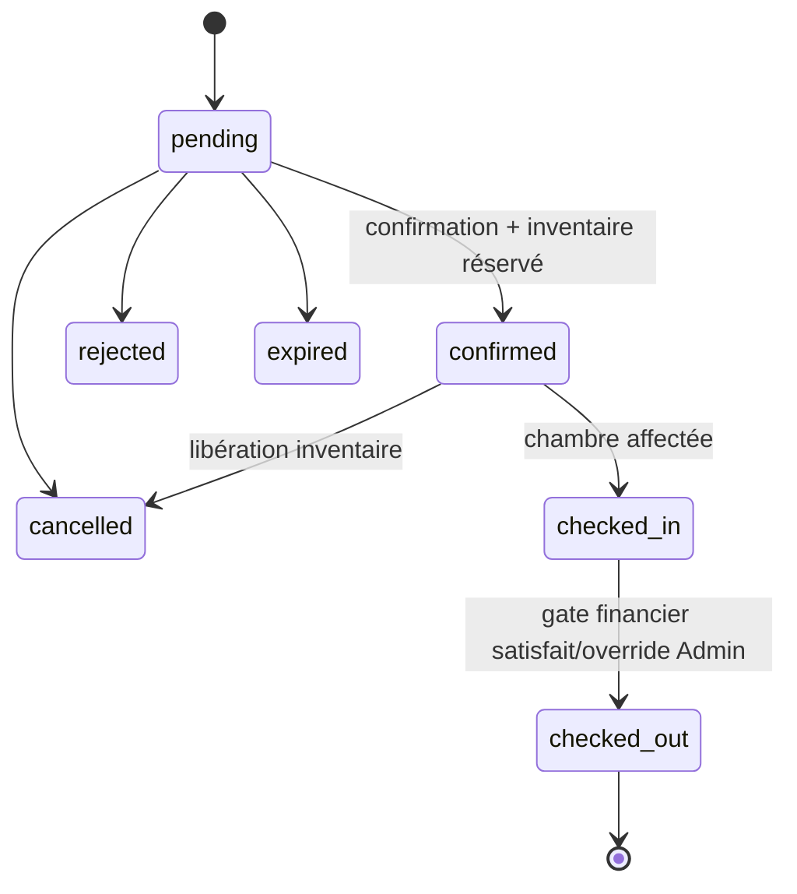
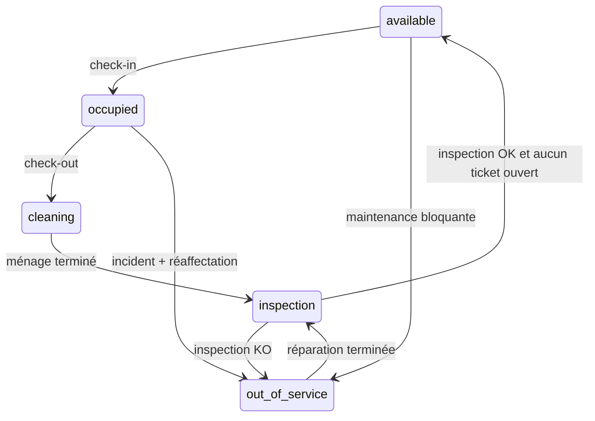
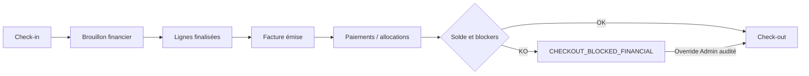

# SPRINT DASH-3 — Rapport final hébergement

Date de certification : 2026-08-14. Référence de départ : branche `main`, HEAD `0cebcd5bbd180ff8a7814139a0f4a42dade9d2ba`. Ce document complète `DASH3_HOSPITALITY_ETAT_INITIAL.md` et conserve les travaux DASH-1/DASH-2 présents dans le worktree.

## 1. Résumé exécutif

DASH-3 rend les outils d'exploitation hébergement existants accessibles depuis le portfolio propriétaire DASH-2, sans créer de second métier. Le propriétaire choisit un établissement, puis travaille dans un contexte explicite maison meublée ou hôtel. Le P0 d'analytics maison meublée a été fermé par un contrôle exact d'ownership. Le cockpit hôtel expose les indicateurs opérationnels du jour avec un échec analytics non bloquant. Verdict : **GO sous réserves documentées** ; les parcours HTTP, Mongo, web et mobile passent le gate `release-check` 12/12.

## 2. Architecture avant

Les domaines `Accommodation` et `Hotel` étaient déjà complets côté API, mais leurs écrans opérationnels étaient principalement montés sous `/dashboard`, layout qui refusait le rôle `Proprietaire`. Le portfolio DASH-2 listait les actifs sans fournir un accès propriétaire cohérent à leur exploitation.

## 3. Architecture après

```mermaid
flowchart LR
  P[Portfolio propriétaire /mes-hotels] --> S{Type sélectionné}
  S -->|Maison meublée| A[/mes-hebergements/:id]
  S -->|Hôtel| H[/mes-hotels/:hotelId]
  A --> AA[Accommodation + Property ownership]
  A --> AR[Réservations / disponibilité / tarifs]
  H --> HA[Analytics établissement]
  H --> OPS[Chambres / inventaire / tarifs / PMS]
  H --> HM[Housekeeping / inspection / maintenance]
  H --> HF[Finance]
  AA & AR & HA & OPS & HM & HF --> T[Contrôles acteur + tenant + établissement]
```

Les routes propriétaires sont des adaptateurs de navigation vers les composants et API existants. Il n'existe ni dashboard V2 ni duplication de service métier.

## 4. Portfolio DASH-2

Chaque carte `Accommodation` propose « Ouvrir l'exploitation » vers `/mes-hebergements/:id`. Chaque carte `Hotel` propose « Ouvrir le centre opérationnel » vers `/mes-hotels/:hotelId`. Les états et compteurs de portfolio DASH-2 restent inchangés.

## 5. Sélection établissement

La sélection est matérialisée par l'identifiant dans l'URL. Pour les analytics hôtel, `hotelId` est accepté uniquement s'il appartient à la liste centrale des hôtels accessibles à l'acteur ; sinon réponse 403. Pour une maison meublée propriétaire, `accommodationId` est obligatoire et la propriété liée doit avoir `owner === userId` ou `createdBy === userId` ; sinon 403. Un tenant n'est pas un établissement : le tenant borne l'organisation, puis l'ownership ou l'affectation borne l'actif.

## 6. Maison meublée

La source métier est `Accommodation`, liée à `Property`, avec `AccommodationReservation`, `AccommodationNightLock`, blocs de disponibilité et `RatePlan`. Une maison indépendante est une `Accommodation` non exploitée par le PMS `Hotel` ; le discriminant existant comprend notamment `Accommodation.accommodationType`, dont la valeur `hotel`, tandis que l'exploitation hôtelière structurée repose sur le modèle `Hotel` séparé. Aucune `Room`, `RoomCategory` ou `RoomInventory` n'est créée pour une maison meublée.

## 7. Hôtel

L'hôtel conserve son PMS existant : `Hotel`, catégories, inventaire journalier, chambres physiques, réservations, affectations, housekeeping, inspections et tickets de maintenance. Les capacités et `HotelStaffAssignment` continuent de régir le staff ; l'ownership central régit le propriétaire.

## 8. Overview quotidien

Le cockpit sélectionné affiche occupation (`occupiedRooms / totalRooms` des chambres actives), arrivées et départs du jour, check-ins et check-outs restant à traiter, chambres à nettoyer, à inspecter, maintenance/hors service et présence d'un solde financier émis restant. Le chargement de la fiche et celui des analytics sont indépendants : une panne d'agrégat laisse les outils accessibles.

## 9. Disponibilité

Maison : les nuits sont protégées par `AccommodationNightLock` avec unicité `(accommodation, date)` et complétées par les blocs de disponibilité. Hôtel : la disponibilité est calculée par catégorie et date dans `RoomInventory`, protégée par verrou d'opération Mongo et décrément atomique avec compensation. Les deux inventaires sont isolés.

## 10. Tarification

Les `RatePlan` existants sont réutilisés. La réservation hôtel conserve un snapshot tarifaire immuable ; les changements ultérieurs de tarif ne réécrivent pas le prix réservé. Les écrans propriétaires contextualisés ouvrent les outils tarifaires du seul établissement sélectionné.

## 11. Réservations



La liste propriétaire accepte désormais le filtre `hotelId` et le formulaire manuel est prérempli dans ce contexte. La pagination existante est conservée. Aucun séjour réel n'a été créé pendant ce sprint.

## 12. Clients/Guests

Une réservation hôtel porte un snapshot client et peut référencer `guestUser` sans rendre le compte utilisateur obligatoire. Le sprint n'a ni inventé ni fusionné de CRM parallèle.

## 13. Chambres

Les chambres physiques appartiennent exclusivement au flux hôtel. La création, le statut, l'affectation et la remise en disponibilité utilisent les services et contrôles existants. La maison meublée demeure une unité louée entière.

## 14. Check-in

Le check-in exige une réservation `confirmed`, une affectation valide et les capacités opérationnelles requises. Il passe les chambres affectées à `occupied`. L'échec de création du brouillon financier après commit est explicitement retryable et ne dévalide pas le séjour déjà commencé.

## 15. Check-out

Le check-out évalue d'abord la situation financière. Les blockers produisent `CHECKOUT_BLOCKED_FINANCIAL`. Seul un Admin peut appliquer l'override audité. Après succès, les chambres passent à `cleaning` et les tâches housekeeping sont créées.

## 16. Housekeeping

Une unicité empêche plusieurs tâches ouvertes concurrentes pour la même chambre. Le dashboard accepte un `initialHotelId` fixe lorsqu'il est ouvert depuis l'établissement. La fin du nettoyage mène à l'inspection, pas directement à `available`.

## 17. Inspection

Une inspection réussie remet la chambre à `available` uniquement s'il n'existe aucune maintenance ouverte. Un échec la place `out_of_service` et alimente le flux de remédiation.

## 18. Maintenance



La maintenance hôtel est distincte de la maintenance locative. Elle agit sur chambre, inventaire et éventuelle réaffectation. Le dashboard contextualisé fixe l'hôtel sélectionné.

## 19. Finance



Tous les blocs du diagramme sont **IMPLEMENTED** dans le socle existant : F2.1, F2.2, F2.3, F2.4 et F2.5. DASH-3 les rend accessibles dans le contexte hôtel propriétaire ; il ne les réimplémente pas. Le KPI d'alerte est un signal binaire dérivé de `remainingAmount`, pas un nombre de dossiers litigieux.

## 20. Notifications

Les notifications existantes et leurs payloads sont conservés. L'exhaustivité des deep-links notification → établissement pour tous les événements hospitality n'a pas été démontrée : **NON CONFIRMÉ**, dette P3.

## 21. Socket.IO

Le gate certifie connexion/déconnexion et isolation utilisateur Socket.IO existantes. Un room/channel temps réel propre à chaque hôtel n'a pas été démontré : **NON CONFIRMÉ**. L'isolation HTTP par établissement est, elle, couverte.

## 22. Ownership

Le P0 corrigé empêchait auparavant de garantir qu'un propriétaire demandant des analytics d'une `Accommodation` arbitraire possédait sa `Property`. Le contrôleur exige maintenant la sélection et vérifie exactement `owner`/`createdBy`. Pour l'hôtel, la sélection est recoupée avec la liste d'accès centrale, couvrant propriétaire, manager legacy et affectations staff.

## 23. Tenant

Le staff reste borné par le tenant actif et ses affectations. Les agrégats accommodation staff reçoivent le scope tenant. Le propriétaire n'obtient pas un accès global du seul fait du tenant : l'ownership exact demeure requis. Les tests adversariaux tenant du gate sont verts.

## 24. Multi-établissement

Le portfolio est le point de sélection ; toutes les pages propriétaires transportent `accommodationId` ou `hotelId`. Housekeeping, maintenance, finance et réservations peuvent être verrouillés sur l'hôtel choisi. Changer d'établissement signifie revenir au portfolio ou utiliser une autre URL autorisée, jamais élargir silencieusement l'agrégat.

## 25. Performance

La fiche hôtel déclenche la lecture de détail et un unique agrégat sélectionné, sans cascade chambre par chambre. Les sous-écrans réutilisent leurs endpoints paginés/agrégés existants. Aucun N+1 nouveau n'a été introduit. Une mesure de charge production n'entre pas dans le périmètre : **NON MESURÉE**.

## 26. UX

Les libellés sont orientés action (« Aujourd'hui », « À nettoyer », « À inspecter ») et les cartes mènent au bon outil. Les erreurs analytics sont locales et retryables. Les routes staff et propriétaire sont distinctes tout en rendant les mêmes composants, ce qui évite une divergence fonctionnelle.

## 27. Bugs trouvés

- P0 : fuite potentielle d'analytics `Accommodation` par identifiant arbitraire.
- P2 : outils hospitality inaccessibles au propriétaire à cause du layout `/dashboard`.
- P2 : agrégat hôtel non sélectionnable et incomplet pour les tâches du jour.
- P3 : pages housekeeping/maintenance/finance/réservations non verrouillées depuis un contexte établissement.
- P3 : routage interne staff du cockpit pouvait perdre le préfixe dashboard pendant l'ultime revue ; détecté avant certification.

## 28. Bugs corrigés

Contrôle d'ownership accommodation, contrôle central d'accès hôtel, agrégats hôtel sélectionnés, compteurs cleaning/inspection/out-of-service/pending in-out, routes propriétaires contextualisées, filtres initiaux des sous-écrans et liens staff/propriétaire exacts. Aucun modèle métier et aucune API concurrente n'ont été ajoutés.

## 29. Tests

Tests ciblés DASH-3 : analytics serveur 9/9 ; cockpit hôtel 3/3 ; lot client DASH-2/DASH-3 43/43 ; lot HTTP hôtel/finance/analytics 115/115. Gate final : serveur 116 suites/1 321 tests ; Mongo 82 suites/861 tests ; client 84 fichiers/558 tests. Les scénarios couvrent notamment accès propriétaire, refus cross-owner, sélection hôtel, routes portfolio, réservations filtrées et workflows opérationnels.

## 30. Gates

`npm run release-check` : **12/12, 0 erreur** — lint serveur, tests serveur, Mongo séquentiel, lint client, tests client, build Next 144/144 routes, syntaxe/lint/types/tests/doctor/export mobile. `git diff --check` : PASS. Les avertissements lint et logs de scénarios d'erreur restent non bloquants et préexistants. Le premier lancement sandbox a échoué sur `listen EPERM`; la relance autorisée hors sandbox a réussi.

## 31. Dette restante

Deep-links de notifications hospitality exhaustifs, rooms Socket.IO par établissement, tests E2E navigateur complets avec données synthétiques multi-établissements et métriques de charge. Ces éléments ne remettent pas en cause l'isolation HTTP certifiée.

## 32. Sprints financiers manquants

Aucun des jalons F2.1 à F2.5 n'est manquant : **F2.1 IMPLEMENTED, F2.2 IMPLEMENTED, F2.3 IMPLEMENTED, F2.4 IMPLEMENTED, F2.5 IMPLEMENTED**. Restent de futurs travaux produit possibles (rapprochement bancaire enrichi, reporting comptable/export), mais ils ne constituent pas un prérequis DASH-3 démontré.

## 33. Risques

Risque résiduel principal : une navigation déclenchée par une ancienne notification peut ne pas restaurer automatiquement le contexte hôtel. Les agrégats temps réel ne doivent pas être supposés isolés par hôtel tant qu'un test de rooms dédié n'existe pas. Les tests n'ont utilisé que des bases éphémères et mocks ; aucune donnée métier réelle n'a été créée.

## 34. État Git

Branche `main`, HEAD inchangé `0cebcd5bbd180ff8a7814139a0f4a42dade9d2ba`. Worktree volontairement non propre : travaux DASH-1, DASH-2 et DASH-3 non commités. Aucun commit, push, deploy, rotation de credentials ou opération Cloudinary. Aucun fichier source mobile modifié par DASH-3 ; l'export de test est un artefact local généré par le gate.

## 35. Verdict

**GO SOUS RÉSERVES DOCUMENTÉES.** La maison meublée reste une unité `Accommodation` sans chambres ; l'hôtel utilise le PMS `Hotel` et ses chambres. La sélection établissement est explicite, l'isolation ownership/tenant est appliquée avant les agrégats, les disponibilités maison et hôtel restent séparées, et F2.2 à F2.5 sont réellement implémentés. Les réserves se limitent aux deep-links notifications, au scoping Socket.IO par hôtel non confirmé et aux tests E2E/charge futurs. Cloudinary est resté strictement intact.
