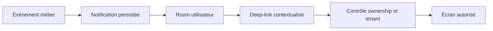
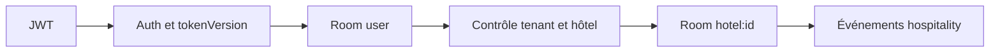
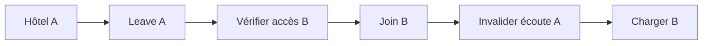
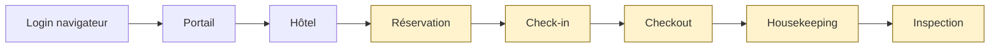

# DASH-4 — Rapport realtime, notifications et E2E

## 1. Résumé exécutif

DASH-4 ajoute un canal Socket.IO hôtel strictement autorisé, fiabilise les notifications d'exploitation et certifie les principaux changements de contexte propriétaire. Verdict : **GO SOUS RÉSERVES**, le workflow PMS complet n'étant pas piloté de bout en bout par le navigateur et Expo Doctor conservant une dette de versions patch hors périmètre web.

## 2. Architecture avant

Le socket authentifiait le JWT et joignait les rooms utilisateur/conversation. Aucun room d'établissement, événement hospitality ou listener hôtel n'existait. Plusieurs producteurs staff omettaient l'attribution hôtel/tenant et certains types n'étaient pas acceptés par le modèle.

## 3. Architecture après

Le serveur expose une room `hotel:<id>`, vérifie session, tenant et droit opérationnel avant join et avant chaque émission. Le détail hôtel s'abonne au contexte sélectionné et conserve HTTP comme source/fallback.

## 4. Notifications

Les types réservation, housekeeping, inspection, maintenance et échec de brouillon financier produits par le code sont désormais persistables. Les notifications staff héritent du tenant de l'hôtel lorsque l'entité primaire ne suffit pas. Aucun envoi réel externe n'a été exécuté.

## 5. Matrice événements

| Domaine | Événement | Notification | Realtime |
|---|---|---|---|
| Réservation | création/statut/modification | client ou gestionnaire | statut/modification |
| Séjour | check-in/check-out | client; housekeeping au départ | oui |
| Housekeeping | création/assignation/fin | staff | oui |
| Inspection | échec/remise en service | staff | oui |
| Maintenance | création/assignation/résolution | staff | oui |
| Finance | échec brouillon | staff finance | événement minimal si opération concernée |

Aucun producteur dédié facture/paiement hospitality n'a été inventé.

## 6. Deep-links

Les liens hôtel sont contextualisés par `hotelId`: réservations propriétaire, housekeeping, maintenance et finance. La route cible refait ses contrôles HTTP d'autorisation; un lien périmé ou étranger ne divulgue rien.

## 7. Contexte établissement

Le `hotelId` actif est explicite côté écran et dans les liens. Il n'est jamais déduit d'une room globale.

## 8. Socket.IO

Le payload est minimal: identifiants hôtel/entité, type, statut et horodatage. Aucun token ni donnée personnelle n'est journalisé ou diffusé.

## 9. User rooms

Les rooms personnelles existantes sont conservées pour les notifications et restent séparées des rooms opérationnelles.

## 10. Tenant rooms

Aucune room tenant large n'a été ajoutée: cela réduit le rayon de diffusion et évite une exposition inter-établissements.

## 11. Hotel rooms

Join et émission revalident compte actif, version de session, tenant sélectionné et accès opérationnel central. La révocation déconnecte la socket.

## 12. Accommodation rooms si applicable

Aucune room maison meublée n'est créée faute de producteur realtime accommodation dans le périmètre actuel. Le contexte maison reste HTTP et constitue une réserve fonctionnelle documentée.

## 13. Authorization join

Les ObjectId invalides, hôtels étrangers, tenants incompatibles et sessions révoquées sont refusés. Même un gestionnaire multi-tenant ne traverse pas le tenant sélectionné.

## 14. Switch établissement

Le join B quitte la room active A avant d'autoriser B; les événements A ne sont plus reçus.

## 15. Reconnexion

Le hook rejoint à nouveau l'hôtel après `connect`; le serveur refait toutes les validations. Le callback est référencé sans provoquer de reconnexions à chaque rendu.

## 16. Logout/session invalidée

La `tokenVersion` est vérifiée au handshake, au join et avant émission. Une session invalidée n'obtient plus d'événement et est déconnectée.

## 17. Frontend listeners

`useHotelRealtime` filtre `hotelId`, quitte la room, retire les listeners et ferme sa socket au démontage ou changement de contexte.

## 18. Réservations

Les mutations de statut et modification émettent après succès; check-in et check-out déclenchent aussi une actualisation ciblée du détail hôtel.

## 19. Housekeeping

Création, assignation, démarrage, achèvement et annulation émettent un événement hôtel; les destinataires staff sont attribués au tenant de l'hôtel.

## 20. Inspection

Les résultats passed/failed sont propagés; les notifications d'échec et de remise en service sont persistables et contextualisées.

## 21. Maintenance

Création, assignation, démarrage, résolution et clôture sont propagés. Le lien ouvre le dashboard maintenance filtré sur l'hôtel.

## 22. Finance

Le lien d'échec de brouillon ouvre la finance de l'hôtel concerné. Aucun événement facture/paiement absent du domaine existant n'a été simulé.

## 23. E2E propriétaire

Le navigateur certifie connexion, portail propriétaire, Hôtel A, bascule Hôtel B, maison C et navigation directe contextualisée.

## 24. E2E hôtel

Le navigateur certifie les liens, requêtes portant le bon `hotelId` et refus d'un hôtel étranger. Les transitions PMS sont couvertes par les suites API/Mongo, pas toutes cliquées dans un unique scénario navigateur.

## 25. E2E maison meublée

La maison C est atteinte depuis le portefeuille et par URL directe; une accommodation étrangère retourne 403 et un état vide sûr.

## 26. Cross-owner

Les tests Socket.IO avec Mongo réel et les tests navigateur refusent l'accès d'un autre propriétaire et empêchent toute réception croisée.

## 27. Cross-tenant

Un contexte tenant A ne peut joindre un hôtel B, y compris pour un compte ayant par ailleurs un rôle de gestion sur B.

## 28. Bugs trouvés

Absence de room hospitality; notifications opérationnelles non admises par l'enum; attribution tenant manquante; liens globaux ambigus; absence d'écoute contextuelle; risque de conservation de room au switch.

## 29. Bugs corrigés

Room et revalidation strictes, enum aligné, fallback d'attribution hôtel, liens contextualisés, producteurs enrichis, émissions post-succès, hook avec nettoyage et rejoin.

## 30. Tests

PASS ciblés: serveur notification/socket (19), client realtime/détail (4), Socket.IO Mongo réel (4), hôtel/finance/analytics HTTP (115). Les trois scénarios Playwright sont PASS dans leur état final (deux lors du run groupé puis le troisième lors de sa relance ciblée).

Les nœuds jaunes sont certifiés par API/Mongo; login, portail, hôtel, contexte et interdictions le sont dans Playwright.

## 31. Gates

`npm run ci`: 10 validations PASS, avec deux échecs: timeout du test documentaire Mongo dans la passe globale et Expo Doctor. Le test expiré a ensuite passé isolément (1 suite, 16/16 tests, 39 s). `npm run release-check`: serveur lint/unitaire/Mongo PASS (116 suites/1326 tests unitaires; 82 suites/863 tests Mongo), client lint/85 fichiers/559 tests/build PASS, mobile syntax/lint/types/24 suites/227 tests/export PASS; seul Expo Doctor échoue. Le diagnostic isolé donne 20/21 contrôles PASS et 12 dépendances Expo en retard d'une version patch. `npm run health`: 28/28 PASS.

## 32. Dette restante

Ajouter un scénario navigateur complet créant réservation, check-in, checkout, housekeeping et inspection; définir le besoin realtime maison meublée; contextualiser plus finement les notifications accommodation historiques.

## 33. Risques

Le temps réel reste un mécanisme de rafraîchissement, non une source d'autorité. Toute nouvelle mutation doit émettre après commit et toute nouvelle famille de notification doit être ajoutée au schéma et à la matrice.

## 34. État Git

Branche `main`, baseline conservée `0cebcd5bbd180ff8a7814139a0f4a42dade9d2ba`. Les travaux DASH-1 à DASH-3 déjà présents ont été préservés; aucun commit, push, deploy, rotation, écriture production ou action Cloudinary.

## 35. Verdict

**GO SOUS RÉSERVES**: la sécurité contextuelle Socket.IO/HTTP et le gate serveur complet sont verts. Restent à traiter le parcours navigateur PMS unique et l'alignement patch des 12 dépendances Expo; aucune modification mobile n'a été faite dans ce sprint.
