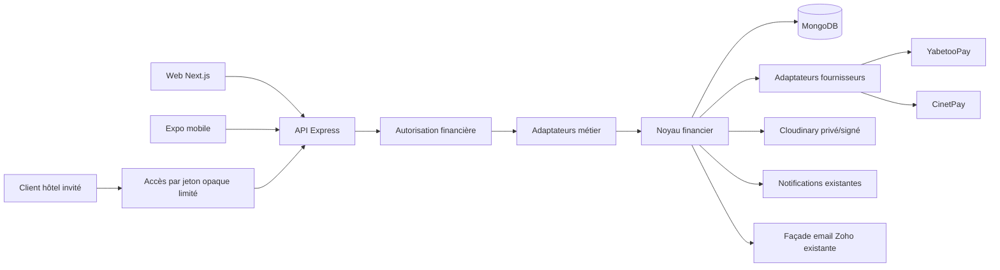
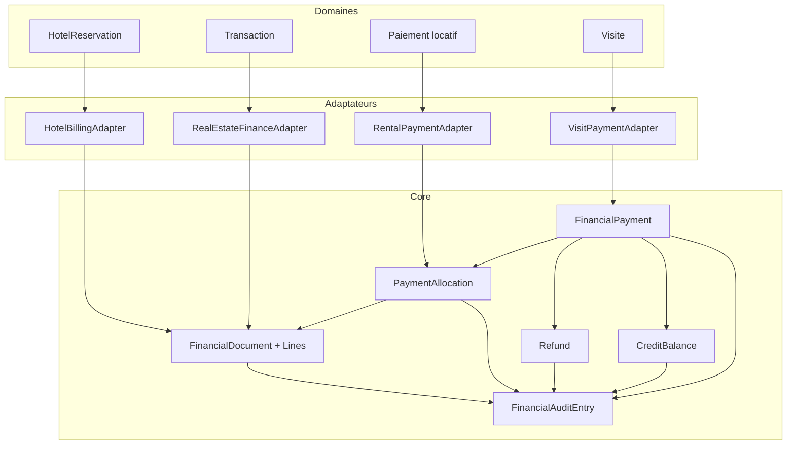
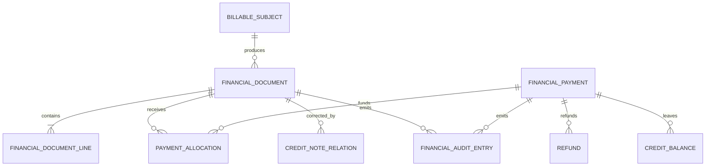
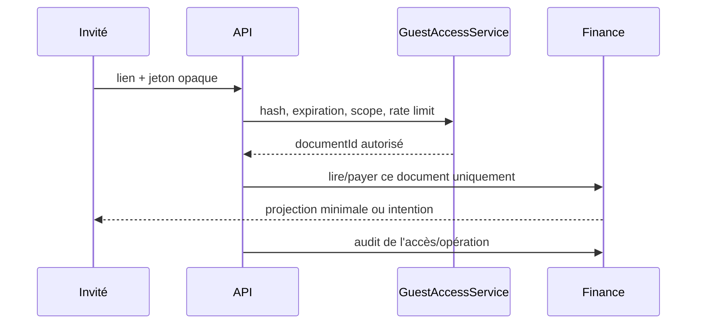
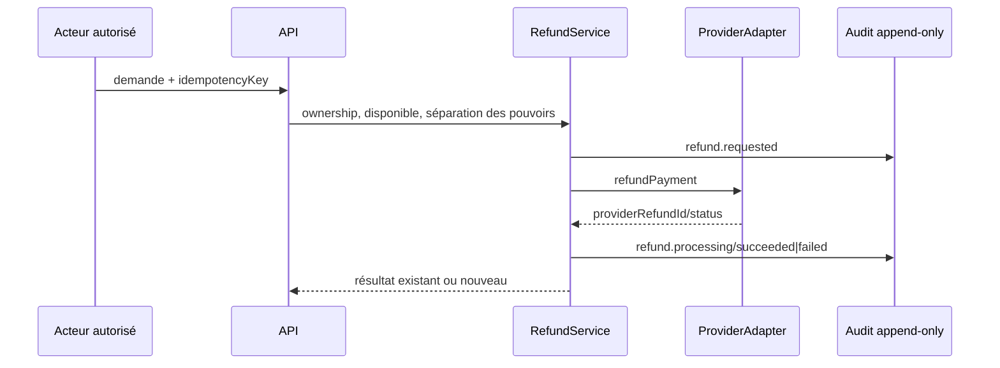
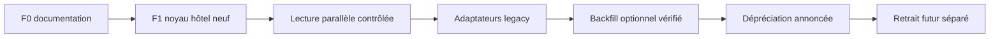

# Financial Core Architecture — Sprint F0

Statut : **Accepted — décisions structurantes validées pour Sprint F1**  
Périmètre initial F0 : spécification sans migration. L'implémentation F1 est décrite dans `FINANCIAL_CORE_IMPLEMENTATION.md`.

## 1. Objectif et principes

Le futur noyau financier fournit les invariants génériques de facturation, d'encaissement, d'allocation, de remboursement, de crédit et d'audit. Les domaines Hôtel, Immobilier, Gestion locative, Visites, Altcom et Mila Events restent propriétaires de leurs règles métier.

Principes obligatoires :

- coexistence non destructive avec les collections et API actuelles ;
- montants futurs en unités mineures entières et devise explicite ;
- calculs et autorisations exclusivement côté serveur ;
- facture émise immuable, correction par avoir ou contre-écriture ;
- événements fournisseurs et opérations métier idempotents ;
- journal financier append-only, sans prétention initiale de comptabilité générale ;
- aucun taux fiscal ou règle légale locale codé sans validation compétente.



## 2. État réel cartographié

| Domaine | Structure source | Créance | Paiement | Allocation | Remboursement/crédit | Devise/montants | Ownership et limites |
|---|---|---:|---:|---:|---:|---|---|
| Gestion locative | `Paiement` | Oui, échéance mensuelle | Oui, montant reçu intégré | Non | Non | `Number`, devise implicite XAF | Portail sécurisé par `req.user -> Locataire`; routes staff par rôles. Mélange créance et encaissement. |
| Immobilier | `Transaction` | Montant final et commission | Références vers plusieurs `PaiementTransaction` | Non | Statut `remboursé` seulement, sans objet Refund | `Number`, devise implicite | Lecture transaction : client ou staff. Solde/allocation absents. |
| Encaissement immobilier | `PaiementTransaction` | Non | Oui : Yabetoo, CinetPay legacy, virement, espèces, chèque | Non | Statut seulement | `Number`, devise non stockée | Plusieurs actions authentifiées n'établissent pas systématiquement l'ownership transactionnel. |
| Visites | champs de `Visite` | Frais/honoraires intégrés | Statut et référence Yabetoo intégrés | Non | Non | `Number`, `visitFeeCurrency` XAF | Initiation et vérification contrôlent le client ; deuxième couple de champs de statut legacy. |
| Documents | `Document` | Facture/devis avec lignes | Non | Non | Non | `Number`; taxe globale; aucune devise | Routes staff uniquement. Modèle polymorphe mêlant finance et administratif. |
| Hôtellerie | `HotelReservation` | Snapshot du prix du séjour | Non | Non | Non | `Number`, devise libre, défaut XAF | Client connecté, manager d'hôtel ou staff ; invité sans compte déjà supporté. |
| Devis commerciaux | `Devis`, `Quote`, `QuoteRequest` | Proposition/demande selon domaine | Non | Non | Non | Structures hétérogènes | Ne constituent pas une facture commune. |

### 2.1 Documents et numérotation

- `Document` contient `items`, `subTotal`, `tax`, `totalAmount` et un `docNumber` atomique via `mongoose-sequence`.
- `HotelReservation` possède une séquence atomique et une référence `RES-AAAA-NNNNNN`.
- La finalisation d'une `Transaction` crée un `Document(type=Facture)` de commission. Le `subTotal` utilise `commission.total`, tandis que `totalAmount` utilise `commission.agencyNet` : la signification comptable doit être clarifiée avant toute reprise.
- Les quittances locatives sont des PDF stockés dans `Contrat.documents`, pas des `Document` financiers.
- Aucune politique légale configurable de facture/avoir/reçu n'existe.

### 2.2 Fournisseurs et preuves

| Moyen | Implémentation | État | Risques confirmés |
|---|---|---|---|
| YabetooPay immobilier | `paiementTransactionController`, `yabetooService` | Actif | webhook sans validation de signature annoncée en sandbox ; idempotence fournisseur incomplète ; ownership incomplet sur certains endpoints |
| YabetooPay visite | `visiteController`, `yabetooService` | Actif | données de paiement embarquées dans `Visite`; aucun registre commun |
| CinetPay locatif/générique | `cinetpayController` | Actif/legacy ambigu | montant et transaction fournis par le client ; mapping direct vers `Paiement.reference` |
| CinetPay immobilier | webhook dans `paiementTransactionController` | Legacy conservé | secret facultatif ; événement non persisté avant traitement |
| Virement | `PaiementTransaction.preuvePaiement` | Actif | middleware générique jusqu'à 100 Mo et MIME trop larges pour une preuve financière |
| Espèces/chèque | saisie staff | Actif | confirmation manuelle sans allocation ni séparation des pouvoirs |

### 2.3 Notifications et emails

Le moteur `notificationService` gère déjà succès/échec de paiement, transaction, paiement de visite, loyer, quittance et portail locataire, avec `dedupeKey` disponible. Il doit être réutilisé.

Zoho est déjà accessible via `zohoMailService`, `emailService`, `utils/email` et `config/email`. F1 devra choisir une façade applicative unique sans créer de nouveau moteur et sans casser les appelants historiques.

## 3. Risques

### Critiques

- webhook Yabetoo sans signature vérifiée et CinetPay conditionné à un secret facultatif ;
- absence de stockage/idempotence atomique des événements fournisseur ;
- endpoints de paiements immobiliers authentifiés mais sans ownership systématique ;
- aucune source unique pour solde, allocation et remboursement.

### Élevés

- quatre représentations de paiement incompatibles ;
- montants `Number` et calculs flottants/arrondis dispersés ;
- middleware générique trop permissif pour justificatifs financiers ;
- `Document` polymorphe et mutable, impropre à l'immutabilité d'une facture émise ;
- statuts fournisseurs et métier mélangés.

### Moyens

- devise absente ou implicite dans plusieurs collections ;
- taxe globale non ventilée et fiscalité non configurable ;
- numérotation non segmentée par nature/établissement ;
- aucune séparation formelle réceptionniste/comptable dans les rôles actuels ;
- check-out sans notion de solde (à ne pas modifier en F0).

### Faibles

- terminologie française/anglaise hétérogène ;
- plusieurs façades Zoho ;
- anciens champs de statut conservés pour compatibilité.

## 4. Frontière du noyau et adaptateurs



Le noyau gère identité financière, monnaie, documents, lignes, états financiers, allocations, remboursements, crédits, idempotence et audit. Les adaptateurs déterminent ce qui est facturable, construisent les snapshots, appliquent les règles de domaine et vérifient les relations d'ownership.

Les contrôleurs ne doivent pas contenir de calcul comptable : `controller -> authorization -> domain adapter -> financial service`.

## 5. Stratégie `Document`

| Critère | A — étendre `Document` | B — artefact historique/administratif + futur `FinancialDocument` |
|---|---|---|
| Compatibilité | immédiate | coexistence explicite, adaptateur historique |
| Cohésion | faible : identité, contrat et facture ensemble | forte : invariants financiers isolés |
| Immutabilité | migration risquée | conçue dès l'origine |
| Avoirs/taxes/devises | nombreux champs conditionnels | modèle financier dédié |
| Coût initial | inférieur | supérieur |
| Dette future | élevée | maîtrisée |
| Migration | mutation d'une collection hétérogène | aucune migration destructive requise |

**Décision Accepted : option B.** `Document` reste la représentation historique et administrative. Les factures existantes restent lisibles ; un adaptateur peut les exposer en lecture. Le noyau F1 utilise `FinancialDocument`.

## 6. Modèle conceptuel et cardinalités



- un document appartient exactement à un domaine et une entité facturable ;
- une facture a au moins une ligne lors de son émission ;
- une allocation référence exactement une facture, un paiement et un montant positif ;
- facture et paiement ont zéro à plusieurs allocations ;
- la portion non allouée d'un paiement peut devenir crédit ;
- un remboursement référence un paiement et ne dépasse jamais son montant remboursable ;
- un avoir est un document financier négatif/correctif, pas un mouvement de fonds ;
- aucune suppression physique après émission ; archivage logique uniquement ;
- correction par avoir, reversal d'allocation et nouvelle émission.

Pour éviter une polymorphie Mongoose incontrôlée, chaque objet financier stockera un `domain` enum contrôlé et un `subject` `{ entityType, entityId }`, validé par un adaptateur enregistré côté serveur. Les requêtes utilisent des index composés `domain + entityType + entityId`. Aucun `refPath` libre fourni par le client.

## 7. Convention monétaire

Contrat futur :

```js
{ amountMinor: 25000, currency: 'XAF' }
```

- stockage MongoDB recommandé : `Number` entier validé comme `Number.isSafeInteger`, borné à `Number.MAX_SAFE_INTEGER` ;
- valeur absolue sur documents, lignes, paiements et allocations ; signe seulement pour écritures d'audit/contre-écritures explicitement typées ;
- XAF utilise 0 décimale ; EUR/USD utilisent 2 décimales ;
- aucune conversion implicite ; allocation seulement si devises identiques ;
- toute conversion future enregistre monnaies source/cible, montants, taux rationnel, fournisseur et horodatage ;
- pourcentage en points de base, calcul entier avec règle d'arrondi documentée (`half-up` recommandé, à valider) ;
- total calculé côté serveur ; frontend/mobile ne font que formater ;
- `Decimal128` n'est pas recommandé pour F1 : il complexifie JSON et mobile. `Long` n'est utile que si les limites métier dépassent le safe integer JavaScript.

Futur `moneyService` pur : `assertCurrency`, `assertIntegerMinor`, `addMoney`, `subtractMoney`, `multiplyMoney`, `percentageOf`, `allocateMoney`, `formatMoney`. Il devra refuser mélange de devises, flottants, NaN, infinities et dépassements.

Migration : les champs historiques restent inchangés. Chaque adaptateur convertit seulement les valeurs validées vers unités mineures lors de la création d'un nouvel objet financier.

## 8. Devise, taxes, frais et remises

- devise plateforme par défaut : XAF ;
- hôtel/plan/réservation déterminent la devise source ;
- la facture snapshotte la devise de réservation ;
- paiement et facture doivent avoir la même devise pour allocation ;
- aucun change en Sprint F ;
- taxes par ligne, incluses ou exclues explicitement ; taxes globales seulement comme ajustements documentés ;
- taux en points de base (`1800 = 18 %`) ; aucun taux congolais codé avant validation juridique/comptable.

Ligne conceptuelle : `description`, `quantity` rationnelle contrôlée, `unitAmountMinor`, `subtotalMinor`, `discounts[]`, `taxes[]`, `totalMinor`, `sourceType`, `sourceId`, `serviceDate`, `metadata`. Chaque taxe : `taxCode`, `taxLabel`, `taxRateBasisPoints`, `taxAmountMinor`, `included`.

## 9. Machines d'état

### Document financier

Le statut documentaire est `draft -> issued -> cancelled|credited|void`. `partially_paid`, `paid` et `overdue` sont des états de règlement dérivés, jamais des transitions éditables.

- `draft -> issued` : autorisé après validation et attribution atomique du numéro ;
- `draft -> void` : abandon avant émission ;
- `issued -> cancelled` : seulement si annulation légale autorisée et sans mutation du contenu ;
- `issued|cancelled -> credited` : avoir total ; avoir partiel conservant `issued` avec relation corrective ;
- retour vers `draft`, modification ou suppression après émission : interdit.

### Paiement

`pending -> processing -> succeeded|failed|cancelled`; retry contrôlé `failed -> processing`; `succeeded -> partially_refunded -> refunded`. Retour de `succeeded` vers `failed` interdit sauf événement de reversal représenté séparément.

### Allocation

Une allocation est append-only logique. Une désallocation crée une écriture de reversal liée à l'originale ; elle ne modifie ni ne supprime l'allocation originale. L'état `active/reversed` peut être dérivé de cette relation.

### Remboursement

`requested -> approved|cancelled`; `approved -> processing`; `processing -> succeeded|failed`; retry `failed -> processing` avec nouvelle tentative idempotente. Aucun passage direct `requested -> succeeded` pour les remboursements externes.

## 10. Journal append-only

F1 doit implémenter un **audit log financier append-only**, pas une comptabilité en partie double. Chaque entrée capture : type, acteur, rôle/source, entité, montant/devise éventuels, état avant/après, fournisseur, horodatage serveur, métadonnées filtrées et clé d'idempotence.

Événements : création/émission/annulation/avoir de facture ; création/traitement/succès/échec de paiement ; allocation/reversal ; demande/approbation/succès/échec de remboursement ; création/application de crédit ; événement fournisseur.

Les entrées ne sont ni modifiables ni supprimables. Une erreur produit une contre-écriture référant l'entrée d'origine. Une vraie comptabilité en partie double est un chantier ultérieur soumis à un plan comptable validé.

## 11. Idempotence

| Identifiant | Rôle | Unicité conceptuelle |
|---|---|---|
| `providerEventId` | livraison webhook | `provider + providerEventId` |
| `providerPaymentId` | paiement distant | `provider + providerPaymentId` |
| `idempotencyKey` | requête client retryable | `actor/guestScope + operation + key` |
| `businessOperationKey` | opération métier déterministe | `domain + subject + operation + key` |
| `notificationDeduplicationKey` | effet de bord | `recipient + key`, compatible moteur actuel |
| `providerRefundId` | remboursement distant | `provider + providerRefundId` |

Le traitement webhook doit : authentifier la signature sur octets bruts, persister/réserver atomiquement l'événement, retourner le résultat existant en doublon, appliquer la transition, écrire l'audit, puis déclencher notifications/emails en outbox/retry. Répondre rapidement est permis après persistance durable, pas avant celle-ci.

PDF, facture et allocation utilisent une clé métier ; un doublon retourne la ressource existante. Email et notification possèdent leur propre clé pour ne pas répéter les effets de bord.

## 12. Sécurité et permissions proposées

Les rôles `réceptionniste` et `comptable` n'existent pas encore comme rôles établis : la matrice décrit des capacités futures, pas une modification immédiate de `User.role`.

| Action | Admin | Manager/propriétaire hôtel autorisé | Réception | Comptable | Client/locataire propriétaire | Invité avec jeton | Webhook/système |
|---|---:|---:|---:|---:|---:|---:|---:|
| Brouillon hôtel | Oui | Oui, son hôtel | Oui, hôtel assigné | Oui | Non | Non | Adaptateur seulement |
| Émettre | Oui | Selon politique | Selon délégation | Oui | Non | Non | Non |
| Voir/télécharger | Oui | Son hôtel | Hôtel assigné | Oui | Sa facture | Facture scopée | Non |
| Initier paiement | Non requis | Non requis | Manuel seulement | Manuel seulement | Sa facture | Facture scopée | Non |
| Confirmer manuel/allouer | Oui | Selon délégation | Non par défaut | Oui | Non | Non | Adaptateur fournisseur |
| Demander remboursement | Oui | Son hôtel | Non | Oui | Demande seulement | Demande scopée | Provider callback |
| Approuver remboursement | Oui | Non par défaut | Non | Oui, séparation requise | Non | Non | Non |
| Annuler/créer avoir | Oui | Selon seuil/politique | Non | Oui | Non | Non | Non |
| Journal/export | Oui | Son hôtel, lecture limitée | Non | Oui | Non | Non | Tâche autorisée |

Services conceptuels : `assertCanViewFinancialDocument`, `assertCanManageHotelFinance`, `assertCanPayFinancialDocument`, `assertCanAllocatePayment`, `assertCanRefundPayment`, `assertReservationOwnership`, `assertGuestTokenScope`.

Chaque service recharge côté serveur hôtel, réservation, facture et paiement. Aucun `hotelId`, `clientId`, `invoiceId`, `paymentId` ou `reservationId` envoyé par le frontend n'établit une autorisation.

## 13. Réservation invitée

Recommandation : conserver la réservation sans compte et proposer un jeton opaque limité à une facture.

- secret aléatoire fort transmis une seule fois ; seul le hash est stocké ;
- expiration, révocation, rotation et scope `view|download|pay` ;
- jeton lié au document/réservation, jamais à un hôtel entier ;
- HTTPS, rate limiting et journalisation ;
- paiement sans exposition des autres réservations ;
- confirmation secondaire/OTP pour actions sensibles ou réémission du lien.

Le compte obligatoire casserait le flux invité existant. Référence + email/téléphone seuls sont insuffisants ; ils peuvent servir à obtenir un code temporaire, pas de preuve d'accès permanente.



## 14. Facture hôtelière conceptuelle

Le brouillon est créé lors de la confirmation ou au check-in selon politique d'établissement ; recommandation : confirmation pour figer la créance prévisionnelle, sans numéro légal. Il copie le snapshot `HotelReservation`, jamais le `RatePlan` courant.

Lignes initiales : nuitées × chambres, taxes, frais et remise explicitement ventilés. Les extras futurs (minibar, restauration, blanchisserie, transport, room service, dommages, arrivée anticipée, départ tardif) viennent de sources métier identifiées.

Avant émission, staff autorisé peut modifier/ajouter des lignes avec audit. Après émission, aucune mutation : avoir et nouvelle facture. Check-in peut ajouter des consommations au brouillon. Check-out ne doit pas être modifié en F0 ; en F1+, un service financier pourra signaler le solde et appliquer une politique configurable sans incorporer la comptabilité dans `checkOutService`.

## 15. Solde, allocations, remboursements et crédits

`invoiceAllocatedMinor = somme(allocations originales) - somme(reversals)`  
`invoiceBalanceMinor = max(0, invoiceTotalMinor - invoiceAllocatedMinor)`  
`paymentAvailableMinor = paymentSucceededMinor - allocations nettes - refunds succeeded + crédits retournés explicitement`

- surallocation et allocation multi-devise interdites ;
- paiement partiel et multi-factures autorisés ;
- surpaiement reste non alloué ou devient `CreditBalance` ;
- paiement manuel passe par permissions renforcées et audit ;
- le statut de règlement de facture est dérivé des allocations et échéances.

`Refund` retourne effectivement des fonds. `CreditBalance` conserve une valeur disponible. `CreditNote`/avoir réduit ou annule une créance. Un avoir peut exister sans remboursement ; un remboursement peut concerner un paiement non alloué ; après avoir, la valeur libérée devient crédit ou remboursement selon décision explicite.



## 16. Interface fournisseur conceptuelle

`PaymentProviderAdapter` : `createPaymentIntent`, `verifyPayment`, `handleWebhook`, `refundPayment`, `mapProviderStatus`, `validateWebhookSignature`.

Mapping commun : fournisseur créé/en attente -> `pending`; action utilisateur/réseau -> `processing`; confirmé -> `succeeded`; refus/erreur terminale -> `failed`; annulé/expiré -> `cancelled`; remboursement partiel/total -> états correspondants.

Priorités de sécurisation avant paiement hôtelier :

1. signature webhook obligatoire et rejet fail-closed ;
2. stockage atomique/idempotent de chaque événement ;
3. ownership sur tous les endpoints de paiement immobilier ;
4. montant et devise dérivés côté serveur, jamais du frontend ;
5. unification du mapping de statuts ;
6. clarification/dépréciation documentée du double flux CinetPay ;
7. preuve financière via middleware dédié.

Le middleware futur autorise un fichier (exception justifiée au besoin), PDF/JPEG/PNG, taille recommandée 8 Mo, validation signature/MIME, nom généré, Cloudinary privé ou URL signée, rollback compensatoire, antivirus si disponible, ownership et audit.

## 17. Événements financiers

| Événement | Déclencheur | Données minimales | Effets |
|---|---|---|---|
| `financial_document.draft_created` | adaptateur métier | document, domain, subject, actor, operationKey | audit ; notification optionnelle staff |
| `.issued` | émission autorisée | document, numéro, total/devise | audit, PDF, notification, email |
| `.cancelled` / `.credited` | correction autorisée | document, motif, relation d'avoir | audit, notification/email |
| `payment.created` / `.processing` | intention/manuelle | payment, provider, montant/devise | audit |
| `payment.succeeded` / `.failed` | webhook/vérification | IDs fournisseur, état | audit, allocation éventuelle, notification/email |
| `payment.allocated` | allocation serveur | invoice, payment, montant | audit, recalcul du solde |
| `payment.allocation_reversed` | contrepassation | allocation originale, motif | audit, recalcul |
| `refund.requested` / `.approved` | acteurs distincts | payment, montant, motif | audit, notification approbateur |
| `refund.succeeded` / `.failed` | fournisseur | refund et IDs fournisseur | audit, notification/email |
| `credit.created` / `.applied` | surpaiement/affectation | owner, montant/devise, cible | audit, recalcul |

Chaque événement possède acteur/source, horodatage serveur, entité, clé métier et clé de notification. Les notifications réutilisent le service central ; les emails réutilisent une façade Zoho consolidée.

## 18. API et compatibilité

Recommandation : `/api/finance/v1/...` pour les ressources communes, et endpoints hôteliers orientés domaine appelant les adaptateurs, par exemple `/api/hotels/:hotelId/finance/...`. Le préfixe versionné permet l'évolution sans modifier `/api/paiements`, `/api/transactions`, `/api/visites`, `/api/tenant-portal` ni les contrats mobiles existants.

Les réponses exposent des montants `{ amountMinor, currency }`, des états normalisés et des projections filtrées. Les champs legacy restent servis par les endpoints legacy pendant la transition.

## 19. Migration progressive



| Source | Stratégie |
|---|---|
| `HotelReservation` | première entité facturable ; snapshot copié, aucun changement du moteur opérationnel |
| `Document` | conservation intégrale ; factures historiques en lecture via adaptateur, aucune conversion automatique |
| `PaiementTransaction` | enveloppé par adaptateur/lecture ; ne pas généraliser ni remplacer en place |
| `Transaction` | conserve commission/statuts ; référence future optionnelle uniquement après contrat de compatibilité |
| `Paiement` | reste source GL de l'échéance et du règlement ; adaptateur futur, aucune migration F hôtel |
| `Visite` | conserve ses champs et API ; adaptateur futur après stabilisation hôtelière |

Tout backfill futur est un sprint distinct : dry-run, comptages, réconciliation, reprise, rollback logique, métriques et validation métier.

## 20. Plan de tests avant implémentation

- monnaie : entier, borne, overflow, addition/soustraction, points de base, arrondi, devise incompatible, négatif ;
- facture : calcul de lignes, brouillon, émission atomique, immutabilité, avoir, annulation, concurrence de numérotation ;
- allocation : partielle, multiple, multi-factures, surallocation, devise, reversal, doublon idempotent, courses concurrentes ;
- paiement : succès/échec/retry/annulation, événement inconnu, signature invalide, webhook dupliqué et désordonné ;
- remboursement : partiel/total, dépassement, double demande, séparation des pouvoirs, transition invalide ;
- ownership : client tiers, autre hôtel, staff non assigné, invité valide/expiré/révoqué, enumeration d'IDs ;
- journal : append-only, ordre, acteur, contre-écriture, unicité ;
- effets : PDF/email/notification exactement une fois logiquement ;
- compatibilité : snapshots de contrats web/mobile legacy inchangés.

Types : tests unitaires purs, contrats API, intégration Mongo avec index uniques, concurrence, sécurité, provider adapters et end-to-end preview avec sandbox fournisseur.

## 21. Matrice des sept décisions validées

| # | Décision Accepted | Justification | Risque/conséquence | Alternative | Suivi requis |
|---|---|---|---|---|---|
| 1 | `Document` devient artefact historique/administratif ; futur document financier séparé | cohésion et immutabilité | coexistence à maintenir | étendre `Document` | Produit + architecture |
| 2 | unités mineures entières safe integer | cohérence web/mobile/Mongo | bornes strictes | Decimal128/Long | Architecture + comptabilité |
| 3 | séquence atomique à l'émission, configurable par établissement/type/année | auditabilité sans inventer la loi | règles finales inconnues | séquence globale | Comptable/juridique |
| 4 | invité autorisé par jeton opaque hashé, expirant et scopé | conserve le parcours invité | gestion de secrets/rate limit | compte obligatoire ou OTP seul | Produit + sécurité |
| 5 | adaptateur autour de `PaiementTransaction`, pas remplacement immédiat | compatibilité mobile/API | période de double lecture | migration directe | Architecture + mobile |
| 6 | audit financier append-only initial | réaliste sans plan comptable | pas de bilan/partie double | ledger double entrée | Comptable + architecture |
| 7 | identité globale mais numérotation et ownership isolés par établissement/domaine | sécurité multi-tenant et consolidation possible | requêtes/index plus riches | collections par domaine | Produit + comptabilité |

## 22. Numérotation configurable

Concept `DocumentSequence` futur : `entityScope`, `documentType`, `year`, `prefix`, `currentValue`. Allocation atomique uniquement lors de `issued`; les brouillons n'ont pas de numéro légal. Facture, avoir, proforma et reçu ont des séries configurables. Un numéro émis n'est jamais réutilisé ; annulation/duplicata gardent le numéro et un statut/label. La politique de trous, réinitialisation annuelle et périmètre doit être validée juridiquement avant code.

## 23. Conditions d'entrée en Sprint F1

F1 reste interdit tant que les sept décisions ne sont pas explicitement validées, que le modèle de rôles financiers n'est pas choisi et que le plan prioritaire webhooks/ownership n'est pas accepté. Cette spécification n'autorise aucune migration ni création de collection.
