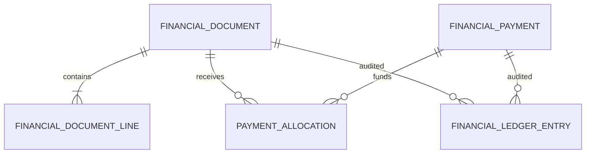
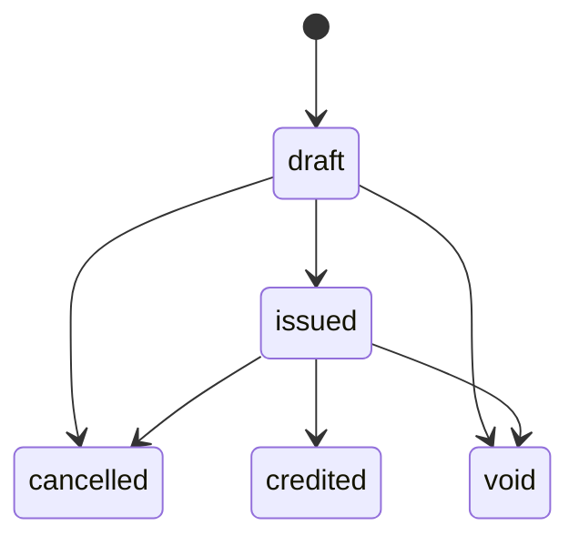
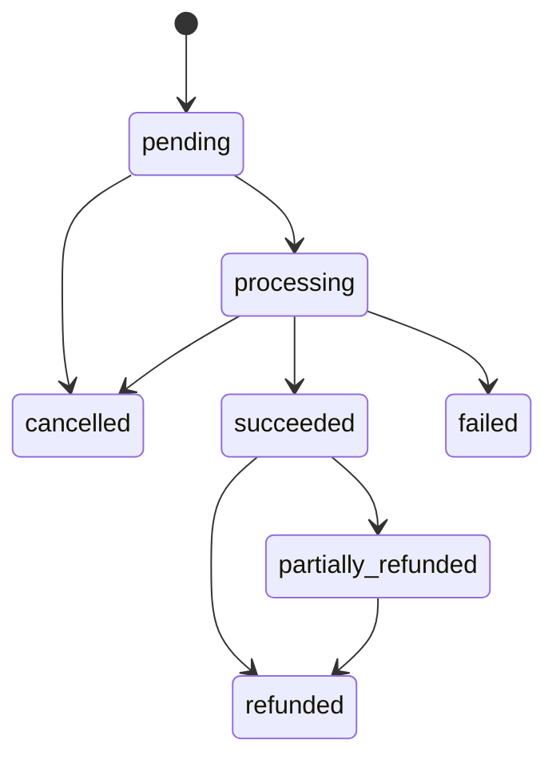

# Financial Core — Implémentation Sprint F1

Statut : implémenté, en attente de validation fonctionnelle. Les décisions ADR FIN-001 à FIN-007 sont `Accepted`. La fiscalité, les mentions légales et la règle locale de numérotation restent ouvertes.

## Périmètre

F1 livre les fondations serveur sans fournisseur réel, PDF, email de facture, remboursement, crédit, accès public invité ni interface de caisse. Les modèles legacy et le moteur hôtelier sont inchangés.

```mermaid
flowchart LR
  Routes[/api/financial] --> Auth[FinancialAuthorizationService]
  Auth --> Hotel[HotelBillingAdapter]
  Auth --> Docs[FinancialDocumentService]
  Auth --> Pay[FinancialPaymentService]
  Auth --> Alloc[PaymentAllocationService]
  Hotel & Docs & Pay & Alloc --> Money[MoneyService]
  Hotel & Docs & Pay & Alloc --> Ledger[FinancialLedgerService]
  Docs --> Seq[FinancialSequenceService]
```

## Modèles et relations

| Modèle | Rôle | Index structurants |
|---|---|---|
| `FinancialDocument` | facture/proforma/avoir/reçu séparé de `Document` | établissement+statut, numéro par établissement, sujet, clé métier unique |
| `FinancialDocumentLine` | lignes séparées, quantités entières F1 | document+numéro de ligne unique, source métier |
| `FinancialSequence` | compteur atomique à l'émission | domaine+type établissement+établissement+type document+année unique |
| `FinancialPayment` | registre commun, manuel dans F1 | référence par établissement, ID fournisseur, sujet |
| `PaymentAllocation` | relation paiement-facture | paiement, facture, clé métier par établissement unique |
| `FinancialLedgerEntry` | audit append-only | chronologie établissement, chronologie entité, opération+événement unique |
| `FinancialProviderEvent` | réservation idempotente d'un événement | fournisseur+ID événement unique |



Les relations métier utilisent des enums fermés. F1 active `domain=hotel`, `establishmentType=Hotel`, `subjectType=HotelReservation`. Aucun type libre du frontend n'est utilisé pour établir une relation.

## Monnaie

Tous les nouveaux montants sont des unités mineures `Number.isSafeInteger`. XAF a zéro décimale ; EUR/USD en ont deux. Les chaînes, décimaux, NaN, infinis, valeurs hors plage et négatifs non autorisés sont rejetés.

`moneyService` centralise validation, addition, soustraction, multiplication entière, pourcentage en points de base, allocation proportionnelle et formatage. La règle de pourcentage F1 est l'arrondi à l'entier le plus proche, moitié vers le haut pour les montants positifs. La distribution proportionnelle attribue les restes selon les plus grands restes puis l'ordre d'entrée ; la somme est strictement conservée.

## Calcul des lignes et factures

```text
lineSubtotalMinor = unitAmountMinor × quantity
lineTotalMinor = lineSubtotalMinor - discountAmountMinor
                 + taxAmountMinor + feesAmountMinor
documentTotalMinor = somme(lineTotalMinor)
balanceMinor = totalMinor - allocations actives nettes
```

Les totaux envoyés par le client sont ignorés. Les lignes sont recalculées côté serveur. La remise ne peut dépasser le sous-total. Les quantités F1 sont entières : nuitées, chambres et extras unitaires. Les quantités fractionnaires sont reportées.

## Cycle documentaire



`unpaid`, `partially_paid`, `paid`, `overpaid` sont dérivés des allocations et ne sont pas des transitions documentaires. Les lignes et champs comptables ne sont modifiables que via les services de brouillon. Après émission, `replaceDraftLines` et le recalcul de brouillon refusent la mutation.

L'émission recharge les lignes, recalcule les totaux, incrémente atomiquement la séquence et applique une mise à jour conditionnelle `status=draft`. Un double appel retourne la facture déjà émise. Sans Replica Set garanti, une course peut consommer un numéro non utilisé ; elle ne peut pas attribuer deux numéros à la même facture. L'absence de trous reste une question légale ouverte.

## Numérotation

Format technique F1 : `<préfixe>-<code établissement>-<année>-<6 chiffres>`. Préfixes techniques par défaut : `FAC`, `AVO`, `PRO`, `REC`. Ils restent configurables. Aucun numéro n'est attribué au brouillon.

## Paiements et allocations



F1 crée uniquement des paiements manuels. Une allocation exige paiement `succeeded`, facture `issued`, même domaine, établissement et devise. Elle ne dépasse ni le disponible du paiement ni le solde de facture.

Le service réserve d'abord le disponible du paiement par `$inc` conditionnel, puis le solde de facture. Si la seconde réservation échoue, la première est compensée. Une clé métier unique empêche la double allocation logique. Cette stratégie fonctionne sans transaction Mongo, mais une interruption entre une écriture et sa compensation requiert une future tâche de réconciliation. Avec Replica Set confirmé, F2 pourra envelopper ces écritures dans une transaction.

Le renversement marque l'allocation `reversed`, restitue les agrégats et écrit une contre-écriture. Aucune allocation n'est supprimée.

## Journal et idempotence

Le seul point d'écriture du journal est `appendFinancialLedgerEntry`. Le schéma bloque les opérations update/delete Mongoose. Les corrections utilisent de nouvelles entrées. Les métadonnées retirent récursivement clés, jetons, signatures, secrets, payloads et métadonnées fournisseur.

`FinancialProviderEvent` conserve un hash SHA-256 du payload, jamais le payload brut. L'index `provider+providerEventId` retourne l'événement existant en doublon. Aucun webhook réel n'est exposé en F1.

## Autorisations

- manager/propriétaire : accès uniquement à ses hôtels ; création/édition/lecture de brouillon ;
- rôles staff existants : accès hôtel selon les conventions actuelles ;
- capacité comptable F1 : `Admin`, `Collaborateur`, `Secretaire` ; émission, paiement manuel, allocation, reversal, journal ;
- admin ne contourne ni états ni immutabilité ;
- les rôles dédiés réceptionniste/comptable n'existent pas encore dans `User` et devront faire l'objet d'une évolution séparée.

Chaque endpoint recharge la ressource puis l'hôtel correspondant. Les `domain`, `establishmentId`, totaux, `issuedBy` et champs sensibles envoyés arbitrairement sont ignorés ou remplacés par les valeurs serveur.

## API staff

| Méthode | Route | Usage |
|---|---|---|
| POST | `/api/financial/hotel/reservations/:reservationId/invoice-draft` | brouillon principal idempotent |
| GET | `/api/financial/documents/:documentId` | projection facture et lignes |
| PATCH | `/api/financial/documents/:documentId/draft` | remplacement/recalcul des lignes |
| POST | `/api/financial/documents/:documentId/issue` | émission idempotente |
| POST | `/api/financial/payments/manual` | paiement manuel F1 |
| POST | `/api/financial/allocations` | allocation |
| POST | `/api/financial/allocations/:allocationId/reverse` | reversal motivé |
| GET | `/api/financial/documents/:documentId/ledger` | audit filtré |

Toutes les routes utilisent JWT. Les projections excluent `guestAccess.tokenHash`, `providerMetadata`, détails de validation manuelle et métadonnées du journal.

## Adaptateur hôtel

Une seule facture principale est permise par réservation via `hotel-reservation-primary-invoice:<id>`. Le brouillon copie le client, le vendeur, les dates, la devise, le tarif unitaire, les nuits, chambres, remise, taxes et frais du snapshot `HotelReservation`. Il ne consulte pas le `RatePlan` courant et n'est pas créé automatiquement.

## Erreurs métier

Les erreurs exposent un code stable et un message filtré : `FINANCIAL_INVALID_AMOUNT`, `FINANCIAL_CURRENCY_MISMATCH`, `FINANCIAL_DOCUMENT_IMMUTABLE`, `FINANCIAL_DOCUMENT_NOT_ISSUED`, `FINANCIAL_PAYMENT_NOT_AVAILABLE`, `FINANCIAL_OVERALLOCATION`, `FINANCIAL_INVALID_TRANSITION`, `FINANCIAL_ESTABLISHMENT_MISMATCH`, `FINANCIAL_UNAUTHORIZED`, `FINANCIAL_SEQUENCE_ERROR`. Les conflits d'index sont traités comme idempotence lorsqu'ils correspondent à une clé métier connue.

## Limites reportées

- aucune fiscalité ou mention légale configurée ;
- aucun fournisseur réel, webhook, remboursement ou crédit ;
- accès invité seulement préparé dans le schéma ;
- aucun PDF, email, notification ou frontend ;
- pas de folios multiples ni quantités fractionnaires ;
- pas de transaction Mongo obligatoire tant que le Replica Set n'est pas garanti ;
- pas de migration ou double écriture legacy ;
- pas de blocage financier du check-out.
