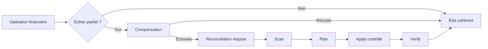

# Noyau financier — réconciliation

## Cycle d’incident



Le scan contrôle les agrégats document/paiement, totaux de lignes, statut et numérotation des documents, paiements suralloués ou remboursés de façon incohérente, allocations orphelines ou incompatibles, métadonnées de renversement, séquences en retard et journaux critiques manquants.

Seuls ces champs sont réparables automatiquement :

- `FinancialDocument.amountAllocatedMinor`, `balanceMinor`, `paymentStatus`;
- `FinancialPayment.allocatedAmountMinor`, `availableAmountMinor`.

Les lignes d’une facture émise, montants de paiement, devises, numéros, snapshots, allocations, séquences et journaux historiques ne sont jamais inventés ni réécrits. Ces anomalies restent `critical`, `repairable: false`. Une réparation ajoute `financial_reconciliation.repair_applied` avec anciennes/nouvelles valeurs, anomalie, raison et origine.

## CLI

```bash
npm run finance:reconcile -- --dry-run --domain=hotel --establishment=<id> --limit=500
npm run finance:reconcile -- --dry-run --document=<id>
npm run finance:reconcile -- --dry-run --payment=<id>
npm run finance:reconcile -- --apply --transactional --establishment=<id>
```

Le dry-run est le défaut. `--apply` est interdit en production sans `FINANCIAL_RECONCILIATION_ALLOW_PRODUCTION=true`. La sortie ne contient aucun snapshot client ou payeur. En incident : isoler l’établissement, sauvegarder, exécuter le scan, faire valider le plan, appliquer sur les seuls agrégats autorisés puis relancer `verify`. Un journal manquant est signalé mais jamais reconstruit avec un faux acteur ou horaire.

La validation finale couvre trois bases temporaires : base propre sans mutation, anomalie d'agrégat réparable avec dry-run/apply/verify et anomalie critique non réparable sans correction automatique. La campagne métier exécute `scan → plan → verify` sans `apply` et exige zéro anomalie.
