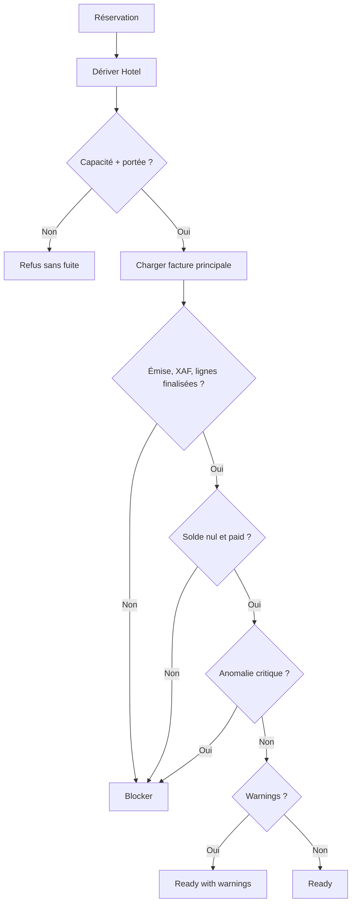

# Autorisation financière Hôtel et politique de check-out

## Contexte et portée

Cette note fige les décisions Pré-F2.1. Elle ne branche aucun contrôle au check-in ou au check-out. Le Financial Core est le seul noyau prévu pour les nouveaux parcours financiers hôteliers ; `Document`, `Paiement`, `PaiementTransaction`, `Transaction` et les paiements de visite restent propres à leurs domaines historiques.

## Rôles existants

`User.role` accepte : `User`, `Client`, `Proprietaire`, `Collaborateur`, `Secretaire`, `GestionnaireImmobilier`, `CommunityManager`, `Communicant`, `Admin` et `Prestataire`. La forme historique retenue est `Proprietaire`, sans accent.

Il n'existe pas encore d'affectation fine Staff → Hotel. La seule relation hôtel vérifiable est `Hotel.manager`. Dans F2, un gestionnaire rattaché désigne donc un `Collaborateur` ou une `Secretaire` dont l'identifiant correspond exactement à `Hotel.manager`. Un rôle seul ne confère jamais une portée sur un hôtel.

## Rôle, capacité et portée

Toute autorisation suit trois contrôles séparés :

1. rôle connu dans le registre central ;
2. capacité requise ;
3. portée globale Admin ou correspondance avec `Hotel.manager`.

L'établissement doit être dérivé du document, du paiement, de l'allocation ou de la réservation. Une valeur transmise par le client ne peut pas élargir la portée.

La source unique est `financialAuthorizationService.FINANCIAL_CAPABILITIES`, dont les identifiants sont exposés par `CAPABILITIES` :

- `financial.document.view`, `financial.document.draft.create`, `financial.document.draft.edit`, `financial.document.issue` ;
- `financial.payment.view`, `financial.payment.create`, `financial.payment.confirm`, `financial.payment.allocate` ;
- `financial.allocation.reverse` ;
- `financial.ledger.view` ;
- `financial.reconciliation.view`, `financial.reconciliation.run` ;
- `hotel.checkout.financial.view`, `hotel.checkout.financial.override`.

## Matrice F2 initiale

| Capacité | Admin | Gestionnaire rattaché | Propriétaire rattaché | Collaborateur non rattaché |
|---|---:|---:|---:|---:|
| Voir document | Oui | Oui | Oui | Non |
| Créer/éditer brouillon | Oui | Oui | Non | Non |
| Émettre document | Oui | Oui | Non | Non |
| Voir paiement | Oui | Oui | Oui | Non |
| Créer/confirmer paiement | Oui | Oui | Non | Non |
| Allouer paiement | Oui | Oui | Non | Non |
| Renverser allocation | Oui | Oui | Non | Non |
| Voir ledger | Oui | Oui | Oui, limité à l'hôtel | Non |
| Voir réconciliation | Oui | Oui | Oui, sans données confidentielles | Non |
| Lancer réconciliation | Oui | Non | Non | Non |
| Voir état financier du check-out | Oui | Oui | Oui | Non |
| Déroger au check-out | Oui | Non | Non | Non |

Admin possède une portée globale. `Proprietaire` est limité à la consultation, y compris lorsqu'il est `Hotel.manager`. Cette politique remplace l'autorisation implicite F1.1 de gérer un brouillon.

## Évaluation financière en lecture seule

`evaluateHotelCheckoutFinancialReadiness` dérive l'hôtel depuis `HotelReservation`, vérifie la portée, charge la facture principale, ses allocations et paiements, puis lance une analyse de cohérence ciblée. Il ne crée ni ne modifie aucune donnée.

Résultat stable :

```js
{
  allowed,
  status: 'ready' | 'warning' | 'blocked',
  blockers: [{ code, details? }],
  warnings: [{ code, details? }],
  info: [{ code, details? }],
  financialSnapshot: {
    reservationId, establishmentId, documentId, documentStatus,
    currency, totalMinor, paidMinor, balanceMinor, paymentStatus
  }
}
```

`allowed` vaut vrai si et seulement si `blockers.length === 0`. Un avertissement ne bloque jamais.

## Bloqueurs

| Code | Condition |
|---|---|
| `FINANCIAL_DOCUMENT_MISSING` | Aucune facture principale |
| `FINANCIAL_DOCUMENT_NOT_ISSUED` | Facture non émise |
| `FINANCIAL_BALANCE_REMAINING` | Solde différent de zéro |
| `FINANCIAL_PAYMENT_NOT_SETTLED` | Statut non payé ou paiement affecté non réussi |
| `FINANCIAL_ALLOCATION_INCONSISTENT` | Allocation, paiement, domaine, devise ou établissement incohérent |
| `FINANCIAL_RECONCILIATION_CRITICAL` | Anomalie critique détectée |
| `FINANCIAL_LINES_NOT_FINALIZED` | `metadata.linesFinalized` vaut explicitement `false` |
| `FINANCIAL_CURRENCY_UNSUPPORTED` | Devise différente de XAF |

L'absence du marqueur `linesFinalized` ne bloque pas les documents F1 existants. F2.1 devra poser explicitement ce marqueur sur ses brouillons.

## Avertissements et informations

- `UNALLOCATED_CONFIRMED_PAYMENT` : paiement réussi lié à la réservation avec un disponible non alloué ;
- `UNMATCHED_PAYMENT_REQUIRES_REVIEW` : réservé à un futur rapprochement fournisseur ;
- `FINANCIAL_RECONCILIATION_WARNING` : anomalie non critique ;
- `FINANCIAL_DOCUMENT_PAID`, `FINANCIAL_ZERO_BALANCE`, `FINANCIAL_NO_ANOMALY`, `FINANCIAL_NO_UNALLOCATED_PAYMENT` : informations neutres.

## Restriction XAF

F2 Hôtel accepte uniquement XAF. Toute autre devise produit `FINANCIAL_CURRENCY_UNSUPPORTED`. Aucun change ou conversion implicite n'est réalisé. Le support générique EUR/USD du Financial Core n'est pas modifié.

## Dérogation future

La capacité `hotel.checkout.financial.override` appartient uniquement à Admin. F2.3 pourra écrire un événement append-only `hotel_checkout.financial_override` contenant : `reservationId`, `financialDocumentId`, `establishmentId`, `actorId`, `actorRole`, `reason`, `ticketReference` facultative, `balanceMinor`, `currency`, `blockerCodes` et `createdAt`.

La justification sera obligatoire. Une dérogation ne modifiera jamais artificiellement un solde, une allocation ou un statut de paiement. Aucun événement n'est écrit pendant Pré-F2.1.

## Concurrence et responsabilités futures

Pré-F2.1 fournit un instantané en lecture seule, sans garantie transactionnelle de check-out. F2.1 créera les brouillons sans brancher cette décision. F2.3 devra refaire l'évaluation dans la frontière atomique immédiatement avant les mutations du check-out.

Le futur RBAC Staff → Hotel devra remplacer la convention `Hotel.manager` sans changer les identifiants de capacités.


