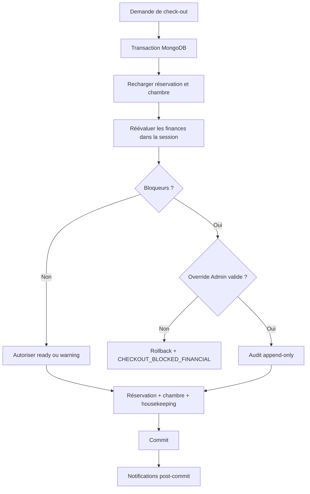

# Contrôle financier du check-out hôtelier — F2.3

## Objectif et périmètre

F2.3 branche `evaluateHotelCheckoutFinancialReadiness` dans le check-out réel. Il bloque toute clôture présentant un bloqueur financier et autorise une dérogation uniquement à un Admin, avec justification et audit append-only. PDF, emails, dashboard financier, remboursements, avoirs et fournisseurs externes restent exclus.

## Audit du parcours antérieur

Le flux Sprint D exécutait successivement libération de l’affectation, passage de la chambre à `cleaning`, création du housekeeping, sauvegarde de la réservation puis notification. Ces opérations n’étaient pas transactionnelles : une erreur après la libération pouvait laisser une chambre ou une tâche sans réservation clôturée. F2.3 place les mutations MongoDB critiques dans une transaction et reporte les notifications après commit.

## Évaluation et calculs

L’évaluateur recharge, avec la session transmise, réservation, facture principale, allocations actives et renversées, paiements associés, paiements confirmés non alloués et réconciliation. Il ne réalise aucune mutation.

```text
allocatedMinor = somme(allocations actives valides)
balanceMinor = documentTotalMinor - allocatedMinor
allowed = blockers.length === 0
```

Le snapshot expose total, alloué, solde, paiements confirmés, montant confirmé non alloué, nombres d’allocations actives/renversées, statut et devise. Un paiement confirmé non alloué ne solde jamais la facture.

## Bloqueurs

- `FINANCIAL_DOCUMENT_MISSING` : aucune facture principale.
- `FINANCIAL_DOCUMENT_NOT_ISSUED` : facture non émise.
- `FINANCIAL_BALANCE_REMAINING` : solde strictement positif.
- `FINANCIAL_PAYMENT_NOT_SETTLED` : statut dérivé incompatible.
- `FINANCIAL_ALLOCATION_INCONSISTENT` : allocation ou agrégat incohérent.
- `FINANCIAL_RECONCILIATION_CRITICAL` : anomalie critique.
- `FINANCIAL_LINES_NOT_FINALIZED` : lignes non finalisées.
- `FINANCIAL_CURRENCY_UNSUPPORTED` : devise différente de XAF.

## Avertissements

- `UNALLOCATED_CONFIRMED_PAYMENT`
- `UNMATCHED_PAYMENT_REQUIRES_REVIEW`
- `FINANCIAL_RECONCILIATION_WARNING`

Les avertissements seuls donnent `status: warning` et n’interdisent pas le départ.

## Intégration transactionnelle

La requête réelle recharge la réservation `checked_in`, réévalue les finances dans la transaction, décide de l’override, libère l’affectation, passe la chambre à `cleaning`, crée ou récupère la tâche ouverte, clôture la réservation et écrit l’audit obligatoire. Le commit précède toutes les notifications. Le filtre `status: checked_in`, la version Mongoose et les index uniques empêchent double clôture et double housekeeping.

Un blocage sans override retourne HTTP 409 :

```text
CHECKOUT_BLOCKED_FINANCIAL
```

La réponse inclut la projection actuelle `financialReadiness`. Le frontend doit la rafraîchir car la prévisualisation n’est jamais une autorisation.

## Dérogation Admin

Structure acceptée :

```json
{ "financialOverride": { "requested": true, "reason": "...", "ticket": "..." } }
```

La raison contient 10 à 1000 caractères; le ticket facultatif est plafonné à 100. Le registre central et le rôle `Admin` sont vérifiés. Gestionnaire et propriétaire ne peuvent pas déroger.

L’événement `hotel_checkout.financial_override` est écrit dans le ledger financier append-only dans la même transaction. Il conserve acteur, rôle, réservation, hôtel, chambre, facture, snapshot, codes de bloqueurs/avertissements, raison, ticket et dates. Son échec annule le check-out. Il ne modifie jamais paiement, allocation, facture, solde ou réconciliation.

## Housekeeping et effets post-commit

Un check-out bloqué ne modifie ni affectation, ni chambre, ni réservation et ne crée aucune tâche. Après autorisation, la chambre devient `cleaning` et une seule tâche `checkout_cleaning` ouverte existe. Notifications client et housekeeping sont envoyées après commit; leur échec est journalisé sans annuler la clôture.

## Autorisations et interface

`GET /api/hotel-reservations/:id/checkout-financial-readiness` applique authentification, accès réservation et capacité financière. Le check-out réévalue toujours côté serveur.

L’interface affiche `ready`, `warning`, `blocked`, total, alloué, solde, bloqueurs et avertissements. Le bouton est désactivé pour un blocage sans capacité. Un Admin peut confirmer une dérogation et saisir sa justification. Une réponse obsolète `CHECKOUT_BLOCKED_FINANCIAL` rafraîchit l’état sans mutation optimiste.

## Idempotence, concurrence et limites

Les tests Replica Set couvrent blocage sans mutation, override atomique et deux check-outs concurrents. Une seule clôture, tâche et écriture d’override persistent. La dette demeure visible après override.

F2.4 (PDF/email), F2.5 (dashboard), remboursements/avoirs, fournisseurs externes et RBAC Staff→Hotel fin sont reportés.


