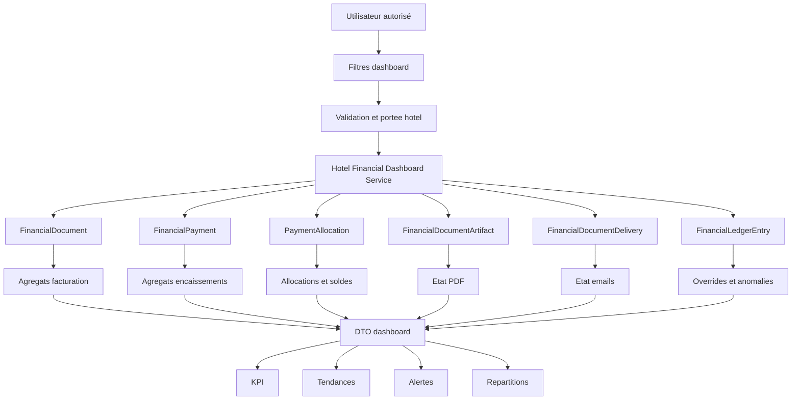

# F2.5 — Dashboard financier hôtelier

## 1. Objectif

Fournir une vue de pilotage lecture seule de la situation financière hôtelière (facturé, encaissé, alloué, restant dû, anomalies) pour les utilisateurs autorisés. Le dashboard **lit et agrège** le Financial Core ; il ne recrée aucune règle métier et ne modifie aucune donnée.

## 2. Périmètre

Inclus : KPI de synthèse, tendances temporelles, répartitions, alertes opérationnelles paginées, vieillissement des créances, dérogations de check-out, état PDF/email.
Exclus (hors périmètre strict F2.5, voir §23) : remboursements, avoirs, comptabilité générale, rapprochement bancaire, fiscalité, export BI, RBAC Staff→Hotel complet, F2.6+. L'export CSV décrit en option par la spécification n'a pas été implémenté dans cette itération (non bloquant, voir §22).

## 3. Sources de données

Exclusivement en lecture : `FinancialDocument`, `FinancialPayment`, `PaymentAllocation`, `FinancialLedgerEntry` (event `hotel_checkout.financial_override` déjà tracé par F2.3), `FinancialDocumentArtifact`, `FinancialDocumentDelivery`, `HotelReservation` (jointure limitée pour le check-out bloqué). Aucun nouveau modèle créé. Le service de réconciliation existant (`financialReconciliationService.scanFinancialConsistency`) est réutilisé tel quel pour les anomalies — aucune définition concurrente n'a été inventée.

## 4. Définitions officielles des KPI

| KPI | Définition | Champ/source |
|---|---|---|
| CA facturé | Somme `totalMinor` des documents hôteliers `issued` dont `issueDate` est dans la période | `FinancialDocument.totalMinor` |
| Encaissements confirmés | Somme `amountMinor` des paiements `succeeded` dont `confirmedAt` est dans la période | `FinancialPayment.amountMinor` |
| Montants alloués | Somme `amountMinor` des allocations `active` dont `allocatedAt` est dans la période | `PaymentAllocation.amountMinor` |
| Solde restant à recevoir | Somme des `balanceMinor` **positifs** des documents `issued` de la période (jamais compensé entre documents) | `FinancialDocument.balanceMinor` |
| Paiements confirmés non alloués | Somme `availableAmountMinor` des paiements `succeeded` de la période — KPI séparé, jamais mélangé au solde restant | `FinancialPayment.availableAmountMinor` |
| Facture soldée / partielle / impayée | `balanceMinor===0` / (`amountAllocatedMinor>0` et `balanceMinor>0`) / (`amountAllocatedMinor===0` et `balanceMinor>0`) | `FinancialDocument` |
| Anomalies financières | Résultat de `scanFinancialConsistency` (aucune redéfinition) | service existant |

Note de conception : `totals.allocatedMinor` (flux d'allocations de la période, source `PaymentAllocation.allocatedAt`) et `totals.outstandingMinor` (état courant du solde des documents émis dans la période, source `FinancialDocument.balanceMinor`) répondent à deux questions différentes (flux vs état) et ne doivent jamais être combinés en un seul indicateur.

## 5. Périodes et dates

Chaque KPI précise sa date de référence (voir tableau §4). Timezone de référence : `Africa/Brazzaville`, exposée dans chaque réponse (`period.timezone`). Période par défaut : 30 jours glissants. Plage maximale : 366 jours (`FINANCIAL_DASHBOARD_PERIOD_TOO_LARGE`). Le vieillissement des créances (§15) n'utilise pas de plage de dates : il porte sur l'état courant des documents impayés, avec `issueDate` comme point de départ (`dueDate` n'étant pas fiabilisé dans ce sprint).

## 6. Devise

Limité à XAF. Toute devise non-XAF détectée dans le périmètre hôtelier est comptée séparément (`documents.nonXafExcludedCount`), exclue des totaux agrégés, et fait passer `dataStatus` à `warning` au minimum — jamais agrégée silencieusement.

## 7. Architecture backend

```
server/services/finance/hotelFinancialDashboardService.js   → agrégations MongoDB, validation des filtres (fonction pure testée isolément), DTO
server/controllers/hotelFinancialDashboardController.js      → 5 handlers fins (aucune logique métier)
server/routes/financialRoutes.js                             → 5 routes GET montées sous /api/financial/hotel/dashboard/*
```

Le contrôleur ne fait que : valider les filtres → appeler le service → répondre. Toute la logique d'agrégation, de portée hôtel et de définition des KPI vit dans le service, testable isolément.

## 8. Endpoints

| Méthode | Chemin | Filtres | Permission |
|---|---|---|---|
| GET | `/api/financial/hotel/dashboard/summary` | hotelId, dateFrom, dateTo | `financial.hotel.dashboard.view` |
| GET | `/api/financial/hotel/dashboard/trends` | + granularity | idem |
| GET | `/api/financial/hotel/dashboard/breakdown` | + dimension (hotel\|status\|paymentMethod\|documentType\|currency) | idem |
| GET | `/api/financial/hotel/dashboard/aging` | hotelId | idem |
| GET | `/api/financial/hotel/dashboard/alerts` | + page, limit | `financial.hotel.dashboard.alerts.view` |

Réponses : `{ status: 'success', data: { filters, summary|trends|breakdown|aging|alerts, pagination? } }`. Erreurs via `FinancialError` existant (`fail()`), codes dédiés : `FINANCIAL_DASHBOARD_FILTER_INVALID`, `FINANCIAL_DASHBOARD_PERIOD_TOO_LARGE`, `FINANCIAL_DASHBOARD_ACCESS_DENIED`.

## 9. Filtres

`hotelId` (ObjectId valide), `dateFrom`/`dateTo` (ISO, `dateFrom<=dateTo`, plage ≤366 jours), `documentStatus`/`paymentStatus`/`deliveryStatus` (valeurs des enums existants), `granularity` (`day|week|month`, auto-choisie sinon), `page`/`limit` (clamp 1..100), `search` (échappé regex, tronqué à 100 caractères). Toute valeur invalide est rejetée explicitement (aucune valeur par défaut silencieuse en cas d'erreur de saisie).

## 10. Autorisations

Nouvelles capacités ajoutées à `financialAuthorizationService.js` : `DASHBOARD_VIEW`, `DASHBOARD_ALERTS_VIEW` (Admin, Collaborateur, Secretaire, Proprietaire), `DASHBOARD_OVERRIDE_AUDIT_VIEW` (Admin uniquement — les détails d'override restent restreints, §16). Aucune capacité d'export créée (aucun export implémenté).

## 11. Isolation hôtel

`assertFinancialDashboardScope(user, capability, hotelId)` : si `hotelId` fourni, réutilise `assertFinancialScope` (capacité + `Hotel.manager===user` sauf Admin) — mêmes règles que tous les autres endpoints financiers. Si `hotelId` omis, seul `Admin` peut obtenir une consolidation globale ; tout autre rôle reçoit `FINANCIAL_DASHBOARD_ACCESS_DENIED`. Testé explicitement (isolation croisée hôtel A/B, manager étranger rejeté, manager sans hotelId rejeté).

## 12. Agrégations

Pipelines `$match` (scope + période) → `$group` (sommes conditionnelles `$cond`) exclusivement, sans `$lookup` non borné. Le seul `$lookup` (check-out bloqué, vers `hotelreservations`) est appliqué après un `$match` réduisant déjà l'ensemble aux documents `issued` à solde positif — jamais sur l'ensemble complet des réservations.

## 13. Tendances

Granularité `day|week|month` via `$dateTrunc`. Les points sans activité sont représentés (valeurs à 0) pour la lisibilité des séries, jusqu'à `MAX_TREND_POINTS=400`.

## 14. Alertes

Sévérités `critical|warning|info`. Sources : factures à solde restant, paiements confirmés non alloués, emails échoués/incertains, documents sans PDF, anomalies de réconciliation (si hôtel scope unique), dérogations de check-out récentes. Tri stable (`severity desc, createdAt desc, entityId`) puis pagination en mémoire — limitation connue documentée en §22 (pas de curseur DB natif cross-sources dans cette première itération).

## 15. Vieillissement

Buckets `0_7 | 8_30 | 31_60 | 61_90 | over_90`, calculés depuis `issueDate` sur les documents `issued` à solde positif, tous hôtels du scope confondus.

## 16. PDF et emails / Overrides

PDF/email : comptages depuis les métadonnées déjà persistées (`FinancialDocumentArtifact.status`, `FinancialDocumentDelivery.status`) — aucune vérification binaire Cloudinary déclenchée par le dashboard. Overrides : comptés depuis `FinancialLedgerEntry` (`eventType: hotel_checkout.financial_override`, déjà écrit par F2.3), aucun nouveau modèle d'override créé. Le check-out « bloqué » est une **projection légère** (réservations `checked_in` dont le document émis a un solde positif) et non une ré-exécution de `hotelCheckoutFinancialReadinessService` par réservation (coût N+1 explicitement évité, voir §20).

## 17. Interface web

`client/app/dashboard/hotel-finance/page.jsx` → `client/lib/pages/dashboard/HotelFinanceDashboardPage.jsx`. Sections : filtres (hôtel, période, raccourcis), cartes KPI, tendances (recharts `LineChart`, bibliothèque déjà installée), répartition par statut (`BarChart`), vieillissement (tableau), alertes paginées. États gérés : chargement, succès, vide (« Aucune anomalie financière détectée. », etc.), erreur (403 → message dédié), partiel (`Promise.allSettled`, une section en échec n'empêche pas l'affichage des autres).

## 18. Performance

Agrégations `$match` précoce + `$group`, aucune boucle de requêtes par document. Anomalies (`scanFinancialConsistency`) uniquement calculées en scope hôtel unique — en consolidation globale (`hotelId` omis), `dataStatus` est explicitement `unavailable` plutôt que de lancer un scan non borné sur tous les hôtels. Toutes les listes (alertes) sont plafonnées et paginées.

## 19. Index

Aucun nouvel index ajouté dans cette itération : les agrégations s'appuient sur les index existants (`{domain,establishmentId,status}` sur `FinancialDocument`, `{establishmentId,occurredAt:-1}` sur `FinancialLedgerEntry`). Limite connue : pas d'index composé incluant `issueDate`/`confirmedAt`/`allocatedAt` — acceptable au volume actuel, à revisiter si le volume de documents par hôtel croît significativement (voir §22).

## 20. Tests

- Unitaires (`server/__tests__/hotelFinancialDashboardService.test.js`, 17 tests) : validation pure des filtres (dates, hotelId, statuts, granularité, pagination, échappement de recherche), sans dépendance MongoDB.
- MongoDB Replica Set (`server/__tests__/hotelFinancialDashboardF25.mongo.integration.test.js`, 10 tests, `--runInBand` via `test:mongo`) : agrégations réelles multi-hôtels, allocations actives/renversées, surplus séparé, anomalies via réconciliation, devise non-XAF, vieillissement, overrides/check-out bloqué, pagination stable des alertes, absence de mutation sous lecture concurrente, tendances avec périodes vides.
- Frontend (`client/lib/__tests__/HotelFinanceDashboardPage.test.jsx`, 7 tests) : KPI, état vide, erreur 403, état partiel, pagination des alertes, filtres (période, hôtel).

## 21. Limites

Bloquantes pour F2.5 : aucune.
Non bloquantes : pas d'export CSV ; anomalies indisponibles en vue consolidée multi-hôtels (par conception, pour éviter un scan non borné) ; pagination des alertes en mémoire plutôt qu'un curseur DB unique cross-sources ; check-out bloqué est une projection basée sur le solde, pas une ré-évaluation complète des règles de check-out F2.3.
Reportées à un sprint ultérieur : index composés dédiés si le volume l'exige, export CSV si le besoin est confirmé, sélecteur d'hôtel enrichi (liste réelle plutôt que saisie d'identifiant).

## 22. Exclusions

Voir §2. Aucune fonctionnalité de remboursement, avoir, comptabilité générale, rapprochement bancaire, fiscalité ou export BI n'a été commencée.

## 23. Diagramme


