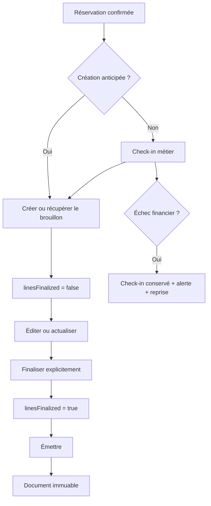

# Facturation hôtelière — Sprint F2.1

## Objectif et périmètre

F2.1 relie les réservations hôtelières au Financial Core. Il couvre le brouillon, ses lignes, leur finalisation, l'émission et une interface web minimale. Paiements, allocations, contrôle du check-out, PDF, emails et dashboard financier restent hors périmètre.

## Workflow

## Source tarifaire et XAF

La source unique est le snapshot persistant de `HotelReservation` : prix unitaire, quantité, sous-total, taxes, frais, remise, total, devise et `rateSnapshot`. Aucun `RatePlan` courant et aucune valeur financière du client ne sont utilisés à la création ou à l'actualisation.

Un snapshot incomplet produit `FINANCIAL_RESERVATION_SNAPSHOT_INCOMPLETE`. F2 Hôtel accepte uniquement XAF et retourne `FINANCIAL_CURRENCY_UNSUPPORTED` sans conversion. Les devises génériques du Financial Core restent disponibles hors parcours F2 Hôtel.

## Création manuelle et idempotence

`POST /api/financial/hotel/reservations/:reservationId/invoice-draft` accepte uniquement les réservations `confirmed` ou `checked_in`. L'hôtel, le client, la devise, les montants et les lignes sont dérivés côté serveur.

La clé unique reste `hotel-reservation-primary-invoice:<reservationId>`. La création séquentielle ou concurrente récupère le même document. La réponse vaut 201 lors de la création et 200 lors d'une récupération idempotente.

## Création automatique au check-in

L'architecture retient l'option B : `performCheckIn` termine le check-in et ses effets métier, puis crée ou récupère le brouillon avec la même clé. Le contrat historique `{ reservation, room }` est conservé et reçoit un champ additif `financialDocument`.

En cas d'échec financier :

- le check-in reste réussi ;
- `financialDocument.status` vaut `creation_failed` ;
- `retryable` vaut vrai ;
- l'erreur est journalisée sans stack dans la réponse ;
- le staff reçoit une alerte opérationnelle ;
- le client n'est pas notifié du problème interne ;
- la route manuelle permet une reprise idempotente.

## Métadonnées et détection d'actualisation

Le document stocke notamment `source=hotel_reservation`, `creationSource`, `linesFinalized`, `reservationUpdatedAt`, `sourceSnapshotHash` et, lorsqu'elle existe, la version du snapshot tarifaire.

La réservation n'actualise jamais silencieusement le brouillon. Le hash du snapshot permet de comparer les versions sans dépendre des tarifs courants. `POST /api/financial/documents/:documentId/refresh-from-reservation` reconstruit explicitement les lignes et remet la finalisation à faux.

## Politique `linesFinalized`

| Action | Valeur résultante |
|---|---:|
| Création | `false` |
| Modification financière | `false` |
| Actualisation | `false` |
| Finalisation explicite | `true` |
| Nouvelle modification | `false` |
| Émission | exige `true` |

Les champs financiers sont : quantité, prix unitaire, remise, taxes, frais, type de ligne et toute opération ajoutant ou supprimant une ligne. Le serveur dérive toujours `sourceType` et `sourceId` du document afin d'empêcher une falsification inter-entités.

La finalisation recalcule les lignes, compare tous les agrégats, exige au moins une ligne, un brouillon et XAF, puis utilise un compare-and-set. Elle est idempotente et écrit `financial_document.lines_finalized` une seule fois.

Une modification écrit `financial_document.draft_updated` et, si nécessaire, `financial_document.lines_finalization_invalidated`. Une actualisation écrit `financial_document.refreshed_from_reservation`.

## Émission et immutabilité

L'émission d'une facture issue de réservation exige : brouillon, XAF, lignes finalisées, réservation existante, statut compatible et hôtel identique. Sinon elle retourne un code stable, notamment `FINANCIAL_DOCUMENT_LINES_NOT_FINALIZED`, `FINANCIAL_DOCUMENT_IMMUTABLE`, `FINANCIAL_RESERVATION_CHANGED` ou `FINANCIAL_ESTABLISHMENT_MISMATCH`.

Après émission, les services de modification, finalisation et actualisation refusent l'opération. Aucun recalcul depuis la réservation n'est effectué.

## Annulation

Une réservation annulée ne peut pas produire ni émettre une facture. Un document déjà émis reste immuable et nécessitera ultérieurement le processus d'avoir/document correctif, hors F2.1. Aucune cascade destructive n'est ajoutée.

## Autorisations et isolation

Les routes utilisent exclusivement `FINANCIAL_CAPABILITIES` puis la portée `Hotel.manager` :

- Admin : portée globale, création, édition, finalisation, émission et lecture ;
- Collaborateur/Secretaire rattaché : mêmes actions sur son hôtel uniquement ;
- Proprietaire rattaché : lecture uniquement ;
- collaborateur non rattaché : aucun accès.

L'établissement provient toujours de la réservation ou du document. Les paramètres client ne peuvent pas élargir la portée.

## API de consultation

- `GET /api/financial/hotel/reservations/:reservationId/document` retourne la facture principale ou `document: null` ;
- `GET /api/financial/hotel/:hotelId/documents` fournit une liste paginée, filtrable par statut, dates, réservation, client et numéro ;
- les réponses exposent des projections financières, sans identifiants d'acteurs ni métadonnées sensibles.

## Interface web

Le panneau minimal affiche absence de document, brouillon non finalisé, brouillon finalisé, document émis et lecture seule. Selon les droits et l'état, il propose création anticipée, modification, actualisation, finalisation et émission. Le bouton d'émission reste désactivé avant finalisation.

## Concurrence et ledger

L'index métier et les transactions existantes empêchent les doubles créations et doubles émissions. La finalisation emploie un compare-and-set sur le document. Les conflits ne sont pas masqués et renvoient `FINANCIAL_DOCUMENT_STATE_CHANGED` ou les erreurs de transition existantes.

L'évaluation d'actualisation et l'édition restent propres au brouillon. Les événements utilisent exclusivement `FinancialLedgerEntry`, append-only.

## Compatibilité

Les réponses check-in conservent leurs champs historiques. Aucune route mobile ou immobilière n'est modifiée. Aucun fichier `altimmo-app/` n'est modifié. Housekeeping, inventaire et notifications existantes conservent leur ordre métier.

## Exclusions

- F2.2 : paiement, confirmation, allocation et renversement ;
- F2.3 : blocage financier du check-out et dérogation réelle ;
- F2.4 : PDF, téléchargement et email ;
- F2.5 : dashboard et statistiques ;
- futur RBAC : affectation Staff → Hotel plus fine que `Hotel.manager`.
