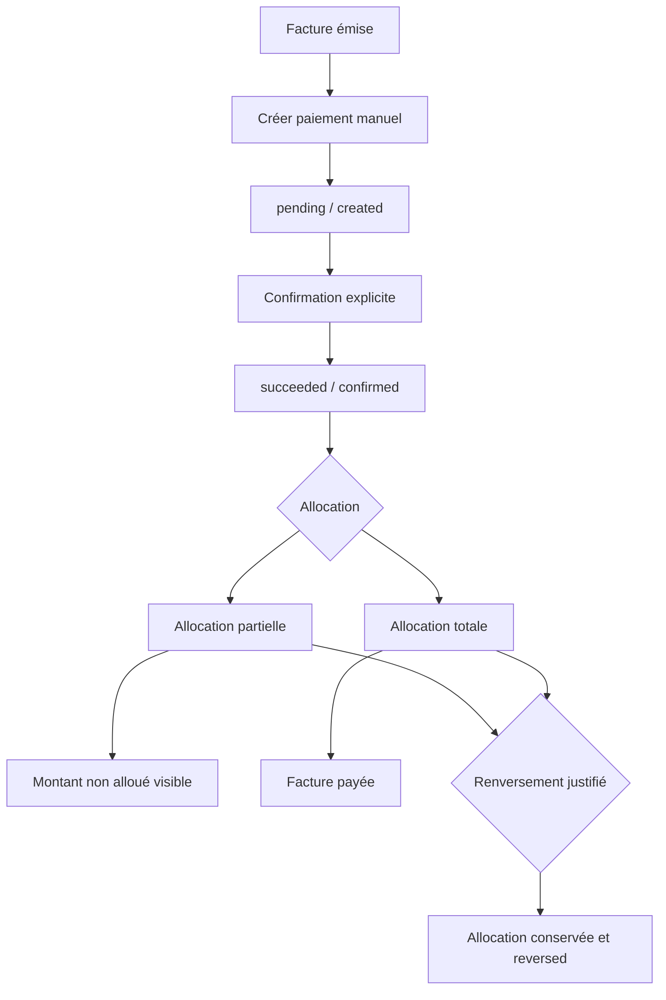

# Encaissements hôteliers — F2.2

## Objectif et périmètre

F2.2 fait de `FinancialPayment` et `PaymentAllocation` l’unique parcours des nouveaux encaissements hôteliers. Il couvre création manuelle, confirmation explicite, allocation partielle ou totale, montants non alloués et renversement append-only. Le check-out réel, les PDF, emails, remboursements, avoirs, fournisseurs externes et le dashboard F2.5 sont exclus.

## Stratégie legacy

`Paiement`, `PaiementTransaction`, `Transaction`, les paiements de visite et les paiements locatifs restent inchangés dans leurs domaines. Il n’existe ni migration, ni double-write, ni suppression. L’application mobile ne consomme pas le nouveau parcours et n’est pas modifiée.

## Cycle de vie et création

Le vocabulaire historique du Core est conservé : `pending` correspond à *created* et `succeeded` à *confirmed*. `failed` et `cancelled` ne sont pas allouables. La route hôtelière dérive hôtel, réservation, client, document, domaine et devise depuis la facture émise et la réservation persistées. XAF est obligatoire. Le client ne choisit ni hôtel, ni client, ni domaine, ni acteur de confirmation.

`POST /api/financial/hotel/payments` exige une clé `Idempotency-Key`. Le hash du payload détecte la réutilisation contradictoire. Les méthodes contrôlées sont `cash`, `bank_transfer`, `card`, `mobile_money`, `cheque` et `other`; une référence est obligatoire hors espèces et `other`. `mobile_money` reste une saisie manuelle sans fournisseur ni webhook.

## Confirmation et immutabilité

`POST /api/financial/payments/:paymentId/confirm` effectue la transition atomique `pending → succeeded`. L’opération est idempotente et journalisée une seule fois. Après confirmation, montant, devise, hôtel, client et référence ne sont pas modifiés par les API F2.2.

## Allocation, paiements partiels et multiples

`POST /api/financial/payments/:paymentId/allocations` n’accepte qu’un paiement confirmé et une facture émise du même hôtel, de la même réservation et en XAF. F2.2 limite volontairement un paiement hôtelier à sa facture cible. Plusieurs paiements peuvent néanmoins solder la même facture.

Calculs centralisés en unités mineures entières sûres :

```text
paymentAvailableMinor = amountMinor - somme(allocations actives)
documentBalanceMinor = totalMinor - somme(allocations actives)
0 alloué                 → unpaid
0 < alloué < total       → partially_paid
alloué == total          → paid
```

La réservation atomique par compare-and-set porte simultanément sur `availableAmountMinor` et `balanceMinor`, dans une transaction MongoDB quand elle est disponible. Une surallocation produit `FINANCIAL_PAYMENT_OVERALLOCATION`; un surpaiement produit `FINANCIAL_DOCUMENT_OVERPAYMENT`. Un surplus confirmé reste non alloué et visible; l’évaluateur de check-out l’expose sous `UNALLOCATED_CONFIRMED_PAYMENT`.

## Renversement

`POST /api/financial/hotel/allocations/:allocationId/reverse` exige une justification et une clé d’idempotence. L’allocation originale n’est jamais supprimée : elle passe à `reversed`, conserve acteur, date et motif, puis restitue transactionnellement le disponible du paiement et le solde de la facture. Une répétition identique est idempotente; une répétition contradictoire produit `FINANCIAL_ALLOCATION_ALREADY_REVERSED`.

## Consultation et autorisations

Routes paginées, limite maximale 100 :

- `GET /api/financial/hotel/:hotelId/payments`
- `GET /api/financial/hotel/reservations/:reservationId/payments`
- `GET /api/financial/documents/:documentId/payments`
- `GET /api/financial/payments/:paymentId`

Le registre central applique capacité et portée hôtel. Admin agit globalement; le gestionnaire désigné par `Hotel.manager` consulte et mute; un compte `Proprietaire` dispose des capacités de lecture seulement; un collaborateur non rattaché est refusé. Les réponses projettent les champs sûrs et n’exposent ni hash, ni clé d’idempotence, ni métadonnées fournisseur.

## Ledger

Le ledger existant reste unique et append-only. F2.2 écrit `payment.created`, `payment.confirmed`, `payment.allocated` et `payment.allocation_reversed`, avec entités liées, hôtel, réservation, facture, acteur, montant, devise, méthode et référence sûre. Les index uniques empêchent les doublons métier.

## Interface web et check-out futur

Le panneau de facture émise affiche paiements, statut, méthode, référence, montant alloué, disponible, solde et allocations. Le gestionnaire peut créer, confirmer, allouer et renverser avec justification; la vue propriétaire reste en lecture seule. Aucun dashboard global n’est créé.

Les agrégats produits sont déjà lisibles par `hotelCheckoutFinancialReadinessService` : facture payée ou partielle, allocation active ou renversée et paiement confirmé non alloué. F2.2 ne branche pas cet évaluateur au check-out réel.



## Exclusions reportées

- F2.3 : blocage et dérogation du check-out.
- F2.4 : PDF, email et historique d’envoi.
- F2.5 : dashboard, graphiques, exports et statistiques.
- Futurs sprints : remboursements, avoirs, crédits, rapprochement, fournisseurs externes et RBAC Staff→Hotel fin.
