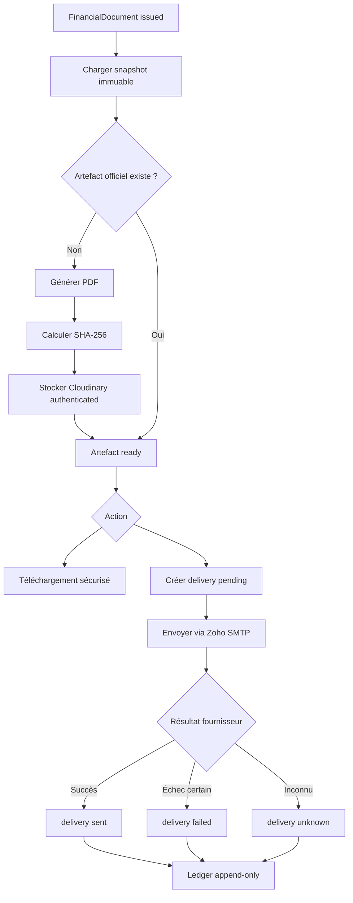

# F2.4 — PDF officiel et envoi de facture hôtelière

## 1. Objectif et périmètre

F2.4 produit la représentation PDF officielle d'une facture hôtelière émise, la conserve dans un stockage privé, la télécharge après une nouvelle autorisation et l'envoie par Zoho SMTP avec un historique persistant. Il ne crée ni reçu, ni état de paiement, ni dashboard F2.5.

## 2. Source immuable

Le rendu charge exclusivement `FinancialDocument` et ses `FinancialDocumentLine` finalisées. Les snapshots `customer` et `seller`, la référence de réservation, la période de service, le numéro, la date d'émission et les totaux ont été persistés avant ou pendant l'émission F2.1. Le service ne lit jamais `HotelReservation`, `Hotel`, `RatePlan` ou `User` pour reconstruire le contenu. Le paiement et le solde courant ne figurent pas dans la facture officielle.

## 3. Conditions de génération

Le document doit être hôtelier, `issued`, en XAF, numéroté, daté, avec `metadata.linesFinalized=true`, au moins une ligne et des totaux exactement égaux à la somme des lignes. Un brouillon retourne `FINANCIAL_DOCUMENT_NOT_ISSUED`. Les snapshots incomplets ou incohérents retournent `FINANCIAL_PDF_GENERATION_FAILED`.

## 4. Contenu, déterminisme et version

Le modèle `hotel-invoice-v1` contient l'émetteur figé, la facture, le client facturé, la réservation, le séjour, les lignes et les totaux immuables. Les lignes sont triées par `lineNumber`; espaces, dates UTC, champs absents et nombres sont normalisés. PDFKit reçoit les dates d'émission comme métadonnées fixes et aucune valeur aléatoire ou date de téléchargement. Deux rendus du même snapshot et de la même version produisent le même SHA-256.

## 5. Artefact, stockage et intégrité

`FinancialDocumentArtifact` conserve le document source, l'hôtel, la réservation, le type, la version, le hash du snapshot, le statut (`pending`, `ready`, `failed`, `superseded`), SHA-256, MIME, taille, générateur, auteur et référence Cloudinary. La clé interne est exclue des lectures ordinaires.

Cloudinary utilise `resource_type=raw` et `type=authenticated`. Aucune URL permanente n'est retournée au client. Le backend fabrique une URL signée de très courte durée uniquement pour récupérer le binaire, puis vérifie taille et SHA-256 avant téléchargement ou envoi. La limite est 10 Mio. Un artefact défaillant reste historisé et n'est jamais téléchargeable.

## 6. Génération idempotente et concurrence

`POST /api/financial/documents/:documentId/pdf` exige `Idempotency-Key`. Un index unique protège la clé et un index actif unique protège `(document, type, version, snapshotHash)`. Le premier appel crée `pending`; les concurrents attendent le même résultat. Un changement de contexte avec la même clé retourne `FINANCIAL_IDEMPOTENCY_CONFLICT`. Le stockage n'est appelé qu'une fois et le passage `pending→ready` est compare-and-set.

## 7. Téléchargement sécurisé

`GET /api/financial/documents/:documentId/pdf/download` revérifie JWT, capacité, portée `Hotel.manager` et relation document-hôtel. Le serveur streame le binaire avec `application/pdf`, `Content-Disposition: attachment`, `Cache-Control: private, no-store` et `nosniff`. Un fichier absent, non prêt ou corrompu est refusé. Aucun identifiant d'artefact fourni par le client n'est accepté.

## 8. Autorisations

Les capacités centrales sont :

- `financial.document.pdf.generate` ;
- `financial.document.pdf.download` ;
- `financial.document.email.send` ;
- `financial.document.delivery.view`.

Admin et gestionnaire réellement rattaché via `Hotel.manager` peuvent générer, télécharger, envoyer et voir l'historique. Un collaborateur non rattaché est refusé. Le rôle propriétaire conserve les capacités de lecture, mais la politique de portée existante ne lui ouvre pas un hôtel sans relation `Hotel.manager`; aucun nouveau portail client ni RBAC Staff→Hotel n'est introduit.

## 9. Destinataire et email transactionnel

`POST /api/financial/documents/:documentId/email` exige une clé d'idempotence. Le destinataire par défaut est `FinancialDocument.customer.email`, donc l'adresse facturée figée. Admin ou gestionnaire autorisé peut saisir une adresse alternative unique, validée et journalisée. Le message complémentaire est du texte nettoyé limité à 500 caractères.

L'objet, le corps HTML et le texte sont construits côté serveur. Zoho SMTP reçoit le PDF en pièce jointe avec un `Message-ID` déterministe par delivery. Le hash de la pièce jointe est celui conservé sur l'artefact.

## 10. Historique append-only et reprise

`FinancialDocumentDelivery` est créé `pending` avant l'appel SMTP. Il conserve document, hôtel, réservation, artefact/hash/version, destinataire, sujet, fournisseur, acteur, corrélation et résultat. Une tentative terminale n'est jamais réouverte : une reprise réelle utilise une nouvelle clé et crée une nouvelle ligne. Les suppressions sont bloquées.

Même clé et même payload retournent le même résultat logique; même clé et payload différent retourne un conflit. Un rejet certain devient `failed`. Un timeout, reset de socket ou résultat fournisseur ambigu devient `delivery_unknown`; il n'est jamais réenvoyé automatiquement. SMTP ne permet pas de promettre un exactly-once absolu, mais la persistance préalable, la clé unique et le `Message-ID` limitent les doublons.

## 11. Ledger et observabilité

Le ledger append-only reçoit : `pdf_generation_requested`, `pdf_generated`, `pdf_generation_failed`, `pdf_downloaded`, `email_requested`, `email_sent`, `email_failed`, `email_delivery_unknown`. Les clés métier empêchent les doublons de génération/envoi. Les métadonnées contiennent identifiants, version, hash, statut et code normalisé, jamais le binaire, le corps complet, le mot de passe SMTP ou une URL interne.

## 12. Interface web

Le panneau d'une facture émise affiche l'état du PDF, génère, télécharge, propose l'adresse facturée, confirme l'envoi et recharge l'historique persistant. Les actions sont désactivées pendant la requête et utilisent une clé d'idempotence stable jusqu'au succès. Les états `sent`, `failed`, `pending` et `delivery_unknown` sont visibles. Aucun état optimiste financier n'est créé.

## 13. Tests

Les tests unitaires couvrent admissibilité, totaux, accents, nom sûr, déterminisme, version et SHA-256. Les tests Replica Set couvrent 12 générations, 12 envois, unicité, snapshot immuable, intégrité, conflit de payload, échec et état inconnu. Les tests React couvrent brouillon, génération, double clic, destinataire, confirmation, historique, état incertain et lecture seule.

## 14. Exclusions et suites

F2.5, dashboard, reçu/état de paiement, remboursement, avoir, signature électronique, archivage légal et RBAC Staff→Hotel restent hors périmètre. Une évolution graphique utilisera une nouvelle version explicite sans écraser `hotel-invoice-v1`.

## 15. Stabilisation CI et tests MongoDB Replica Set

### 15.1. Échec initial

`npm --prefix server test -- --runInBand --detectOpenHandles` (85 suites, 1034 tests, exécution séquentielle) réussissait systématiquement. `npm run ci` échouait en exécution parallèle : plusieurs suites `*.mongo.integration.test.js` / `*.replica.integration.test.js` démarraient simultanément leur propre `MongoMemoryReplSet` (mongod réel + wiredTiger), et des suites frontend historiques devenaient intermittentes dans le même run.

### 15.2. Comportement en parallèle et cause racine

Aucune collision de port, de base, de dossier temporaire ou de singleton global n'a été trouvée : `financialMongoEnvironment.js` (`server/__tests__/helpers/financialMongoEnvironment.js`) crée un `MongoMemoryReplSet` isolé par suite avec port dynamique, et Jest isole le registre de modules par fichier de test — il n'y a pas de partage d'état entre suites. Les 7 suites lourdes (`financialCore.mongo`, `financialCore.replica`, `financialCore.resilience.replica`, `hotelFinancialInvoicingF21`, `hotelFinancialPaymentsF22`, `hotelFinancialCheckoutF23`, `hotelFinancialPdfEmailF24`) démarrent chacune un mongod + réplication indépendant.

Le coût réel est celui du démarrage simultané de plusieurs Replica Sets WiredTiger (CPU, mémoire, E/S disque) : `.github/workflows/lint.yml` exécute `npm test` directement sur des runners GitHub Actions à ressources limitées, où Jest utilise par défaut jusqu'à `cpus-1` workers. Sur une machine de développement à 16 cœurs, cette même charge (démarrage des 7 Replica Sets en parallèle, y compris sous stress CPU artificiel) n'a pas pu être mise en échec — ce qui confirme que la cause est un coût de démarrage concurrent réel plutôt qu'un défaut d'isolation, et qu'il se manifeste seulement sous contrainte de ressources (runner CI), pas dans le code des tests.

### 15.3. Correctif appliqué (le plus local possible)

Aucun code métier F2.1–F2.4 n'a été modifié. Le seul changement porte sur l'orchestration des tests (Solution C — étape MongoDB dédiée) :

- `server/package.json` : `test` repasse en parallèle par défaut (`jest`, sans `--runInBand` global). Ajout de `test:mongo` (`jest --runInBand --detectOpenHandles --testPathPatterns='\.(mongo|replica)\.integration\.test\.js$'`), qui couvre par motif **toutes** les suites Replica Set (au lieu des trois anciens scripts `test:finance:mongo/replica/resilience` qui ne ciblaient que `financialCore.*` par nom de fichier exact et omettaient donc silencieusement F2.1–F2.4). `ci` devient `lint && test:unit && test:mongo`.
- `client/package.json` : `test` repasse à `vitest run` (sans `--maxWorkers=1 --no-file-parallelism`) — aucune preuve de suite frontend réellement flaky n'a été trouvée (3 exécutions complètes consécutives en parallèle : 51 fichiers, 348 tests, stables).
- `scripts/local-ci.js` : l'étape SERVER exécute désormais `test:unit` (rapide, parallèle) puis `test:mongo` (dédiée, séquentielle) au lieu d'un `npm test` unique.
- `.github/workflows/lint.yml` : le job `test` exécute, pour `server` uniquement, `test:unit` puis `test:mongo` ; `client` continue d'utiliser `npm test` (parallèle).

Un correctif générique (`--runInBand` sur tout `server test`, `--no-file-parallelism` sur tout `client test`) avait été appliqué avant cet audit ; il a été annulé car il masquait la question de concurrence au lieu de la traiter et ralentissait inutilement l'ensemble de la suite serveur (toutes les suites unitaires en série).

### 15.4. Pourquoi la CI n'est pas entièrement séquentielle

Seules les 7 suites qui démarrent un `MongoMemoryReplSet` sont sérialisées (`test:mongo`). Les 78 autres suites serveur (aucune base réelle, modèles mockés) et les 51 suites client restent parallèles par défaut. Rendre toute la CI séquentielle aurait accepté silencieusement une éventuelle dépendance à l'ordre des tests et inutilement allongé chaque run.

### 15.5. Résultats

`test:unit` : 78 suites / 977 tests, parallèle, ~22 s. `test:mongo` : 7 suites / 57 tests, séquentiel, ~150 s. Total 85 suites / 1034 tests — identique à la campagne de référence. Aucun test désactivé, aucun `forceExit`, aucun timeout global modifié.

### 15.6. Ajouter une future suite Replica Set

Nommer le fichier `*.mongo.integration.test.js` ou `*.replica.integration.test.js` : il est automatiquement inclus dans `test:mongo` (séquentiel) et exclu de `test:unit` (parallèle) par le même motif, sans modification de script.

## 16. Flux

