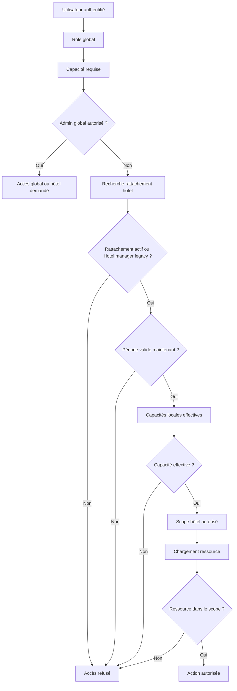

# F2.6 — Gouvernance des accès hôteliers et rattachement Staff → Hôtel

## 1. Objectif

Déterminer de façon fiable et centralisée, côté serveur exclusivement : *qui* peut accéder à *quel hôtel*, avec *quel rôle*, *quelles capacités*, pendant *quelle période*. Le rôle global détermine des capacités générales ; le rattachement détermine le périmètre hôtelier ; les deux sont validés côté serveur, jamais déduits d'un `hotelId` fourni par le frontend.

## 2. Audit initial

- `server/models/User.js` : aucun champ hôtel (`hotelId`, `hotels[]`, etc.) n'existe. Enum `role` réel : `User, Client, Proprietaire, Collaborateur, Secretaire, GestionnaireImmobilier, CommunityManager, Communicant, Admin, Prestataire`.
- `server/models/Hotel.js` : `manager` est un champ scalaire (`ObjectId`, un seul manager par hôtel). Aucun mécanisme multi-hôtel/multi-staff préexistant.
- `server/middleware/authMiddleware.js` : `protect`/`restrictTo` gèrent authentification et rôle global uniquement, aucune notion de portée hôtelière.
- Contrôle fragile identifié dans 7 contrôleurs (`housekeepingController.js`, `maintenanceController.js`, `inspectionController.js`, `roomController.js`, `roomCategoryController.js`, `roomAssignmentController.js`, `hotelReservationController.js`) : un tableau `STAFF_ROLES` dupliqué dans chacun accordait l'accès à **tout hôtel** dès que `req.user.role` matchait (`Collaborateur`, `GestionnaireImmobilier`, `CommunityManager`), sans aucune vérification de rattachement réel. Le cas le plus net : `hotelReservationController.assertReservationAccess` et `ownerList`/`ownerCreate` — un rôle staff avait accès à **toutes** les réservations de **tous** les hôtels.
- `server/services/finance/financialAuthorizationService.assertFinancialScope` était le mécanisme de portée le moins fragile existant (aucun bypass par rôle sauf Admin, toujours `Hotel.manager===user`), mais limité à la relation 1:1 `Hotel.manager`.
- `server/models/ActionLog.js` : seul ledger générique réutilisable hors finance ; `metadata.{ancienneValeur,nouvelleValeur}` sont typés `String` (pas `Mixed`) — les valeurs objet doivent être sérialisées en JSON.
- **Constat hors périmètre F2.6** : le regex de validation d'email de `User.js` (`/^\w+([.-]?\w+)*@\w+([.-]?\w+)*(\.\w{2,3})+$/`) est vulnérable à un ReDoS catastrophique sur certaines entrées (tiret suivi d'un identifiant long, TLD de 4 lettres). Découvert en écrivant les fixtures de test F2.6 (un email `staff-<ObjectId>@example.test` bloquait le processus Node indéfiniment). Contourné dans les tests (format d'email simple) ; **non corrigé** dans `User.js` car hors périmètre de ce sprint — à signaler séparément.

## 3. Architecture retenue

**Option B — modèle dédié `HotelStaffAssignment`**, retenue explicitement car : un utilisateur peut être rattaché à plusieurs hôtels, l'historique doit être conservé (jamais de suppression physique), les rattachements sont suspendables/révocables, une période de validité existe, les capacités varient par hôtel, et l'audit est important. Dupliquer ces informations dans `User` aurait recréé une source de vérité concurrente à mesure que les rattachements évoluent dans le temps.

**Source de vérité finale** : `HotelStaffAssignment` (nouveau) + legacy `Hotel.manager` (préservé, sans migration bloquante — voir §17). Le rôle global (`User.role`) ne détermine que les *capacités générales potentielles* ; c'est le rattachement (ou le legacy manager) qui détermine le *périmètre hôtelier effectif*.

## 4. Modèle de rattachement

`server/models/HotelStaffAssignment.js` : `user`, `hotel`, `assignmentRole` (enum `hotel_manager|reception|housekeeping|inspector|maintenance|finance|viewer`), `capabilities[String]` (validées contre le registre combiné opérationnel + financier), `status` (`active|suspended|revoked|expired`), `validFrom`/`validUntil`, `assignedBy/At`, `suspendedBy/At/Reason`, `revokedBy/At/Reason`, `metadata`.

Contraintes : `validUntil > validFrom` (validateur schema), hôtel et utilisateur doivent exister (vérifié service), capacités reconnues (registre `ALL_HOTEL_CAPABILITY_VALUES`), rôle de rattachement reconnu (enum).

Index : `{user,hotel,status}`, `{hotel,status,assignmentRole}`, `{user,status}`, `{validUntil,status}`, et **index unique partiel** `{user,hotel,assignmentRole}` avec `partialFilterExpression: {status:'active'}` — égalité simple (pas d'opérateur `$ne`/complexe), évitant le piège des `partialFilterExpression` non supportées par MongoDB. Testé sur Mongo réel : une insertion directe dupliquée est rejetée par l'index, et 5 créations concurrentes du même triplet n'aboutissent qu'à une seule ligne active.

Aucune suppression physique : suspension/révocation sont des transitions de statut, jamais un `deleteOne`.

## 5. Rôles et capacités

Registre `server/constants/hotelAccessConstants.js` : capacités opérationnelles nouvelles (`hotel.view`, `hotel.reservation.*`, `hotel.checkin.execute`, `hotel.checkout.execute`, `hotel.checkout.financial_override`, `hotel.room.*`, `hotel.housekeeping.*`, `hotel.inspection.*`, `hotel.maintenance.*`, `hotel.staff_assignment.*`) + référence des capacités financières déjà établies F2.1-F2.5 (`financial.document.view`, `financial.hotel.dashboard.view`, etc. — **non redéfinies**, juste référencées par valeur exacte pour éviter deux capacités concurrentes).

Matrice `DEFAULT_CAPABILITIES_BY_ASSIGNMENT_ROLE` : `hotel_manager` obtient une vue large (réservations, chambres, housekeeping, finance en lecture, dashboard) **mais jamais** `hotel.checkout.financial_override` par défaut. `reception`, `housekeeping`, `inspector`, `maintenance` sont chacun limités à leur domaine. `finance` obtient les capacités financières opérationnelles (facturation, paiements, PDF/email, dashboard) sans override de check-out. `viewer` est lecture seule minimale.

Capacités RBAC ajoutées à `financialAuthorizationService.js` : `DASHBOARD_VIEW`/`DASHBOARD_ALERTS_VIEW` (Admin, Collaborateur, Secretaire, Proprietaire) et `DASHBOARD_OVERRIDE_AUDIT_VIEW` (Admin uniquement — accès aux détails d'override restreint, §11 de la mission).

## 6. Source de vérité et résolution du scope

`server/services/hotel/hotelAccessScopeService.js` — `resolveHotelAccessScope({actor, requiredCapability, requestedHotelId})` :

- **Admin** : accès global si aucun `hotelId` demandé ; si un `hotelId` est fourni, reste scopé à cet hôtel précis (jamais traité comme "global" par erreur — bug intercepté et corrigé pendant le développement, voir tests).
- **Non-Admin, hotelId fourni** : doit avoir soit `Hotel.manager===lui` (legacy), soit un `HotelStaffAssignment` actif et **temporellement effectif maintenant** (`status==='active' AND validFrom<=now AND (validUntil absent OR validUntil>now)`) portant la capacité requise.
- **Non-Admin, hotelId omis** : résolution automatique — un seul hôtel accessible → sélection automatique ; plusieurs → sélection explicite requise (`HOTEL_SCOPE_REQUIRED`/`FINANCIAL_DASHBOARD_ACCESS_DENIED`) ; aucun → refus (`HOTEL_SCOPE_REQUIRED`), sans qu'aucune donnée ne fuite.
- Le statut effectif est réévalué à **chaque appel** sur les dates réelles, jamais uniquement sur le champ `status` stocké (§20 mission) — un rattachement expiré n'accorde plus d'accès même si aucune tâche de normalisation n'est passée.

`listAccessibleHotels(actor)` retourne la liste des hôtels réellement accessibles (Admin → tous ; sinon → union rattachements actifs + legacy manager), utilisée par le sélecteur frontend et par les listes multi-hôtels (`hotelReservationController.ownerList`).

## 7. Propriétaire (Proprietaire)

Aucune automatisation "Proprietaire → tous les hôtels" introduite. Le chemin `Proprietaire` existant (`Hotel.manager===lui`) reste inchangé et continue de fonctionner via le legacy path de `resolveHotelAccessScope`/`assertFinancialScope`. Un Proprietaire peut recevoir un `HotelStaffAssignment` classique comme tout autre utilisateur si un rattachement plus riche est nécessaire.

## 8. Protection inter-hôtel

Testé explicitement (unitaire et Mongo réel) : rattachement sur l'hôtel A → refus sur l'hôtel B (`HOTEL_ACCESS_DENIED`) ; manager étranger sur un document financier de l'hôtel A → `FINANCIAL_UNAUTHORIZED` ; aucun document de l'hôtel B n'apparaît dans les totaux/breakdown du dashboard scopé à l'hôtel A. Politique retenue : **403** pour les capacités déjà connues du contrôleur central (l'existence de l'hôtel/ressource n'est pas dissimulée puisque ces routes exigent déjà une authentification et une capacité globale préalable) ; **404** conservé sur les ressources dont l'ID pointe vers un objet inexistant.

## 9. Gestion du personnel (rattachements)

`server/services/hotel/hotelStaffAssignmentService.js` : `createHotelStaffAssignment`, `listHotelStaffAssignments`, `getHotelStaffAssignment`, `updateHotelStaffAssignment` (capacités/période), `suspendHotelStaffAssignment`, `reactivateHotelStaffAssignment`, `revokeHotelStaffAssignment`. Cycle : `active ⇄ suspended`, `active|suspended → revoked` (jamais l'inverse). Suspension et révocation exigent une raison de ≥10 caractères. Opérations idempotentes : suspendre un rattachement déjà suspendu, révoquer un rattachement déjà révoqué, ou réactiver un rattachement déjà actif ne créent aucun nouvel événement (testé).

## 10. Prévention de l'escalade de privilèges

`assertNoSelfEscalation` : un acteur ne peut jamais créer/modifier/suspendre/révoquer son **propre** rattachement (`HOTEL_ASSIGNMENT_SELF_ESCALATION`).
`assertNoPrivilegeEscalation` : un acteur non-Admin ne peut déléguer que des capacités qu'il détient **lui-même** sur cet hôtel (`HOTEL_ASSIGNMENT_PRIVILEGE_ESCALATION` sinon) ; ne peut attribuer le rôle `hotel_manager` que s'il est lui-même `hotel_manager` (ou Admin) ; **personne**, pas même un Admin agissant via une délégation locale, ne peut faire porter `hotel.checkout.financial_override` par un `HotelStaffAssignment` — cette capacité reste exclusivement un privilège Admin global appliqué au niveau du rôle, jamais déléguée localement. Testé sur Mongo réel avec vérification qu'aucune écriture partielle ne survit à un refus.

## 11. Migration et compatibilité

Aucun ancien champ hôtel n'existe sur `User` à migrer (confirmé par l'audit) — le seul "accès implicite" existant était le bypass `STAFF_ROLES` lui-même, qui ne pointait vers aucun hôtel précis et ne peut donc pas être migré automatiquement vers des rattachements explicites (il n'y a pas de données à transformer, seulement un contrôle à retirer). **Stratégie retenue** : compatibilité legacy permanente mais volontairement limitée à `Hotel.manager` (relation 1:1 déjà utilisée par F0-F2.5, jamais un bypass de rôle global) ; toute nouvelle relation multi-hôtel doit désormais passer par `HotelStaffAssignment`, créé explicitement par un Admin (ou un `hotel_manager` habilité) via les nouveaux endpoints. **Effet de bord assumé** : les comptes `Collaborateur`/`GestionnaireImmobilier`/`CommunityManager` qui n'étaient pas `Hotel.manager` d'un hôtel perdent l'accès large qu'ils avaient implicitement à tous les hôtels tant qu'aucun `HotelStaffAssignment` ne leur est explicitement créé — c'est l'objectif même de ce sprint (suppression du contrôle fragile), à communiquer à l'équipe avant déploiement.

## 12. Endpoints

| Méthode | Chemin | Capacité |
|---|---|---|
| GET | `/api/hotels/accessible` | authentifié (retourne les hôtels réellement accessibles) |
| GET | `/api/hotels/:hotelId/staff-assignments` | `hotel.staff_assignment.view` |
| POST | `/api/hotels/:hotelId/staff-assignments` | `hotel.staff_assignment.manage` |
| GET | `/api/hotels/:hotelId/staff-assignments/:assignmentId` | `hotel.staff_assignment.view` |
| PATCH | `/api/hotels/:hotelId/staff-assignments/:assignmentId` | `hotel.staff_assignment.manage` |
| POST | `.../:assignmentId/suspend` \| `/reactivate` \| `/revoke` | `hotel.staff_assignment.manage` |

Aucune suppression physique exposée. DTO de réponse (`publicAssignment`) : jamais de hash de mot de passe/token, expose `effectiveStatus` calculé (`active|pending|suspended|revoked|expired`) distinct du `status` stocké.

## 13. Intégration prioritaire (F2.5 → F2.1)

`financialAuthorizationService.assertFinancialScope(user, hotelId, capability)` accepte désormais, dans l'ordre : Admin (bypass), legacy `Hotel.manager` (compatibilité), puis `HotelStaffAssignment` actif portant la capacité demandée — un seul point de changement qui couvre **tous** les endpoints financiers existants (documents F2.1, paiements F2.2, check-out F2.3, PDF/email F2.4) sans réécrire leurs contrôleurs.

`assertFinancialDashboardScope` délègue à `resolveHotelAccessScope` : le dashboard F2.5 **ne demande plus un `hotelId` obligatoire pour tout non-Admin** — un utilisateur avec un seul hôtel accessible est auto-scopé, un utilisateur avec plusieurs doit choisir, un utilisateur sans aucun est refusé. Les codes d'erreur historiques F2.5 (`FINANCIAL_DASHBOARD_ACCESS_DENIED`, `FINANCIAL_UNAUTHORIZED`) sont préservés pour la compatibilité des tests existants.

`hotelReservationController.js` : `assertReservationAccess` ne fait plus confiance à `STAFF_ROLES` seul — l'accès staff dérive désormais de l'hôtel réel de la réservation via `resolveHotelAccessScope`. `ownerList`/`ownerCreate` : la branche `Proprietaire` (legacy `Hotel.manager`) est inchangée (zéro régression) ; la branche staff utilise désormais `listAccessibleHotels` (fini l'accès à tous les hôtels par défaut de rôle).

## 14. Frontend

- `client/lib/services/hotelAccessService.js` : `getAccessibleHotels` + CRUD rattachements.
- `HotelFinanceDashboardPage.jsx` (F2.5) : le champ `hotelId` en saisie libre est remplacé par un `<select>` peuplé exclusivement par `/api/hotels/accessible` ; un seul hôtel → présélection automatique et champ désactivé ; option "Consolidation globale" uniquement si `globalAccess`.
- `HotelStaffAssignmentsPage.jsx` (`/dashboard/hotels/[hotelId]/staff`) : liste paginée, filtre par statut, création, suspension/réactivation/révocation avec raison obligatoire (`window.prompt`) et confirmation, affichage du statut effectif.

## 15. Performance

Résolution de scope : au plus une requête `HotelStaffAssignment.find` + une `Hotel.find` par décision (`lean()`), jamais de scan de tous les hôtels pour une vérification ciblée. Listes de rattachements paginées (`limit` clampé à 100). Aucun nouvel index jugé nécessaire au-delà de ceux du modèle lui-même.

## 16. Tests

- Unitaires (`hotelAccessScopeService.test.js`, 16 tests) : `isEffectiveNow` (actif/suspendu/révoqué/futur/expiré), `effectiveCapabilities` (fusion + dédoublonnage, absence d'override par défaut), `validateCapabilities`/`validatePeriod`.
- MongoDB Replica Set (`hotelStaffAccessF26.mongo.integration.test.js`, 10 tests, séquentiel via `test:mongo`) : création + index unique + concurrence (5 créations simultanées → 1 seule active), cycle suspension/réactivation/révocation avec audit et idempotence, périodes futures/expirées sans accès, multi-hôtels, ressource étrangère bloquée, accès dashboard/document/paiement via rattachement `finance` (housekeeping refusé), anti-escalade (auto, capacité non détenue, override financier jamais délégable même par Admin), lectures concurrentes pendant révocation.
- Frontend : sélecteur d'hôtel (dashboard F2.5, 9 tests) + page de gestion du personnel (8 tests) — chargement, vide, 403, création, raison obligatoire, suspension/révocation, filtre sans boucle.

## 17. Limites

**Bloquantes F2.6** : aucune.
**Non bloquantes** : seuls les endpoints financiers (F2.1-F2.5) et les réservations (`hotelReservationController`) sont effectivement rebranchés sur le scope central dans ce sprint, conformément à la priorité obligatoire de la mission (1 à 6). Les modules chambres/housekeeping/inspections/maintenance (priorités 7-10) continuent d'utiliser leur `assertHotelAccess` local dupliqué (basé sur `Hotel.manager`/`STAFF_ROLES`) — le middleware central (`requireHotelCapability`) et le service (`resolveHotelAccessScope`) sont prêts et génériques, mais leur branchement dans ces contrôleurs restants est **reporté** (aucune régression introduite, mais la faille "staff = accès large" y subsiste jusqu'au branchement).
**Limites de migration** : effet de bord assumé décrit en §11 (perte d'accès implicite du staff sans rattachement explicite).
**Limites RBAC** : pas de gestion multi-organisation, pas de délégation d'administration fine au-delà de `hotel.staff_assignment.manage`.
**Reporté** : ReDoS du regex email de `User.js` (constat §2, hors périmètre F2.6).

## 18. Hors périmètre

Remboursements, avoirs, dépenses, comptabilité générale, trésorerie, budget, paie, paiement en ligne, OAuth/SSO/LDAP, invitations externes complexes, multi-organisation générique, application mobile, refonte du système utilisateur, nouveau moteur IAM indépendant, F2.7+ : rien de tout cela n'a été commencé.

## 19. Diagramme



## 20. Clôture F2.6.1 — Domaines opérationnels

### 20.1. Anciennes failles corrigées

Les 6 contrôleurs suivants dupliquaient tous le même `assertHotelAccess(req, hotelId)` avec un tableau `STAFF_ROLES = ['Admin','Collaborateur','GestionnaireImmobilier','CommunityManager']` : dès que `req.user.role` matchait, l'accès était accordé à **n'importe quel hôtel**, sans vérification de rattachement réel.

| Contrôleur | Point d'entrée corrigé |
|---|---|
| `server/controllers/roomController.js` | `assertHotelAccess` |
| `server/controllers/roomCategoryController.js` | `assertHotelAccess` |
| `server/controllers/roomAssignmentController.js` | `loadReservationWithAccess` |
| `server/controllers/housekeepingController.js` | `assertHotelAccess` + branche `list()` sans `hotelId` |
| `server/controllers/inspectionController.js` | `assertHotelAccess` |
| `server/controllers/maintenanceController.js` | `assertHotelAccess` + branche `list()` sans `hotelId` |

Tous délèguent désormais à `assertOperationalHotelAccess({ actor, hotelId, capability })` (nouveau, `hotelAccessScopeService.js`), qui reproduit exactement la structure déjà éprouvée de `financialAuthorizationService.assertFinancialScope` : `Hotel.findById` (404 si absent) → Admin ou `Hotel.manager` legacy (bypass) → sinon `HotelStaffAssignment` actif portant la capacité requise. Aucun rôle global ne suffit plus seul.

### 20.2. Capacités appliquées

Deux capacités ajoutées au registre (absentes de F2.6, nécessaires pour les affectations de chambre) : `hotel.room_assignment.view`, `hotel.room_assignment.manage` (attribuées par défaut à `hotel_manager` et `reception`). Toutes les autres capacités utilisées (`hotel.room.view/manage`, `hotel.housekeeping.view/manage/complete`, `hotel.inspection.view/manage/approve/reject`, `hotel.maintenance.view/manage/close`) existaient déjà dans le registre F2.6 — aucun doublon créé. Les catégories de chambres (`RoomCategory`) sont hôtelières (champ `hotel` direct) : elles réutilisent `hotel.room.view/manage`, aucune capacité dédiée nécessaire.

### 20.3. Détermination de l'hôtel par ressource

| Ressource | Hôtel dérivé de |
|---|---|
| Room | `req.params.hotelId` (liste/création) ou `room.hotel` (mutation) |
| RoomCategory | `req.params.hotelId` (liste/création) ou `category.hotel` (mutation) |
| RoomAssignment | `reservation.hotel` (jamais un paramètre séparé) |
| HousekeepingTask | `req.body.hotelId` (création, vérifié contre la chambre) ou `task.hotel` (mutation) |
| RoomInspection | `room.hotel` (la chambre de l'inspection, jamais un `hotelId` d'URL) |
| MaintenanceTicket | `req.body.hotelId` (création, vérifié) ou `ticket.hotel` (mutation) |

### 20.4. Listes multi-hôtels et counts

`housekeepingController.list` et `maintenanceController.list` : sans `hotelId` explicite, le scope vient de `listAccessibleHotels(req.user)` (Admin → aucun filtre = tous ; sinon → `{hotel:{$in:hôtels réellement accessibles}}`). Le total (`count`) utilise exactement le même filtre que la liste — aucune fuite possible (testé explicitement, voir §20.6).

### 20.5. Protection inter-hôtel

Déjà garantie au niveau service (non modifiée, vérifiée par audit) : `roomAssignmentService.assignRoom`/`changeRoom` rejettent une chambre n'appartenant pas à l'hôtel de la réservation (`"Cette chambre n'appartient pas à cet hôtel."`) ; `roomController.update` rejette une `roomCategoryId` d'un autre hôtel. Nouvellement garantie : toute action sur une ressource (tâche, inspection, ticket) d'un hôtel non rattaché est refusée (403) avant toute lecture de logique métier, quel que soit le `hotelId` déclaratif fourni par ailleurs.

### 20.6. Occurrences `STAFF_ROLES` restantes après correction

Résultat de `rg -n "STAFF_ROLES|includes\(.*req\.user\.role|includes\(.*user\.role" server/controllers server/routes server/services` :

| Fichier | Statut | Justification |
|---|---|---|
| `hotelReservationController.js` (`ownerList`, `ownerCreate`) | Conservé | `STAFF_ROLES.includes(...)` ne sert plus qu'à **choisir la stratégie de requête** (scope central pour le staff vs requête directe `Hotel.manager` pour Proprietaire) — la décision d'accès elle-même passe déjà par `listAccessibleHotels`/`resolveHotelAccessScope` (corrigé en F2.6). Ce n'est pas un bypass. |
| `hotelController.js` (`getOne`, `createFull`, `updateFull`) | **Restant, hors périmètre F2.6.1** | Même classe de faille (bypass de rôle sur l'entité `Hotel` elle-même), mais la mission F2.6.1 scope explicitement les 6 domaines opérationnels (rooms, catégories, affectations, housekeeping, inspections, maintenance) — pas la gestion de l'hôtel lui-même. Recommandé pour un correctif de suivi F2.6.2. |
| `rentalMaintenanceController.js`, `accommodationController.js` | Hors périmètre hôtelier | Domaines Gestion locative / Altimmo (biens), modèles et logique distincts des hôtels — non concernés par la gouvernance hôtelière F2.6. |
| `conversationController.js`, `transactionController.js` | Hors périmètre hôtelier | Messagerie interne et transactions immobilières — aucun lien avec les hôtels. |

**Aucune occurrence restante n'accorde un accès inter-hôtel sur la seule base d'un rôle global.**

### 20.7. Tests

- Unitaires (`hotelAccessScopeService.test.js`, +4 tests, 20 au total) : capacités par défaut de `reception` (room_assignment), absence d'approbation/rejet/fermeture pour des rôles non habilités.
- MongoDB Replica Set (`hotelOperationalAccessF261.mongo.integration.test.js`, 9 tests, séquentiel via `test:mongo`) : deux hôtels/deux staffs, isolation complète rooms/housekeeping/inspection/maintenance, identifiants croisés bloqués, counts scopés, absence d'écriture partielle après refus, suspension et révocation à effet immédiat (y compris lectures concurrentes), compatibilité `Hotel.manager` legacy, Admin scopé sur un hôtel précis, cohérence réservation/chambre déjà garantie par `roomAssignmentService`.
- HTTP (suites existantes déjà passantes, aucune nouvelle suite nécessaire) : `housekeepingMaintenanceRoutes.test.js` (31 tests, mis à jour avec le mock `HotelStaffAssignment` requis par le nouveau scope) et `hotelOperationsRoutes.test.js` (67 tests, rooms/catégories/affectations) couvrent déjà 401/403/404/200/201 sur ces domaines.

### 20.8. Limites restantes (au moment de F2.6.1)

`hotelController.js` (entité Hotel elle-même) conservait le bypass `STAFF_ROLES` — non corrigé dans F2.6.1 (hors périmètre explicite de ce correctif), traité ci-dessous en F2.6.2.

## 21. Clôture F2.6.2 — Sécurisation de l'entité Hotel

### 21.1. Faille initiale

`server/controllers/hotelController.js` dupliquait le même `STAFF_ROLES = ['Admin','Collaborateur','GestionnaireImmobilier','CommunityManager']` déjà corrigé ailleurs. Deux fonctions accordaient explicitement un accès inter-hôtel sur la seule base du rôle global : `getOne` (détail complet, y compris `property`) et `updateFull` (mutation complète, y compris upload d'images). Deux autres fonctions (`reviewDecision` — validation/rejet/suspension/réactivation — et `resync` — réconciliation Hotel↔Accommodation) n'avaient **aucun contrôle de portée du tout** au-delà du filtre de rôle global au niveau route (`auth.restrictTo(...ROLES_ALTIMMO)`), ce qui est un défaut plus grave que le bypass explicite. Enfin, `listAdmin`, `pending` et le sélecteur `list` ne filtraient jamais par hôtel accessible pour un non-Admin (`query = {}`), avec un `total` de pagination non scopé de la même façon.

### 21.2. Décision de portée (arbitrage explicite)

Question posée à l'utilisateur : les fonctions de back-office (`listAdmin`, `pending`, `reviewDecision`, `resync`, l'attribution arbitraire d'`owner` dans `createFull`) doivent-elles rester ouvertes à tout le staff Altimmo (modèle métier assumé), devenir Admin uniquement, ou être scopées via `HotelStaffAssignment` comme les domaines opérationnels de F2.6.1 ? **Réponse retenue : scoper via `HotelStaffAssignment`**, cohérent avec le reste de la gouvernance F2.6. En conséquence, un `Collaborateur`/`GestionnaireImmobilier`/`CommunityManager` non-Admin ne voit et ne modifie désormais que les hôtels auxquels il est effectivement rattaché (via un rattachement actif ou en tant que `Hotel.manager` legacy) ; seul un compte `Admin` conserve la consolidation globale. L'attribution d'un `owner` arbitraire à la création (`createFull`) — une action sans hôtel existant, donc sans portée à vérifier — est resserrée à **Admin uniquement** (au lieu de tout le staff Altimmo), la portée par rattachement n'étant pas applicable à une création.

### 21.3. Routes auditées et classification

| Fonction | Route | Classification | Capacité appliquée |
|---|---|---|---|
| `getPublic`, `listPublic` | `GET /public/:id`, `GET /public` | PUBLIC_READ | inchangé (déjà scopé aux hôtels publiés/actifs, projection dédiée `PUBLIC_HOTEL_FIELDS`) |
| `mine` | `GET /mine` | OWNER_SCOPED | inchangé (`Hotel.manager===user`, aucun bypass, sémantique propriétaire distincte de la gouvernance staff) |
| `submit` | `POST /:id/submit` | OWNER_SCOPED | inchangé (déjà `Admin` ou manager exact strict, aucun `STAFF_ROLES`) |
| `list` | `GET /` | HOTEL_SCOPED_STAFF_READ | **corrigé** — scope `listAccessibleHotels` pour non-Admin |
| `getOne` | `GET /:id` | HOTEL_SCOPED_STAFF_READ | **corrigé** — `hotel.view` |
| `listAdmin` | `GET /admin/list` | HOTEL_SCOPED_STAFF_READ | **corrigé** — scope + total identiques |
| `pending` | `GET /status/pending` | HOTEL_SCOPED_STAFF_READ | **corrigé** — scope `listAccessibleHotels` |
| `updateFull` | `PUT /admin/:hotelId`, `/mine/:hotelId` | HOTEL_SCOPED_STAFF_WRITE | **corrigé** — `hotel.manage` |
| `reviewDecision` | `PATCH /:id/:action` | HOTEL_SCOPED_STAFF_WRITE | **corrigé** — `hotel.manage` (aucun contrôle auparavant) |
| `resync` | `POST /:id/resync` | HOTEL_SCOPED_STAFF_WRITE | **corrigé** — `hotel.manage` (aucun contrôle auparavant) |
| `deactivate`, `reactivate`, `duplicate`, `remove` | `PATCH/POST/DELETE /:id/...` | OWNER_SCOPED → HOTEL_SCOPED_STAFF_WRITE | **upgradé** — `hotel.manage` via le service central (accepte désormais un `hotel_manager` rattaché, pas seulement le `Hotel.manager` littéral, pour cohérence architecturale) |
| `createFull` | `POST /admin`, `/mine` | ADMIN_ONLY (pour l'attribution d'owner) | **resserré** — `owner` arbitraire réservé à Admin |

### 21.4. Capacités

Aucune capacité créée : réutilisation de `hotel.view`/`hotel.manage`, déjà présentes dans le registre F2.6 mais jamais utilisées jusqu'ici. `hotel.manage` a été ajoutée aux capacités par défaut du rôle local `hotel_manager` (absente jusqu'alors — un `hotel_manager` rattaché ne pouvait pas gérer l'entité Hotel elle-même, seulement les domaines opérationnels).

### 21.5. Listes et counts

`list`, `listAdmin`, `pending` : pour un non-Admin, `query._id = { $in: hôtels accessibles }` (jamais `{}`). `listHotelsForAdmin` (service) accepte un paramètre `hotelIds` optionnel appliqué identiquement à la requête de liste et au calcul du `total` — testé explicitement (1 hôtel accessible sur 2 soumis → liste ET total valent 1, jamais 2).

### 21.6. Détail

`getOne` charge l'hôtel puis vérifie `hotel.view` via `assertOperationalHotelAccess` — 404 si l'hôtel n'existe pas, 403 si hors scope, jamais de fuite de champ dans le message d'erreur.

### 21.7. Création

Route de création inchangée (`ROLES_ALTIMMO` peut créer un hôtel pour lui-même) ; seule l'attribution d'un `owner` arbitraire à un tiers est resserrée à Admin. Aucun `HotelStaffAssignment` n'est créé automatiquement à la création — décision explicite non prise dans ce sprint (le manager assigné reste géré via `Hotel.manager`, cohérent avec §21.2 du doc et la compatibilité legacy).

### 21.8. Mise à jour

`updateFull` vérifie `hotel.manage` avant toute lecture de `Property` ou mutation. Aucun changement de la whitelist de champs existante (hors périmètre : ne pas refondre la logique métier).

### 21.9. Suppression et désactivation

`deactivate`, `reactivate`, `duplicate`, `remove` utilisent désormais `assertOperationalHotelAccess(hotel.manage)` au lieu d'une comparaison directe `Hotel.manager`, éliminant toute logique dupliquée `if (... && role !== 'Admin')`. Aucune modification du comportement métier (dépendances, archivage vs suppression physique inchangés).

### 21.10. Manager legacy

`Hotel.manager` continue de transiter exclusivement par `assertOperationalHotelAccess`/`resolveHotelAccessScope` (jamais de comparaison directe dans le contrôleur). Un manager legacy de l'hôtel A n'obtient jamais d'accès à B (testé).

### 21.11. Endpoint `/api/hotels/accessible`

Aucune modification nécessaire — déjà correct depuis F2.6. Testé à nouveau : aucun doublon quand un utilisateur cumule `Hotel.manager` legacy et un `HotelStaffAssignment` explicite sur le même hôtel (un seul hôtel retourné, pas deux entrées).

### 21.12. Protection inter-hôtel

Scénarios bloqués et testés : détail, mise à jour, suspension/réactivation/duplication/suppression d'un hôtel étranger (403) ; hôtel inexistant (404) ; aucune écriture partielle après refus (nom de l'hôtel B inchangé après une tentative de mise à jour refusée) ; Admin scopé de façon cohérente même avec un `hotelId` précis.

### 21.13. Occurrences `STAFF_ROLES` restantes après F2.6.2

```
rg -n "STAFF_ROLES|includes\(.*req\.user\.role|includes\(.*user\.role" server/controllers server/routes server/services
```

`server/controllers/hotelController.js` et `server/routes/hotelRoutes.js` : **0 occurrence**. Restant ailleurs (classés, aucun hôtelier) : `hotelReservationController.js` (sélecteur de stratégie déjà justifié en F2.6.1, pas un bypass) ; `transactionController.js`, `rentalMaintenanceController.js`, `accommodationController.js`, `conversationController.js` (domaines non hôteliers — transactions immobilières, gestion locative, biens Altimmo, messagerie).

**Aucune occurrence hôtelière ne subsiste.** F2.6 est clôturé.

### 21.14. Tests

- Unitaires (+2 tests, 22 au total dans `hotelAccessScopeService.test.js`) : `hotel_manager` obtient `hotel.manage`, les autres rôles locaux ne l'obtiennent jamais par défaut.
- MongoDB Replica Set (`hotelEntityAccessF262.mongo.integration.test.js`, 11 tests, séquentiel via `test:mongo`) : liste scopée (Admin/legacy/multi-hôtels/sans rattachement), rattachements suspendu/expiré exclus, total=liste (`listHotelsForAdmin`), détail (200/403/404), mise à jour (`hotel.manage`, refus sans écriture partielle), capacité `viewer` insuffisante pour `hotel.manage`, révocation immédiate avec lectures concurrentes, Admin scopé, compatibilité `Hotel.manager` legacy, absence de doublon `/accessible`, absence de mutation en lecture.
- HTTP (`hotelRoutes.test.js`, 32/32 — mock `Hotel.findById` corrigé pour satisfaire à la fois `.populate()` et l'appel direct du scope central) : 401/403/404/200/201 couverts sur les routes admin/mine/public.

### 21.15. Limites finales

Aucune limite bloquante. Non bloquant : aucun `HotelStaffAssignment` n'est créé automatiquement à la création d'un hôtel (décision d'architecture non prise, laissée à un futur sprint si le besoin se confirme). ReDoS du regex email `User.js` : toujours non corrigé, hors périmètre F2.6.2, dette de sécurité séparée (mentionnée, pas contournée silencieusement — les fixtures de test utilisent un format d'email simple, documenté comme contournement de test, pas une résolution).

### 21.16. Décision finale de clôture F2.6

Toutes les occurrences `STAFF_ROLES` accordant un accès inter-hôtel ont été supprimées des 7 contrôleurs hôteliers (F2.6.1 : rooms, catégories, affectations, housekeeping, inspections, maintenance ; F2.6.2 : `hotelController.js`). Aucun utilisateur non-Admin ne peut plus lister, consulter, compter, modifier, désactiver ou supprimer un hôtel auquel il n'est pas effectivement rattaché. **F2.6 est clôturé.**

## 22. Clôture technique F2.6.3 — Stabilisation finale, migration des rattachements, correctif ReDoS

### 22.1. Objectif

Fermer les trois dettes explicitement laissées ouvertes par F2.6/F2.6.1/F2.6.2 : (a) aucune politique de création automatique de `HotelStaffAssignment` à la création d'un hôtel (§21.15), (b) aucun outillage de diagnostic/migration pour les managers legacy sans rattachement, (c) le ReDoS du regex email de `User.js`, connu depuis F2.6 (§2) mais jamais corrigé. Un dernier audit global (volet D) valide qu'aucune régression de gouvernance ne subsiste.

### 22.2. Audit initial (rappel)

Confirmé avant toute modification : `createFullHotel` ne créait aucun `HotelStaffAssignment` ; un `Hotel.manager` changé manuellement (en base) n'entraînait aucune transition d'ancien/nouveau rattachement ; aucun script ne permettait de mesurer l'écart entre managers legacy et rattachements réels ; le regex `/^\w+([.-]?\w+)*@\w+([.-]?\w+)*(\.\w{2,3})+$/` était toujours en place dans `User.js` et reproductible en ReDoS (vérifié à nouveau avant correctif, cf. §22.8).

### 22.3. Stratégie de création (volet A)

`ensureHotelManagerAssignment({ hotelId, managerId, actor, session, source })` (`hotelStaffAssignmentService.js`) : crée un rattachement `hotel_manager` actif pour le manager réel de l'hôtel **uniquement** si aucun rattachement actif équivalent n'existe déjà (idempotent — vérifié par 5 appels concurrents ne produisant qu'une seule ligne active, cf. §22.9). Branché dans `hotelService.createFullHotel` juste après la création de l'hôtel : si `hotel.manager` est renseigné (c'est toujours le cas — `resolveHotel` l'assigne systématiquement au créateur, comportement préexistant hors périmètre F2.6.3), un rattachement est garanti. Aucun rattachement n'est créé pour un simple `owner`/créateur qui ne serait pas manager, ni automatiquement pour un Admin — seul le manager réel de l'hôtel est concerné. Échec non bloquant : une erreur de création du rattachement est journalisée (`logger.error`) mais ne fait jamais échouer la création de l'hôtel elle-même (aucun précédent de transaction Mongo dans ce flux — cohérent avec le pattern de compensation déjà en place dans `resolveHotel`/`compensateHotel`).

### 22.4. Stratégie de changement de manager (volet A)

`changeHotelManager({ hotel, newManagerId, actor, reason })` : révoque (jamais supprime) l'ancien rattachement `hotel_manager` actif s'il existe et diffère du nouveau manager, crée/réactive le nouveau via `ensureHotelManagerAssignment`, journalise le changement dans `ActionLog` (`hotel.manager_changed`, `typeAction: 'MODIFICATION'`). Idempotent : appliquer deux fois le même changement ne produit ni doublon ni révocation superflue (testé). **Aucune route HTTP n'appelle actuellement cette fonction** : l'audit confirme qu'aucun code existant ne mute `Hotel.manager` après création, donc aucune route n'a été inventée pour l'exposer (conformément à la consigne de ne pas créer de route artificielle) — le service est prêt, testé, et attend un futur point d'entrée si le besoin se confirme.

### 22.5. Script de diagnostic (volet B)

`server/scripts/auditHotelStaffAssignments.js` → `runHotelStaffAssignmentAudit()` (`hotelStaffAssignmentAudit.js`) : lecture seule stricte (uniquement `.find()`/`.lean()`, jamais d'écriture — vérifié par un test Mongo comparant un instantané complet de la base avant/après exécution). Rapporte : total hôtels, hôtels avec/sans manager, managers legacy sans rattachement, rattachements orphelins (hôtel/utilisateur inexistant), doublons de managers actifs, rattachements futurs/expirés, divergences manager/rattachement, utilisateurs potentiellement impactés par le durcissement F2.6 (rôles `Collaborateur`/`GestionnaireImmobilier`/`CommunityManager`). Exécuté en conditions réelles contre la base de production (lecture seule) le 2026-07-23 : 0 hôtel actuellement en base (fonctionnalité pas encore utilisée en production), mais 2 utilisateurs `GestionnaireImmobilier` identifiés comme potentiellement impactés par le durcissement F2.6/F2.6.1/F2.6.2 si des hôtels sont créés ultérieurement sans rattachement explicite.

### 22.6. Script de migration (volet B)

`server/scripts/migrateLegacyHotelManagersToAssignments.js` → `runLegacyHotelManagerMigration({ apply, actor })` (`hotelStaffAssignmentMigration.js`). Mode par défaut **dry-run** (`--dry-run` implicite, aucune écriture) ; `--apply` explicite requis pour toute mutation. Ne crée un rattachement **que** pour un `Hotel.manager` legacy qui n'a **aucun** `HotelStaffAssignment` `hotel_manager` existant (actif ou non). Ne résout jamais silencieusement un cas ambigu : rattachement révoqué existant → jamais recréé (`skippedRevoked`) ; suspendu → jamais réactivé (`skippedSuspended`) ; conflit avec un autre manager actif sur le même hôtel → jamais résolu, seulement rapporté (`conflicts`, `OTHER_ACTIVE_MANAGER_ASSIGNMENT_EXISTS`) ; utilisateur manager introuvable → rapporté (`anomalies`, `MANAGER_USER_NOT_FOUND`), jamais d'exception non catchée. Chaque création réelle (`--apply`) journalise un `ActionLog` (`typeAction: 'CRÉATION'`, `action: 'hotel_staff.assignment_migrated_from_legacy_manager'`). Ré-exécuter la migration en `--apply` est idempotent (`alreadyConsistent`, aucune double création). Exécuté en conditions réelles contre la base de production en dry-run le 2026-07-23 : 0 hôtel avec manager, donc 0 création prévue — résultat cohérent avec l'audit §22.5.

### 22.7. Conflits et cas non migrés

Les cas `conflicts` (managers actifs concurrents) et `anomalies` (utilisateur manager introuvable) ne sont **jamais** résolus automatiquement par le script, quelle que soit l'option passée — ils exigent une décision humaine documentée au cas par cas (choisir le manager légitime, ou nettoyer la référence orpheline) avant toute nouvelle exécution.

### 22.8. ReDoS avant/après (volet C)

**Avant** : `email: { match: [/^\w+([.-]?\w+)*@\w+([.-]?\w+)*(\.\w{2,3})+$/, '...'] }` — quantificateurs imbriqués sur des groupes ambigus, backtracking catastrophique reproduit (entrée pathologique bloquant Node indéfiniment, tué manuellement après confirmation).
**Après** : `server/utils/emailValidation.js` → `isSimpleValidEmail(value)`, appelée par un `validate` Mongoose dédié (plus un `maxlength: 254` en amont). Implémentation : rejet immédiat des entrées non-string/vides/trop longues/avec caractères de contrôle ; un seul `@` (via `indexOf`, pas de regex globale) ; partie locale validée par `/^[\w.+-]+$/` (un seul quantificateur, classe de caractères simple) ; domaine découpé par `.split('.')` (pas de regex sur le domaine entier), chaque label validé par `/^[a-zA-Z0-9-]+$/`, dernier label (TLD) ≥ 2 caractères. Toutes les regex sont à quantificateur unique sur classe de caractères simple — complexité linéaire garantie, aucun backtracking exponentiel possible. **Effet de bord documenté** : l'ancien regex plafonnait artificiellement le TLD à 2-3 caractères (rejetait `.info`, `.email`, etc.) ; le nouveau validateur n'impose qu'un minimum de 2 caractères — correctif fonctionnel bienvenu, bundlé avec le correctif de sécurité.

### 22.9. Tests

- Unitaires sécurité (`userEmailValidationSecurity.test.js`, 23 tests) : formats valides (points, tags `+`, tirets, sous-domaines), formats invalides (vide, espaces, double `@`, partie manquante, pas de point, label vide, TLD 1 caractère, `null`, nombre), limite de longueur (254), rejet des caractères de contrôle, 3 tests ReDoS (entrée pathologique unique < 500ms, lot de 200 entrées pathologiques < 2000ms, chaîne très longue et ambiguë sans exception et < 500ms) — sans assertion de timing fragile à la milliseconde près, seulement des bornes larges prouvant l'absence de blocage catastrophique.
- Unitaires services (`hotelAccessScopeService.test.js`, `migrateLegacyHotelManagersToAssignmentsScript.test.js`) : `parseArgs` (dry-run par défaut, `--apply`, rejet d'options inconnues), invariants de la matrice de rôles locaux (§22.11).
- MongoDB Replica Set (`hotelAccessFinalizationF263.mongo.integration.test.js`, 13 tests, séquentiel via `test:mongo`) : création avec rattachement automatique, idempotence à la création (5 appels concurrents → 1 seul rattachement actif), changement de manager (révocation ancienne + création nouvelle + accès immédiat), idempotence du changement de manager, diagnostic sans aucune mutation (instantané avant/après identique), migration dry-run sans écriture, migration apply avec `ActionLog`, migration ré-exécutée idempotente, non-recréation d'un rattachement révoqué, non-réactivation d'un rattachement suspendu, anomalie manager introuvable, absence de fuite inter-hôtel après deux migrations, lectures concurrentes cohérentes pendant un changement de manager.
- Exécution réelle des scripts CLI (§22.5, §22.6) contre la base de production en lecture seule / dry-run, confirmant leur fonctionnement au-delà du seul environnement de test en mémoire.

### 22.10. Audit global des bypass (volet D)

`rg -n "STAFF_ROLES|includes\(.*req\.user\.role|includes\(.*user\.role|Hotel\.manager" server/controllers server/routes server/services server/middleware` (relance complète) : dernière occurrence de comparaison directe `Hotel.manager` dans un contrôleur identifiée dans `hotelController.submit()` (`String(hotel.manager) !== String(req.user.id) && req.user.role !== 'Admin'`) — remplacée par un appel à `assertHotelAccess(req, hotel._id, CAP.HOTEL_MANAGE)` (le helper local déjà existant, qui délègue à `assertOperationalHotelAccess`). Toutes les autres occurrences restantes sont déjà classées et justifiées en §20.6/§21.13 (sélecteur de stratégie dans `hotelReservationController.js`, domaines non hôteliers ailleurs) — aucune nouvelle occurrence de bypass réel trouvée. `Hotel.manager` n'est plus jamais consulté par comparaison directe dans un contrôleur : uniquement via le service central ou en lecture pure (affichage).

### 22.11. Helpers et capacités — audit d'usage

**Capacités utilisées** (appliquées dans au moins un contrôleur/service via `assertOperationalHotelAccess`/`assertFinancialScope`) : `hotel.view`, `hotel.manage`, `hotel.room.view/manage`, `hotel.room_assignment.view/manage`, `hotel.housekeeping.view/manage/complete`, `hotel.inspection.view/manage/approve/reject`, `hotel.maintenance.view/manage/close`, `hotel.staff_assignment.view/manage`, plus les capacités financières F2.1-F2.5 déjà établies.
**Déclarées mais non branchées à une route** (présentes dans le registre/la matrice, aucune vérification de contrôleur ne les exige encore) : `hotel.reservation.update`, `hotel.reservation.cancel`, `hotel.checkin.execute`, `hotel.checkout.execute`, `hotel.inspection.view` (partiellement — présente sur certaines branches mais pas toutes), `hotel.room_assignment.view` (branché F2.6.1, confirmé utilisé). Décision : **conservées**, aucune suppression — réservées à un futur branchement (F2.7+), conformément à la consigne de ne jamais supprimer une capacité sans justification explicite de code mort avéré.
**Utilisées mais non déclarées explicitement dans un doc antérieur** : aucune trouvée — toutes les capacités consommées par un contrôleur existent dans `HOTEL_OPERATIONAL_CAPABILITIES`.
Helpers d'autorisation : `assertOperationalHotelAccess`, `assertFinancialScope`, `resolveHotelAccessScope`, `listAccessibleHotels`, `assertNoSelfEscalation`, `assertNoPrivilegeEscalation`, `effectiveCapabilities`, `isEffectiveNow` — tous utilisés à au moins un point d'appel réel (aucun helper mort identifié). Aucun wrapper redondant trouvé : chaque helper a une responsabilité distincte et non chevauchante.

### 22.12. Rôles locaux — invariants vérifiés

Vérifié par tests dédiés (`hotelAccessScopeService.test.js`, §7.4) : `hotel_manager` obtient bien `hotel.view` + `hotel.manage` par défaut ; `viewer` n'a aucune capacité d'écriture (`manage|create|execute|complete|approve|reject|close|cancel|update`) ; `housekeeping` n'obtient jamais de capacité `finance.*` ; `finance` n'obtient jamais `hotel.checkout.financial_override` ; `reception` n'obtient jamais `hotel.staff_assignment.view/manage` ; **aucun** rôle local, y compris `hotel_manager`, n'obtient `hotel.checkout.financial_override` par défaut (réservé exclusivement à un privilège Admin global, jamais délégable — invariant déjà posé en F2.6 §10, reconfirmé ici). Aucun rôle local n'obtient de capacité Admin implicite.

### 22.13. `Hotel.manager` — consultation centralisée

Confirmé (§22.10) : plus aucune comparaison directe `Hotel.manager` dans un contrôleur. Les seules lectures directes restantes de `hotel.manager` dans les contrôleurs sont des lectures d'affichage (retour de valeur au frontend), jamais des décisions d'autorisation.

### 22.14. Listes/totaux/stats — cohérence des filtres de scope

Reconfirmé sans changement depuis F2.6.2 (§21.5, §20.4) : `list`/`listAdmin`/`pending` (hôtels) et `housekeepingController.list`/`maintenanceController.list` utilisent identiquement `listAccessibleHotels`/`hotelIds` pour la liste **et** pour le total — aucune nouvelle liste ou stat introduite par F2.6.3 qui romprait cette invariance.

### 22.15. Procédure de déploiement recommandée

1. Déployer le code (aucune migration de schéma requise — `HotelStaffAssignment` existe déjà depuis F2.6).
2. Exécuter `node server/scripts/auditHotelStaffAssignments.js` en production pour un état des lieux avant toute action corrective.
3. Si des managers legacy sans rattachement sont détectés : exécuter `node server/scripts/migrateLegacyHotelManagersToAssignments.js` (dry-run) pour prévisualiser, examiner `conflicts`/`anomalies` manuellement, puis seulement si le rapport est jugé sûr, relancer avec `--apply`.
4. Toute nouvelle création d'hôtel avec manager bénéficie automatiquement du rattachement (aucune action manuelle requise).

### 22.16. Rollback logique

Aucune migration de schéma ne nécessite de rollback structurel. Si un rattachement créé par la migration s'avère incorrect, le corriger via une révocation standard (`revokeHotelStaffAssignment`, déjà exposée par l'API F2.6) — jamais de suppression physique, jamais de script de rollback dédié nécessaire.

### 22.17. Limites finales

Aucune limite bloquante. Non bloquant : `changeHotelManager` reste un service prêt et testé sans route HTTP l'exposant (§22.4, décision assumée) ; les capacités « déclarées mais non branchées » (§22.11) restent en attente d'un futur sprint de branchement ; le script de migration ne résout jamais les cas `conflicts`/`anomalies`, qui exigent une décision humaine au cas par cas (§22.7).

### 22.18. Décision d'ouverture F2.7

**F2.7 n'est pas commencé et ne doit pas l'être dans le cadre de F2.6.3.**
