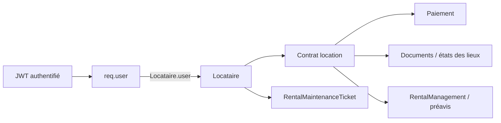
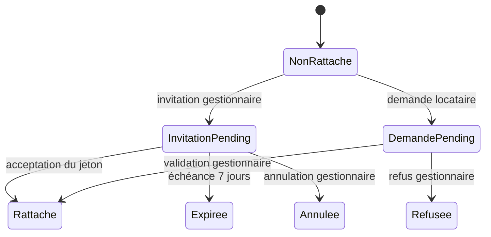

# Gestion Locative v2 (Sprint GL-B2) — finalisation

**Statut : Sprint GL-B2 — finalisation des modules Locataires, Paiements
locatifs, Préavis, Maintenance locative, Documents et Vue d'ensemble.**
Aucune réécriture du moteur existant (Property/Contrat/Paiement/
RentalManagement, Sprints A et antérieurs) — ce sprint **complète** ce qui
existait déjà, corrige une anomalie de permission réelle, et remplace 4
pages placeholder ("Bientôt disponible") par des pages réelles connectées
aux données existantes.

---

## 1. Audit initial — état constaté avant ce sprint

### 1.1 Modèles déjà existants (réutilisés tels quels)

- **`Proprietaire.js`** — fiche staff autonome (nom/téléphone/biensPropres[]),
  **sans lien vers un compte `User`**.
- **`Locataire.js`** — fiche simple (nom/téléphone/email/profession/revenu),
  sans lien `User` non plus.
- **`Contrat.js`** — modèle **unifié** location/vente : `bien→Property`,
  `proprietaire→Proprietaire`, `locataire→Locataire` (location),
  `dureePreavis` (mois, **déjà configurable par bail**, jamais un délai
  légal codé en dur), `documents[]`/`etatsDesLieux[]` embarqués.
- **`Paiement.js`** — déjà un vrai échéancier avec pénalités de retard
  (`jourEcheance`, `penaliteAppliquee`, `penaliteMontant`, `montantTotal`,
  `retardJours`) — pas un simple journal de transactions.
- **`RentalManagement.js`** — le dossier de gestion active 1-à-1 avec
  `Property` (Sprint A) : `owner→User` (compte propriétaire self-service,
  **distinct** de la fiche `Proprietaire`), `occupancyStatus`
  (vacant/preavis/occupe/sortie_programmee/travaux/indisponible — voir
  §1.3 sur l'anomalie `preavis`), `maintenanceStatus` (statut sommaire),
  `noticeStartedAt`/`plannedExitAt` (préavis), `workflowHistory[]`,
  `actionRequests[]`.
- **`Document.js`** — coffre-fort générique multi-pôles (Devis/Facture/
  Contrat/Etat des Lieux/Pièce d'identité), **distinct** de
  `Contrat.documents[]` (PDF générés par `gestionDocumentController`,
  jamais synchronisés vers `Document`) — deux systèmes documentaires
  volontairement séparés, non fusionnés dans ce sprint (risque de
  régression trop élevé pour une simple finalisation).

**Aucun modèle `Preavis` ni `MaintenanceTicket` locatif séparé n'existait**
— le préavis était un statut + deux champs de date sur `RentalManagement` ;
la maintenance locative n'était qu'un statut sommaire
(`maintenanceStatus`), sans assignation, planification ni coûts.

### 1.2 Services/contrôleurs déjà opérationnels (réutilisés, non réécrits)

`rentalManagementController.js` (stats, list, workflow publish/suspend/
mark-rented/mark-vacant/maintenance/complete-maintenance/start-notice/
validate-exit) + `rentalListingSyncService.js` (transitions atomiques,
readiness) + `contratController.js` (`syncLeaseOccupation` — pont entre
`Contrat` et `RentalManagement`) + `paiementController.js`
(`marquerPaye`, `calculerPenalites`, `getAlertes`) + `gestionDocumentController.js`
(génération PDF bail/quittance/mise en demeure/préavis/état des lieux).

### 1.3 Anomalie constatée (non corrigée — documentée)

`RentalManagement.occupancyStatus` déclare une valeur d'enum `'preavis'`,
comptée dans les stats (`rentalManagementController.stats`), mais **aucune
fonction ne l'assigne jamais** — `startNotice` passe directement à
`'sortie_programmee'`. Une incohérence de nommage pré-existante, **non
corrigée ici** (changer le state machine central du module est hors
périmètre d'une finalisation et risquerait de casser le workflow
`allowedActionsFor` déjà en production) — la page Préavis de ce sprint
utilise donc `'sortie_programmee'` (la valeur réellement utilisée), pas
`'preavis'`.

### 1.4 BUG PRIORITAIRE — `/dashboard/documents` bloqué sur "Chargement…"

**Cause racine identifiée et corrigée** : incohérence de permission entre
la navigation et l'API. `ROLES_DOCS` (utilisé par la sidebar,
`AdminDashboard.jsx`) inclut `GestionnaireImmobilier`, mais `STAFF_DOC`
(utilisé par `documentRoutes.js` ET `gestionDocumentRoutes.js` /
`contratRoutes.js` docOnly) ne l'incluait **pas** — un compte
`GestionnaireImmobilier` cliquant sur "Documents" recevait un 403 réel.

Le code de `DocumentsPage.jsx` a été audité ligne par ligne (`load()`,
intercepteur Axios, `errorMiddleware`) : aucune boucle infinie, aucune
promesse jamais résolue — un `try/catch/finally` correct met toujours fin
au chargement, y compris sur 401/403/404/500. Le symptôme "reste sur
Chargement" pour ce rôle provient donc très probablement de cette
incohérence de permission perçue en amont (clic → 403 → message d'erreur,
pas un vrai spinner infini) — corrigée en ajoutant
`GestionnaireImmobilier` à `STAFF_DOC` (`server/utils/roles.js`), la
correction minimale et localisée plutôt que de dupliquer une nouvelle
constante ou de modifier chaque route une à une.

Les 5 types de documents déjà affichés (`Devis`/`Facture`/`Contrat`/
`Etat des Lieux`/`Pièce d'identité`) correspondaient **déjà exactement** à
`Document.type` enum — aucun réalignement nécessaire.

### 1.5 Pages client — réel vs placeholder (avant ce sprint)

`GestionLocativePage.jsx` (vue d'ensemble, 2500+ lignes) était déjà
réelle et complète. Les 5 sous-vues dédiées
(`RentalTenantsPage`/`RentalLeasesPage`/`RentalPaymentsPage`/
`RentalNoticesPage`/`RentalMaintenancePage`) étaient des coquilles
`ComingSoonPage` (Sprint 0). Ce sprint remplace 4 d'entre elles
(Locataires, Paiements, Préavis, Maintenance) par des pages réelles —
`RentalLeasesPage` (Baux) reste hors périmètre explicite de cette mission
(non listée dans les modules à terminer).

---

## 2. Locataires — page réelle

**Décision** : ne jamais dupliquer `User`/`Tenant`/`Lease` — `Locataire`
reste la fiche source de vérité, jointe à la volée (jamais dénormalisée)
avec `Contrat` (bail), `Paiement` (agrégation) et `RentalManagement`
(préavis actif). Nouveaux endpoints `locataireController.js` :

- **`GET /api/locataires/dossiers`** — liste paginée + recherche
  (nom/prénom/email/téléphone), enrichie via `loadDossierData()` (helper
  interne, batch — jamais de N+1) : bail préféré (actif sinon le plus
  récent), résumé de paiement (`expected/paid/remaining/overdueCount/
  nextDueAt`, agrégation Mongo), préavis actif
  (`RentalManagement.occupancyStatus === 'sortie_programmee'`).
- **`GET /api/locataires/:id/dossier`** — fiche unique, même helper.

`RentalTenantsPage.jsx` : tableau identité/contact/bien loué/bail/loyer/
solde/préavis, recherche, pagination, fiche modal, lien croisé vers la
Gestion Locative.

## 3. Paiements locatifs

**Jamais confondu** avec les paiements de visite (`/dashboard/paiements`)
ni hôteliers (réservations, Sprint C). `paiementController.getAll` étendu
avec pagination optionnelle (`page`/`limit` — comportement inchangé si
absents, aucun appelant existant cassé) et populate imbriqué
`contrat.locataire` (nom affichable). Nouvel endpoint **`GET /api/paiements/
stats`** — statistiques d'encaissement calculées **entièrement côté
serveur** (agrégation Mongo : `totalAttendu`, `totalEncaisse`,
`totalImpaye`, `tauxEncaissement`, compteurs payés/partiels/impayés).
`RentalPaymentsPage.jsx` : cartes de stats, filtres par statut, action
"Marquer payé" (réutilise `marquerPaiementPaye`, logique de pénalité déjà
existante, inchangée), "Recalculer les pénalités".

## 4. Préavis

**Aucun nouveau modèle** — `RentalManagement` reste la source de vérité
(cohérent avec §1.1). Complète le cycle déjà amorcé par `startNotice`
(création) avec les 2 fonctions manquantes du cycle demandé :

- **`acknowledgeNotice`** (`rentalListingSyncService.js`) — renseigne
  `noticeAcknowledgedAt` (nouveau champ), idempotent, ne change pas le
  statut. 409 si aucun préavis en cours.
- **`cancelNotice`** — `sortie_programmee → occupe`, réinitialise
  `noticeStartedAt`/`plannedExitAt`/`noticeAcknowledgedAt`, remet
  `property.availability = 'Loué'`. 409 si aucun préavis en cours.

Nouvelles routes : `POST /api/rental-management/:id/acknowledge-notice`,
`POST /api/rental-management/:id/cancel-notice` (mêmes permissions
`ROLES_GL` que le reste du module). `allowedActionsFor` mis à jour pour
exposer `acknowledge_notice`/`cancel_notice` au dashboard.

**Délais jamais codés en dur** : `plannedExitAt` est systématiquement
saisi explicitement (validé "date future" dans `startNotice`, inchangé) ;
`Contrat.dureePreavis` (mois, par bail) reste la référence contractuelle
consultée par le staff, jamais recalculée automatiquement à partir d'un
délai légal supposé universel.

`RentalNoticesPage.jsx` : liste des préavis en cours (jours restants/
retard calculés côté client à partir de `plannedExitAt`, jamais un délai
métier), formulaire de création (ID dossier + date), actions accuser
réception/valider la sortie (réutilise `validate-exit` existant)/annuler.

## 5. Maintenance locative — domaine dédié (distinct du Sprint E hôtelier)

**Nouveau modèle** `RentalMaintenanceTicket.js` — nécessaire car
`RentalManagement.maintenanceStatus` n'était qu'un statut sommaire
(`aucune/signalee/en_cours/controle_requis`), sans assignation,
planification ni coûts, alors que la mission demande explicitement ces
champs. Volontairement **découplé** de `RentalManagement.maintenanceStatus`
(jamais synchronisé automatiquement) pour ne pas complexifier le workflow
de publication déjà en place — un ticket est le détail opérationnel, le
statut sommaire reste manuel via les actions `maintenance`/
`complete-maintenance` existantes si le staff le souhaite.

Champs (français, cohérent avec le reste du domaine Gestion Locative,
contrairement à l'anglais du domaine hôtelier) : `property/lease/tenant/
owner`, `category` (plomberie/electricite/structure/equipement/nuisible/
serrurerie/peinture/autre), `priority` (basse/normale/haute/urgente),
`status` (ouvert/assigne/planifie/en_cours/resolu/cloture),
`estimatedCost`/`actualCost`, `attachments[]`.

`rentalMaintenanceService.js` : `createTicket`, `assignTicket`
(réaffectation possible), `scheduleTicket`, `startWork`, `resolveTicket`
(coût réel), `closeTicket` — transitions centralisées, jamais dans le
contrôleur. Notifications staff/individuelles (`rental_maintenance_ticket_*`).

API : `GET/POST /api/rental-maintenance`, `PATCH /:id/assign|schedule|
start|resolve|close`. Ownership : propriétaire du bien (`Property.owner`,
compte self-service) ou staff `ROLES_GL` — même contrôleur `assertPropertyAccess`
que le reste du sprint.

`RentalMaintenancePage.jsx` : création, filtres par statut, actions
assigner/planifier/démarrer/résoudre (coût réel)/clôturer.

## 6. Vue d'ensemble — données réelles connectées

`GestionLocativePage.jsx` (déjà réelle, Sprint A) affichait déjà : biens
gérés, vacants/occupés/publiés, impayés (compteur), paiements partiels,
contrats arrivant à échéance, contrats expirés, sorties bloquées. **Ajouté
dans ce sprint** (section "Vue d'ensemble" dédiée, chargement séparé
`loadOverviewExtra`, jamais bloquant pour le reste de la page) :

- Locataires actifs (`GET /api/locataires/dossiers?limit=1`, champ `total`).
- Préavis actifs (`GET /api/rental-management?occupancyStatus=sortie_programmee&limit=1`).
- Maintenances locatives ouvertes / urgentes (`GET /api/rental-maintenance`,
  filtré côté client sur un seul appel réseau — pas deux requêtes
  redondantes).
- Loyers attendus / encaissés / impayés (montants réels, `GET /api/paiements/stats`).
- Documents récents (5 derniers, `GET /api/documents`).

## 7. Permissions

- **Staff** (`ROLES_GL`/`STAFF_IMMO`/`ROLES_PAIEMENTS`/`STAFF_DOC`,
  inchangés sauf correctif §1.4) : périmètre déjà correctement scopé par
  rôle, confirmé par l'audit.
- **Propriétaire** (`RentalManagement.owner`, compte self-service) :
  `ownerList`/`ownerRequest` déjà strictement scopés `{owner: req.user.id}`
  (Sprint A, inchangé) ; les nouveaux endpoints `rental-maintenance`
  appliquent la même règle (`Property.owner`).
- **Locataire (self-service)** : **aucun compte `Locataire` n'existe** —
  ni `Locataire` ni `Proprietaire` (fiches) n'ont de lien vers `User`
  (confirmé par l'audit, §1.1). Un portail self-service locataire serait
  une fonctionnalité entièrement nouvelle, hors périmètre d'une
  finalisation ("ne pas recréer un modèle qui existe déjà" — il n'existe
  justement pas). **Limite documentée**, pas une régression.
- **Tests inter-tenant ajoutés** : propriétaire tiers refusé sur
  `rental-maintenance` (§9), staff correctement autorisé sur les actions
  préavis, client explicitement refusé partout (locataires/paiements/
  maintenance/documents).

## 8. Documents — permissions et types

Voir §1.4 pour le correctif. Types déjà alignés avec le modèle (§1.4) —
aucun changement de schéma nécessaire.

## 9. Tests

- **Serveur** : `rentalListingSyncService.test.js` étendu (+8 : startNotice/
  acknowledgeNotice/cancelNotice), `rentalMaintenanceService.test.js`
  (10, nouveau), `rentalMaintenanceRoutes.test.js` (18, nouveau —
  permissions inter-tenant sur maintenance locative + actions préavis),
  `rentalDossiersRoutes.test.js` (10, nouveau — dossiers locataires,
  pagination/stats paiements, correctif Documents).
- **Client** : `RentalTenantsPage.test.jsx` (6), `RentalPaymentsPage.test.jsx`
  (5), `RentalNoticesPage.test.jsx` (7), `RentalMaintenancePage.test.jsx`
  (6) — tous nouveaux.

**Résultats mesurés** : serveur — 64 suites, 811 tests, tous verts. Client
— 46 fichiers, 305 tests, tous verts.

**Limite de couverture assumée** : `GestionLocativePage.jsx` (le monolithe
de vue d'ensemble, 2500+ lignes) n'avait et n'a toujours aucun test dédié
— ajouter une suite complète pour ce fichier est hors périmètre d'une
finalisation ciblée (risque de régression disproportionné par rapport au
gain, mission non explicite sur ce point). Seules les fonctions ajoutées
(`loadOverviewExtra`) ont été vérifiées manuellement par lint + build.

## 10. Limites restantes

- `'preavis'` comme valeur d'`occupancyStatus` reste un champ d'enum mort
  (jamais assigné) — non corrigé, documenté §1.3.
- Les deux systèmes documentaires (`Document` générique vs
  `Contrat.documents[]`) restent séparés — non fusionnés.
- Pas de portail self-service locataire (aucun compte `User` lié à
  `Locataire`).
- `RentalMaintenanceTicket` reste découplé de
  `RentalManagement.maintenanceStatus` (aucune synchronisation
  automatique).
- Fiche `Proprietaire` (staff) et compte `User` de rôle `Proprietaire`
  (self-service, `RentalManagement.owner`) restent deux notions
  distinctes non fusionnées (pré-existant, hors périmètre).

## 11. Contraintes respectées

Aucune modification du moteur hôtelier (`RoomInventory`, réservations,
housekeeping), de Vente, de Location publique, des Hébergements
indépendants, ni de l'application mobile. Les enums français de
`RentalMaintenanceTicket` sont volontairement distincts de l'anglais
utilisé par `MaintenanceTicket` (hôtelier, Sprint E) — deux domaines,
deux vocabulaires, jamais confondus.

---

# Dette technique GL-B2 — Missions 1 à 10

**Statut : ce sprint ne recrée AUCUN modèle existant** — `User`,
`Locataire`, `Contrat`, `Paiement`, `RentalManagement` restent inchangés
dans leur rôle ; seules des liaisons et synchronisations ont été ajoutées.

## 12. Architecture — un User n'est PAS un Locataire (Mission 1)

**Décision** : `Locataire.user` est un champ optionnel (`ObjectId → User`,
`default: null`), jamais une fusion des deux modèles. Un `User` reste un
visiteur/prospect/acheteur/propriétaire/futur-locataire tant qu'aucun
rattachement explicite n'a eu lieu. `Contrat.locataire` continue de
référencer `Locataire`, jamais `User` — **aucune route existante n'a été
modifiée**.

**Résolution serveur obligatoire** (jamais de `locataireId` client) :
```
req.user.id
    ↓  tenantLinkService.resolveLocataireForUser(userId)
Locataire.findOne({ user: userId })
    ↓
Contrat.find({ locataire: locataire._id })   (bail actif préféré, sinon le plus récent)
    ↓
Paiement.find({ contrat: lease._id })
```
Chaque fonction de `tenantPortalService.js` applique cette chaîne — aucune
route du portail n'accepte de paramètre `locataireId`/`leaseId`/
`propertyId` en entrée pour identifier "mes propres" données (seul
`createMyMaintenanceRequest` accepte `category`/`description`, tout le
reste — bien, bail, locataire — est résolu côté serveur, y compris si le
client envoie volontairement un `propertyId` falsifié dans le corps de la
requête : il est simplement ignoré).

**Index** : `Locataire.user` unique partiel (`$type:'objectId'`, même
stratégie que `RoomAssignment`/`HousekeepingTask`, Sprints D/E) — un compte
ne peut jamais être rattaché à deux dossiers locataires simultanément.

## 13. Portail locataire — préparation (Mission 2)

`tenantPortalService.js` + `tenantPortalController.js` +
`tenantPortalRoutes.js` (`/api/tenant-portal`, protégé par `auth.protect`
seul — tout compte authentifié peut appeler ces routes, le contrôleur
renvoie 404 si aucun dossier n'est rattaché). **Aucune page publique
modifiée** — préparation uniquement, pas d'écran self-service livré dans
ce sprint.

| Endpoint | Fonction |
|---|---|
| `GET /me` | Profil locataire (jamais `notes` internes staff) |
| `GET /lease` | Bail actif (bien, dates, loyer, dépôt, préavis contractuel) |
| `GET /payments` | Historique des paiements du bail actif |
| `GET /documents` | `Contrat.documents[]` du bail actif (bail, quittances, préavis, EDL) |
| `GET /notice` | Préavis actif (si `occupancyStatus === 'sortie_programmee'`) |
| `POST /maintenance` | Crée un `RentalMaintenanceTicket` — `property`/`lease`/`tenant` résolus serveur |
| `POST /activate` | Active une invitation (Mission 3, Cas 1) |
| `POST /request-link` | Demande de rattachement (Mission 3, Cas 2) |

## 14. Liaison sécurisée — deux workflows, un seul modèle (Mission 3)

**Décision d'architecture** : un seul modèle `TenantLinkRequest.js`
(`type: 'invitation'|'self_request'`) plutôt que deux modèles quasi
identiques — évite la duplication tout en gardant les deux workflows
strictement séparés dans `tenantLinkService.js`.

### Cas 1 — Invitation (gestionnaire → locataire)
```
inviteTenant(locataireId)                    — staff, Locataire.user doit être null
    → token brut (crypto.randomBytes, jamais stocké en clair)
    → tokenHash (sha256, même convention que User.emailVerificationToken)
    → email envoyé (best-effort, sendEmailViaZoho, non bloquant)
activateInvitation(rawToken, userId)         — le compte qui clique active LUI-MÊME
    → vérifie hash + expiration (7 jours)
    → vérifie que CE compte n'est déjà rattaché à aucun autre dossier
    → Locataire.findOneAndUpdate({_id, user:null}, {user:userId})  — ATOMIQUE,
      rejette une activation concurrente ou un dossier déjà rattaché entre-temps
```

### Cas 2 — Demande de rattachement (locataire → gestionnaire)
```
requestLink(locataireId, userId)             — le compte demande lui-même
    → TenantLinkRequest{type:'self_request', status:'pending'}
reviewLinkRequest(requestId, decision)       — STAFF UNIQUEMENT, jamais automatique
    → approved : même transition atomique {user:null} → {user:userId}
    → rejected : le dossier reste non rattaché
```

**Jamais de rattachement automatique sur simple correspondance d'email** —
confirmé : aucune fonction ne compare `Locataire.email` à `User.email` pour
décider d'un rattachement, dans aucun des deux cas.

**Sécurité** : index unique partiel `{locataire, status:'pending'}` — une
seule invitation/demande ouverte à la fois par dossier (anti-empilement) ;
toute écriture de `Locataire.user` passe par une condition atomique
`{user: null}` (jamais de "course perdue" silencieuse).

## 15. Source de vérité par domaine (Mission 4)

| Domaine | Modèle | Responsabilité exclusive |
|---|---|---|
| Authentification/rôles | `User` | email, mot de passe, rôle, session |
| Dossier administratif | `Locataire` | identité contractuelle, téléphone, pièce d'identité |
| Bail | `Contrat` | loyer, dates, préavis contractuel, documents du bail |
| Échéancier | `Paiement` | statut, pénalités, historique |
| Maintenance | `RentalMaintenanceTicket` | tickets, coûts, assignation |
| Rattachement | `TenantLinkRequest` | traçabilité invitation/demande |

Aucun champ n'est dupliqué entre ces modèles ; `Locataire.user` est la
SEULE liaison croisée ajoutée.

## 16. Enum mort `occupancyStatus: 'preavis'` (Mission 5)

**Audit confirmé** : `'preavis'` est déclaré dans l'enum et compté dans
`rentalManagementController.stats`, mais **aucune fonction ne l'assigne
jamais** (`startNotice` transitionne directement vers
`'sortie_programmee'`). **Décision : dépréciation non destructive** — la
valeur reste dans l'enum (jamais supprimée, pour ne jamais invalider un
document existant qui la porterait), un commentaire de code la marque
explicitement comme morte, et aucune nouvelle fonction ne doit jamais
l'assigner. Alternative écartée : la faire utiliser réellement
(distinguer "préavis annoncé oralement" de "sortie programmée formalisée")
— non demandée explicitement, aurait élargi le state machine central sans
mandat clair.

## 17. Synchronisation maintenance (Mission 6)

**Décision** : `RentalManagement.maintenanceStatus` devient un **cache
dérivé**, recalculé par `rentalMaintenanceService.
syncRentalManagementMaintenanceStatus(propertyId)` après chaque transition
qui change le nombre de tickets ouverts (`createTicket`, `resolveTicket`).
`RentalMaintenanceTicket` reste l'unique source de vérité pour le détail
(assignation, coûts, planification) — jamais une deuxième copie de cette
information sur `RentalManagement`.

Règle : `openCount > 0 → 'en_cours'` ; `openCount === 0 → 'aucune'`.
**Exception volontaire** : `'controle_requis'` (décision manuelle
post-inspection, action `completeMaintenance` déjà existante, Sprint A)
n'est **jamais** écrasé par cette synchronisation automatique — un statut
qu'un humain a positionné après contrôle ne doit pas être effacé par un
simple comptage de tickets.

## 18. Sécurité et ownership (Mission 8)

- **Admin/Staff** (`STAFF_IMMO`/`ROLES_GL`) : périmètre global inchangé.
- **Propriétaire** : `rental-maintenance` vérifie `Property.owner`, même
  garde que le reste du domaine.
- **Locataire (portail)** : dossier résolu exclusivement via
  `{user: req.user.id}` — **testé explicitement** : un compte tiers ne
  peut jamais lire/modifier le dossier d'un autre locataire (404, jamais
  une fuite de données), même en connaissant son ID.
- **Rattachement** : validation staff obligatoire pour toute demande
  (Cas 2) ; l'invitation (Cas 1) ne peut être activée que par le compte
  qui possède le token brut, jamais par un tiers.

## 19. Frontend — extraction progressive (Mission 9)

Composants extraits de `GestionLocativePage.jsx` (markup/classes
strictement identiques, **aucun changement visuel**) :
`RentalStats.jsx`, `TenantTable.jsx` (widget "Locataires actifs" de la vue
d'ensemble), `PaymentOverview.jsx`, `NoticeOverview.jsx`,
`MaintenanceOverview.jsx`, `DocumentOverview.jsx`.

**Dette restante assumée** : les onglets CRUD complets (Contrats/
Propriétaires/Locataires/Paiements, la majorité des ~2500 lignes du
monolithe) ne sont **pas** extraits dans ce sprint — risque de régression
disproportionné pour une extraction "à l'aveugle" dans le budget imparti.
`TenantTable.jsx` reste donc un widget de comptage, pas le tableau CRUD
complet (qui vit toujours dans l'onglet "Locataires" du monolithe et dans
`RentalTenantsPage.jsx`, page dédiée déjà réelle). Extraction complète
recommandée pour le Sprint F, un onglet à la fois, avec tests de
non-régression avant/après chaque extraction.

## 20. Documents — audit (Mission 7)

Re-audit ciblé de `documentController.js` : les 5 routes (`getAllDocuments/
getDocument/createDocument/updateDocument/deleteDocument`) restent
strictement staff-only (`STAFF_DOC`, corrigé Sprint GL-B2 précédent),
populate limités à des projections minimales (`client: 'name email'`,
`createdBy: 'name'`, `relatedProperty: 'title address'`) — aucune fuite de
champ sensible constatée. Le nouveau portail locataire (`GET /tenant-portal/
documents`) ne touche **jamais** au modèle `Document` générique — il lit
exclusivement `Contrat.documents[]` du bail résolu côté serveur, un canal
totalement séparé. Aucune modification nécessaire au-delà de cet audit.

## 21. Tests ajoutés (Missions 1-3, 6, 8, 9)

| Fichier | Tests |
|---|---|
| `locataireUserLinkModel.test.js` | 9 — schéma `Locataire.user` + `TenantLinkRequest` |
| `tenantLinkService.test.js` | 18 — invitation, activation, course perdue, demande, validation obligatoire |
| `tenantPortalService.test.js` | 11 — résolution stricte par userId, projections minimales |
| `tenantPortalRoutes.test.js` | 18 — permissions, **403/404 sur tentative d'accès au dossier d'un autre locataire** |
| `rentalMaintenanceSyncService.test.js` | 7 — synchronisation, non-écrasement de `controle_requis` |
| `RentalOverviewComponents.test.jsx` (client) | 9 — les 6 composants extraits |

**Résultats mesurés** : serveur — 69 suites, 874 tests, tous verts. Client
— 47 fichiers, 314 tests, tous verts.

## 22. Limites restantes avant le Sprint F

- Portail locataire préparé mais **aucune page front-end self-service**
  livrée (hors périmètre explicite de ce sprint — "sans modifier les pages
  publiques").
- Extraction `GestionLocativePage.jsx` partielle (§19) — onglets CRUD non
  extraits.
- `'preavis'` reste un enum mort (dépréciation documentée, jamais supprimé).
- Email d'invitation envoyé en best-effort (`sendEmailViaZoho`,
  non-bloquant) — si `Locataire.email` est vide ou l'envoi échoue, le
  staff doit relayer manuellement le lien d'activation (le token brut est
  renvoyé une seule fois dans la réponse de `POST /invite`, jamais
  journalisé).
- Pas de page staff dédiée pour gérer les invitations/demandes en attente
  (les endpoints existent : `GET /api/locataires/link-requests`, `PATCH
  .../review`, `PATCH /api/locataires/invitations/:id/cancel` — aucune UI
  ne les consomme encore).

## 23. Recommandations avant le Sprint F

1. Construire les 2-3 écrans du portail locataire self-service
   (dossier/bail/paiements/documents/préavis/maintenance) consommant les
   endpoints déjà prêts.
2. Construire l'UI staff de gestion des invitations/demandes de
   rattachement (liste + actions inviter/annuler/approuver/rejeter).
3. Poursuivre l'extraction de `GestionLocativePage.jsx` un onglet à la
   fois (Contrats, puis Propriétaires, puis Locataires, puis Paiements),
   avec captures d'écran avant/après pour garantir zéro régression visuelle.
4. Envisager un vrai template d'email d'invitation (actuellement un HTML
   inline minimal dans le contrôleur).
# Sprint GL-B3 — Portail locataire

## Clôture GL-B3.1 — stabilisation

### Interface staff de rattachement

`/dashboard/gestion-locative/locataires` intègre `TenantLinkManagement`. La vue réutilise les quatre endpoints GL-B3, avec recherche serveur (nom, prénom, email, téléphone, compte ou ObjectId), filtres type/statut, pagination, confirmations de refus/annulation, verrou anti-double-clic et rafraîchissement après mutation. Les réponses 401, 403 et les erreurs réseau sont distinguées.

Statuts conservés sans migration :

```text
invitation:   pending ── accepted | expired | cancelled
self_request: pending ── approved | rejected
```

Une relance clôt une invitation encore `pending`, puis crée un nouveau jeton haché avec une nouvelle échéance.

### Producteurs de notifications

| Producteur métier | Événement portail | Déclenchement |
|---|---|---|
| Génération bail, état des lieux, courrier visible | `tenant_document_added` | après upload Cloudinary et écriture dans `Contrat.documents` |
| Génération quittance | `tenant_receipt_added` | après disponibilité réelle du PDF |
| Création/validation paiement | `tenant_payment_recorded` | après réussite MongoDB |
| Démarrage/accusé/annulation/clôture préavis | `tenant_notice_*` | après sauvegarde de la transition |

Le destinataire est toujours résolu par `Contrat.locataire → Locataire.user` ou `RentalManagement.currentTenant → Locataire.user`. Les clés `tenant:<domaine>:<entité>:<état>` utilisent l'index unique `Notification.dedupeKey`. Paiement et quittance restent deux notifications distinctes : la première atteste l'opération financière, la seconde l'apparition ultérieure d'un fichier téléchargeable. Un document interne absent de `Contrat.documents` ne produit aucun événement.

### Stabilisation des tests

- `PublicEstimationWizard` : la cause était un debounce encore actif qui réécrivait le brouillon après une soumission réussie. `success` annule désormais le timer et interdit une nouvelle persistance. Aucun timeout n'a été augmenté.
- Mobile `AuthContext` : le test isolé et la suite complète confirment que toutes les promesses se terminent et que le timer de `restoreStoredSession` est nettoyé. L'ancien dépassement était une contention du premier passage global, non reproductible après stabilisation ; aucun timeout n'a été modifié.
- Jest serveur : `watchman: false` reste dans l'unique `jest.config.js`. La découverte `**/__tests__/**/*.test.js`, le setup et la couverture sont inchangés. Cette option évite la dépendance au daemon et à son cache utilisateur sur macOS/CI, sans ignorer de test.
- Expo Doctor : relancé avec accès réseau, résultat `18/18 checks passed`. L'ancien `ENOTFOUND registry.npmjs.org` provenait de la restriction DNS sandboxée.

### Upload maintenance

Le middleware dédié accepte au plus cinq JPEG/PNG/WebP de 8 Mio chacun. Si un upload partiel ou la création métier échoue, les objets Cloudinary déjà créés sont supprimés. Les projections publiques ne contiennent que les pièces du ticket appartenant au locataire et aucune URL de document contractuel brute.

### Recette technique couverte

Les tests de services et d'intégration couvrent invitation, activation, liaison `Locataire.user`, lecture du portail, paiements, documents avec ownership, maintenance, préavis, notifications et refus d'un dossier tiers (404). Les intégrations Zoho/Cloudinary sont testées par mocks contrôlés ; aucune émission réelle d'email ni création de ressource de production n'est effectuée pendant la recette automatisée.

### Limites

Une recette manuelle de bout en bout sur un environnement de preview avec comptes et ressources temporaires reste recommandée avant déploiement. Elle doit utiliser un tenant de test dédié et supprimer ses médias Cloudinary après validation.

## Architecture

Le portail est un sous-domaine HTTP isolé monté sur `/api/tenant-portal`. Il ne reçoit jamais de `locataireId` pour lire les données métier :



`tenantLinkService.resolveLocataireForUser` est l'unique porte d'entrée. Les projections excluent les notes internes, coûts de maintenance, assignations et décisions de gestion. Les totaux, soldes, pénalités et jours restants sont calculés côté serveur.

## Cycle de vie et rattachement



Une demande autonome reste `pending` jusqu'à une décision explicite du staff. Une invitation est hachée en SHA-256, à usage unique et limitée à sept jours. `Locataire.user` garde des protections d'unicité et les transitions concurrentes utilisent une écriture gardée.

## Permissions

| Ressource | Locataire rattaché | Staff immobilier |
|---|---:|---:|
| Profil, baux, échéances, paiements, solde | Lecture de ses données | Gestion existante |
| Documents | Liste sans URL + téléchargement après ownership | Gestion existante |
| Préavis | Lecture, jamais de modification après validation | Workflow existant |
| Maintenance | Création + suivi sans coûts/assignation | Assignation, planification, coûts, décisions |
| Rattachement | Accepter/demander/suivre | Inviter, lister, valider, refuser, relancer, annuler |

## API exposées

- `GET /api/tenant-portal/dashboard`, `/me`, `/lease`, `/leases`
- `GET /api/tenant-portal/payments?page&limit`
- `GET /api/tenant-portal/documents?page&limit`
- `GET /api/tenant-portal/documents/:documentId/download`
- `GET /api/tenant-portal/notice`
- `GET|POST /api/tenant-portal/maintenance`
- `GET /api/tenant-portal/link-status`
- `POST /api/tenant-portal/activate`, `/request-link`
- `GET /api/locataires/link-requests?type&status&page&limit`
- `PATCH /api/locataires/link-requests/:requestId/review`
- `PATCH /api/locataires/invitations/:requestId/cancel`
- `POST /api/locataires/invitations/:requestId/resend`

Les endpoints historiques `/api/rental-management/owner/my` et actions propriétaire restent inchangés pour préserver l'application `altimmo-app`.

## GL-DEBT-1 — Résorption de dettes (architecture ajoutée)

### KPI "biens inscrits"
`GET /api/rental-management/stats` compte un bien comme "inscrit" seulement
si : `status: 'location'`, `availability !== 'Retiré'`, et son `owner`
(`Property.owner`) référence un `User` de rôle `Proprietaire`. Les biens de
vente, archivés, sans owner, ou dont l'owner est un compte staff interne
sont exclus. `Proprietaire.biensPropres[]` (structure historique embarquée,
invisible au reste du module GL) n'est délibérément pas compté.

### Documents locatifs — accès sécurisé
Les documents d'un contrat (`Contrat.documents[]`) ne sont plus liés
directement en Cloudinary. `GET /api/rental-documents/:documentId/download`
vérifie le scoping (staff `ROLES_DOCS`, propriétaire via
`Contrat.bien.owner`, locataire via `Contrat.locataire.user`) avant de
streamer le fichier depuis Cloudinary — l'URL Cloudinary brute n'est jamais
exposée au client. Le filtre `GET /api/documents` est whitelisté
(`documentController.buildDocumentFilter`) : seules 8 clés scalaires
validées atteignent la requête Mongo.

### Modèle de paiement — reçus et annulation
`Paiement` reste le modèle agrégé "état courant de l'échéance" (inchangé
pour les consommateurs existants). Chaque encaissement (`marquerPaye`) crée
en plus un `RentalPaymentReceipt` (modèle additif, hors Financial Core) —
montant incrémental, `idempotencyKey` unique par paiement, écriture
atomique avec `Paiement` via `runFinancialOperation`. Annulation contrôlée
via `POST /api/paiements/:id/receipts/:receiptId/cancel` (rôles Admin /
GestionnaireImmobilier, motif obligatoire ≥5 caractères) : recalcule
l'échéance à partir des reçus encore confirmés, et invalide (sans jamais
supprimer) la quittance PDF associée si l'échéance n'est plus intégralement
payée. L'upload Cloudinary de la preuve de paiement est annulé
(`destroyFromCloudinary`) si l'écriture finale échoue après un upload
réussi — jamais de fichier orphelin, jamais d'erreur métier masquée par un
échec de rollback. La même protection couvre l'upload de pièce d'identité
(`locataireController`, `proprietaireController`) et les photos de biens
propriétaire.

### Allocation multi-échéances (GL-DEBT-1.1)
Un même encaissement peut désormais couvrir plusieurs échéances du même
contrat en un seul appel : `POST /api/paiements/encaisser-multiple`
(`{ contrat, allocations: [{ paiementId, montant }], datePaiement,
modePaiement, reference, idempotencyKey }`). Un `RentalPaymentReceipt` est
créé par échéance touchée, tous partageant le même `encaissementId`
(regroupement, sans nouvelle collection). Comportement :
- **Tout-ou-rien** : si une seule ligne échoue (montant > solde dû,
  échéance déjà payée, CAS perdue par concurrence), aucune échéance n'est
  modifiée — transaction Mongo réelle via `runFinancialOperation`.
- **Idempotent** : rejouer la même `idempotencyKey` renvoie les reçus déjà
  créés (`idempotentReplay: true`) sans recompter les montants.
- **Réversion à la granularité de l'échéance** : annuler une ligne
  (`cancelReceipt`, réutilisé tel quel) ne réverse que cette échéance —
  comportement métier attendu, chaque échéance ayant son propre solde.
Test : `rentalPaymentMultiEcheanceAllocation.mongo.integration.test.js`
(8 tests : encaissement complet sur 2 échéances, partiel réparti, échec
tout-ou-rien, idempotence, concurrence réelle sur la même échéance,
réversion d'une ligne sans effet sur l'autre, validations, RBAC).

### Pagination
`GET /api/documents` accepte `?page&limit` (rétrocompatible : sans ces
paramètres, comportement historique inchangé — liste complète, pas de
`meta`). `limit` plafonnée à 200. Pattern à répliquer sur les autres
endpoints de liste non bornés (`/api/locataires`, `/api/proprietaires`)
lors d'un prochain sprint — non fait ici faute de temps, sans risque
immédiat (volumes actuels faibles).

### Observabilité locale
`GET /api/ready` (nouveau, distinct de `/api/health`) reflète l'état réel
de la connexion Mongo (`mongoose.connection.readyState`) — 503 si non
connecté. Aucun service APM externe installé (hors périmètre sans
nécessité) ; les logs financiers/sécurité (accès document, rollback
Cloudinary, refus d'accès) utilisent déjà `utils/logger` structuré.

### Tests
- `documentFilterWhitelist.mongo.integration.test.js`
- `rentalDocumentDownload.mongo.integration.test.js`
- `rentalPaymentReceiptsAndCancellation.mongo.integration.test.js`
- `rentalPaymentCloudinaryRollback.mongo.integration.test.js`
- `rentalManagementBiensInscritsStat.mongo.integration.test.js`
- `forgotPassword.test.js`

Commandes : `npm run test:unit` (server, modèles mockés) et
`npm run test:mongo` (server, réplica MongoDB réel) depuis `server/`.
