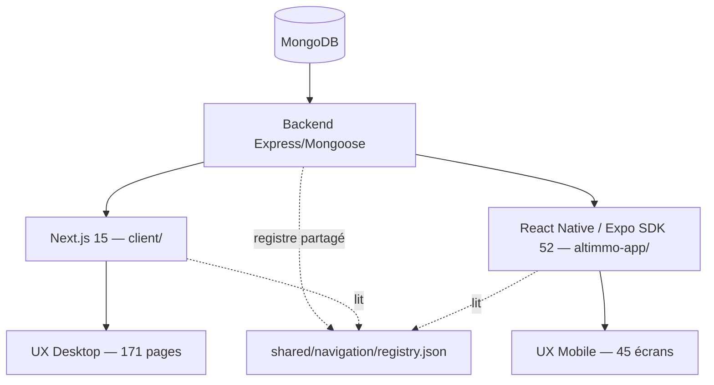
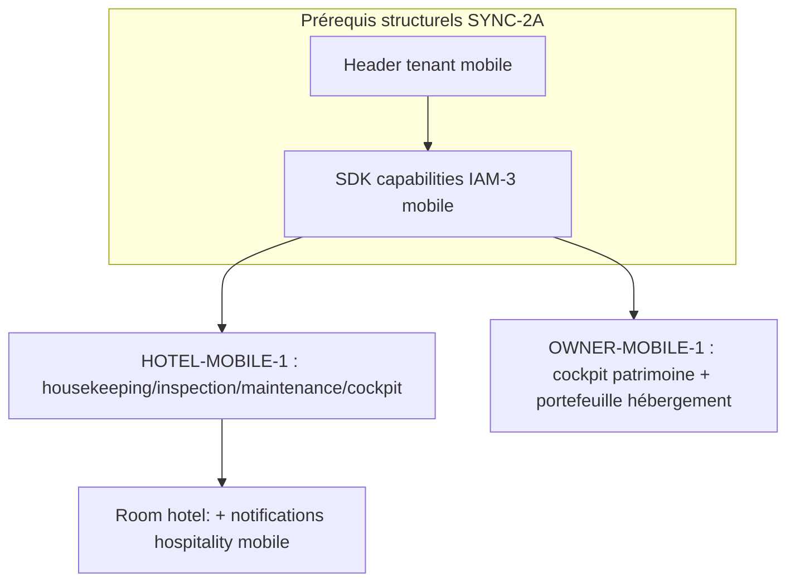

# SYNC-1 — Rapport final d'audit de parité Web ↔ Mobile

Date : 2026-08-15. Branche `main`, HEAD `0fc4157262d3a8b69e86b02cda66cb95d2e26ed5`. Fait suite à `SYNC1_WEB_MOBILE_ETAT_INITIAL.md` et `SYNC1_PARITY_MATRIX.md`.

## 1. Résumé exécutif

SYNC-1 est un audit, pas une livraison fonctionnelle. Il établit que le Web (Next.js, 171 pages) et le Mobile (Expo/React Native, 45 écrans réels) partagent déjà un backend unique et un socle de navigation partagé (`shared/navigation/registry.json`), mais que la parité reste **inégale par domaine** : quasi complète sur Client/Locataire/Documents/Accommodation (grâce à quatre sprints mobiles récents), **absente** sur les opérations PMS hôtel terrain (housekeeping, inspection, maintenance, cockpit) et sur les couches transverses AUTH-1.1/IAM-3 (tenant, capabilities) que le mobile n'a jamais consommées. **Verdict : SYNC-1 AUDIT CERTIFIÉ** (voir §43).

## 2. Architecture actuelle

## 3. Architecture Web

Next.js 15 App Router, 171 pages, 61 services `client/lib/services/*`. Couvre le public, les espaces personnels et la quasi-totalité du staff : gestion locative, patrimoine, hébergements, hôtellerie complète (certifiée E2E-1), finance, documents, communication, événementiel.

## 4. Architecture Mobile

Expo SDK 52 / React Native, React Navigation, Axios + `expo-secure-store`, Socket.IO client, `expo-notifications`, `expo-file-system`/`expo-sharing`. 45 écrans réels, 20 services. Quatre sprints mobiles ont été menés entre le 5 et le 15 août (`NAV-CORE-1`, `GL-MOBILE-1`, `ACC-MOBILE-1`, `DOC-MOBILE-1`), fermant les P0 « portail locataire » et « hébergement indépendant » identifiés par l'audit précédent (`MOB-GAP-1`, 5 août). Aucun sprint `HOTEL-MOBILE-1`, `OWNER-MOBILE-1`, `PAY-MOBILE-1` ou `CRM-MOBILE-1` n'a eu lieu.

## 5. Backend commun

Express/Mongoose reste l'unique source de vérité métier. JWT partagé, RBAC serveur (`protect`, `restrictTo`, capabilities IAM-3, ownership). Aucune règle métier dupliquée côté client détectée (le mobile fait des checks de rôle grossiers pour l'UI uniquement, jamais une RBAC parallèle).

## 6. Auth

Login/logout/signup/forgot-reset password : parité complète. Stockage token mobile (`expo-secure-store`) **plus sûr** que le Web (`localStorage`). Écarts réels et vérifiés : `tokenVersion` jamais lu côté mobile (0 occurrence), aucune gestion dédiée d'un compte suspendu/banni/inactif à la connexion mobile (seul un libellé de notification existe). Le mobile hérite passivement des refus 401/403 backend mais ne les traite pas explicitement comme le Web (AUTH-1).

## 7. Tenant

**Écart confirmé et non ambigu** : le mobile n'envoie jamais le header `X-Platform-Tenant-Id` (recherche exhaustive négative) et n'a aucune notion de sélection/switch de tenant. Sans conséquence de sécurité aujourd'hui car aucun écran staff multi-tenant n'existe sur mobile, mais **bloquant** pour tout futur écran Admin/staff mobile (HOTEL-MOBILE-1, CRM-MOBILE-1) qui devra consommer AUTH-1.1 dès sa conception.

## 8. IAM

IAM-3 (capabilities READ/MANAGE par domaine staff) n'a jamais été porté sur mobile — confirmé par l'absence totale de `capability`/`hasStaffCapability` dans `altimmo-app/src`. Sans risque immédiat : aucun rôle staff spécialisé (`Secretaire`, `GestionnaireImmobilier`, `CommunityManager`) n'est référencé côté mobile, donc aucun écran n'expose une capacité que le backend refuserait. Le jour où un écran staff mobile est créé, il devra consommer IAM-3 nativement, jamais réinventer un RBAC.

## 9. Navigation

Le registre `shared/navigation/registry.json` (40 destinations) est le socle de convergence réel — pas une aspiration. Il couvre Property, Visits, Payments, Applications, Messages, Profile, Hôtel/Accommodation reservations (côté client), Tenant Portal, My Documents, avec `webRoute`+`mobileRoute` alignés. Aucune destination hôtel opérationnelle (housekeeping/inspection/maintenance/finance/cockpit/room assignment) n'y figure. `HotelOperationsScreen` est câblé en dehors du registre (dette architecturale confirmée).

## 10. Client

`/mon-espace` (Web) vs Profil/Favoris/Transactions/RealEstateApplications (Mobile) : parité quasi complète.

## 11. Locataire

`/espace-locataire` (Web, multi-page) vs `TenantPortalScreen` (Mobile, écran unique agrégé) : capacité métier identique — bail, échéancier, paiements, documents, préavis, maintenance — livrée par GL-MOBILE-1. UX différente par conception (mobile = un écran à sections), pas un écart fonctionnel.

## 12. Owner immobilier

Publication d'annonces : parité quasi complète. Cockpit patrimoine (cycle de vie, revenus/dépenses, entretien, documents, alertes) : **absent** côté mobile, `MesAnnoncesScreen` reste un résumé. P1, roadmap déjà écrite (`OWNER-MOBILE-1`).

## 13. Owner hébergement

Portefeuille unifié Hôtel/Maison (`/mes-hotels`) : **absent** côté mobile (`MY_ESTABLISHMENTS.mobileRoute = null`, vérifié dans le registre). Aucun cockpit portefeuille propriétaire hébergement sur mobile.

## 14. Hôtel

Réservation client, room assignment, check-in, check-out : présents côté mobile (`HotelOperationsScreen`, `hotelReservationService.js`). Financial readiness avant check-out : **absent** — le mobile expose `checkOutHotelReservation` sans afficher l'état financier qui bloque ou autorise le départ côté Web (bug corrigé pendant E2E-1). Housekeeping, inspection, maintenance, cockpit KPI : **absents totalement**, confirmé par recherche exhaustive dans `altimmo-app/src`.

## 15. Accommodation (maison meublée)

Parité quasi complète depuis ACC-MOBILE-1 : disponibilité, création, suivi, financier, remboursement, documents. Invariant respecté : aucune référence à `Room`/`RoomCategory` trouvée dans les écrans Accommodation mobile — la maison meublée n'est jamais transformée en mini-hôtel.

## 16. PMS

Voir la matrice détaillée (`SYNC1_PARITY_MATRIX.md` §7). Réservation/room assignment/check-in/check-out : couverts. Financial readiness, housekeeping, inspection, maintenance, cockpit, realtime `hotel:<id>` : tous absents côté mobile. C'est l'écart le plus significatif de cet audit, cohérent avec le fait qu'aucun sprint `HOTEL-MOBILE-1` n'a encore eu lieu.

## 17. GL (Gestion locative)

Portail locataire (locataire) : couvert (§11). Fonctions staff GL (gestionnaire immobilier, secrétaire) : jamais portées sur mobile, cohérent avec l'absence totale de rôles staff spécialisés référencés côté mobile — non traité comme un manque puisqu'aucun usage mobile staff GL n'est encore envisagé avant IAM-3 mobile.

## 18. Visites

Présentes côté mobile (`VisitesScreen`) mais partielles : paiement de visite et workflow terrain complet (reprogrammation/incident/no-show) non certifiés symétriques au Web — dette déjà identifiée par MOB-GAP-1, non fermée depuis.

## 19. Maintenance

Deux modèles strictement distincts et non fusionnés : maintenance locative (GL-MOBILE-1, `tenantPortalService.js`, tickets avec photos) et maintenance hôtelière (absente côté mobile, voir §16). Aucune confusion trouvée dans le code entre les deux.

## 20. Documents

Coffre personnel unifié (GL + Accommodation + Hôtel) livré par DOC-MOBILE-1 : parité quasi complète. Centre documentaire administratif global : volontairement Web-only (RBAC/volume).

## 21. Finance

Facturation/encaissement/allocation hôtel : volontairement Web-only (Admin uniquement, même côté Web — certifié E2E-1). Lecture financière voyageur : couverte pour Accommodation, absente pour le volet staff hôtel financial-readiness (§14).

## 22. Messaging

Conversations : parité complète (rooms Socket.IO, JWT, reconnect).

## 23. Notifications

Types génériques (propriétés, visites, messages, paiements, candidatures, portail locataire, documents) : résolus via le registre NAV-CORE, parité complète. Types hospitality introduits par DASH-4 (réservation statut, housekeeping, inspection, maintenance, échec brouillon financier) : **aucune destination mobile enregistrée** — ces notifications, si elles atteignent un utilisateur mobile aujourd'hui, n'ont pas de cible native contextualisée.

## 24. Realtime

Le client Socket.IO mobile (`socketService.js`) authentifie par JWT, gère la reconnexion et les rooms de conversation — mais ne rejoint jamais la room `hotel:<id>` introduite par DASH-4. Aucun broadcast global détecté (conforme à la convention room-scoped). L'écart est une simple absence de consommation, pas une divergence de convention.

## 25. Altcom

Web/API uniquement, volontaire. Aucune duplication prématurée recommandée (roadmap CRM-MOBILE-1 limitée au terrain).

## 26. Mila Events

Web/API uniquement, volontaire, même raisonnement que §25.

## 27. Design system

Non audité en détail pixel par pixel (hors mandat — parité ≠ copie visuelle). Constat structurel : les deux clients maintiennent des fichiers de constantes séparés (`client/lib/constants/`, `altimmo-app/src/constants/`) avec des noms qui se recoupent (`amenities`, `locations`, `propertyTypes`, `accommodation`, `rentalProperty`) mais sans centralisation — `propertyTypes.js` comparé sommairement ne montre pas de divergence de valeurs, sans diff exhaustif certifié.

## 28. API parity

Le mobile consomme un sous-ensemble volontairement restreint des routes backend (voir `MOB_GAP_INVENTORY.json` pour le détail brut : 489 routes montées, ~82 appels natifs recensés au 5 août, en croissance depuis avec ACC/GL/DOC-MOBILE-1). Aucun endpoint legacy incompatible détecté pendant cet audit ciblé ; aucun payload divergent trouvé sur les domaines vérifiés (auth, hôtel, documents).

## 29. Status parity

Aucun statut mobile obsolète détecté sur les domaines vérifiés (réservations hôtel, Accommodation, tenant portal) — le mobile affiche les statuts renvoyés par le serveur sans traduction locale divergente trouvée.

## 30. Bugs

Aucun bug P0 sécurité trouvé pendant cet audit (aucun contournement RBAC/tenant/ownership constaté côté mobile — le mobile est simplement en retrait fonctionnel, jamais en excès de privilège). Écarts classés P1/P2 : voir matrice §1 « Résumé chiffré ».

## 31. Sécurité

Aucune fuite ni contournement détecté. Le mobile n'expose aucune capacité que le backend refuserait — l'absence de couches AUTH-1.1/IAM-3 côté mobile est une dette de parité fonctionnelle, pas une faille (le backend reste la sécurité réelle, conformément au critère §72 du mandat).

## 32. Tests

Voir §33. Aucun test Web/API n'a été modifié ou requis par ce sprint (aucun code Web/API touché) — seuls les gates mobiles ont été exécutés en conditions réelles.

## 33. Baseline Expo

| Contrôle | Résultat |
|---|---|
| Syntaxe (`check:syntax`) | ✅ 157 fichiers vérifiés, 0 erreur |
| Lint (`eslint`) | ✅ 0 erreur, 86 avertissements préexistants |
| Types (`tsc --noEmit`) | ✅ succès |
| Tests (`jest`) | ✅ 24 suites, 227 tests réussis |
| Export Android (`expo export`) | ✅ succès, bundle Hermes 6,6 Mo |
| Expo Doctor | ⚠️ 20/21 contrôles réussis — 1 échec : 12 dépendances Expo à jour patch (`expo-asset`, `expo-auth-session`, `expo-dev-client`, `expo-file-system`, `expo-image`, `expo-image-picker`, `expo-location`, `expo-notifications`, `expo-sharing`, `expo-store-review`, `expo-updates`) |

Conformément au mandat (§60), ces 12 dépendances **n'ont pas été mises à jour** dans SYNC-1 — leur traitement appartient à `MOB-1`. Cet échec Doctor est une dette préexistante, déjà documentée identique dans `WEB_MOBILE_PARITY_AUDIT.md` (5 août) et tous les sprints mobiles intermédiaires.

## 34. Web-only

Justifiés par l'usage réel constaté : administration système avancée, configuration plateforme, modération exhaustive, centre documentaire administratif global, finance hôtel avancée (facturation/encaissement/allocation staff), Altcom/Mila Events (pour l'instant), CRM back-office.

## 35. Mobile-only (candidats, non construits dans SYNC-1)

Housekeeping/inspection/maintenance terrain (capture photo, intervention immédiate) sont naturellement mobiles — c'est un des arguments principaux pour prioriser `HOTEL-MOBILE-1` en premier dans SYNC-2.

## 36. Écrans manquants (priorisés)

| Écran/domaine | Priorité | Complexité estimée | API prête ? | Dépendance |
|---|---|---|---|---|
| Consommation header tenant (`X-Platform-Tenant-Id`) côté mobile | P0 (prérequis) | Faible | Oui (déjà utilisé côté Web) | Aucune — doit précéder tout écran staff |
| Financial readiness check-out (lecture seule) | P1 | Faible | Oui (`checkout-financial-readiness` déjà servi au Web) | Aucune |
| Housekeeping (liste tâches, start/complete) | P0 | Moyenne | Oui (API DASH-3 déjà servie au Web) | Header tenant |
| Inspection (passed/failed, notes) | P0 | Moyenne | Oui | Header tenant, Housekeeping |
| Maintenance hôtel (création/suivi) | P1 | Moyenne | Oui | Header tenant |
| Cockpit hôtel (KPI arrivées/départs/occupées/disponibles/cleaning/hors-service) | P1 | Moyenne | Oui, agrégats déjà servis au Web — ne pas inventer de nouveaux KPI | Header tenant |
| Room `hotel:<id>` Socket.IO côté mobile | P1 | Faible | Oui (DASH-4) | Aucune |
| Notifications hospitality → destinations NAV-CORE mobile | P1 | Faible | Oui | Registre à étendre |
| Cockpit patrimoine propriétaire immobilier | P1 | Élevée | Partielle (agrégats à vérifier) | Aucune |
| Portefeuille hébergement (Hôtel/Maison) mobile | P1 | Moyenne | Oui | Header tenant |
| IAM-3 capabilities côté mobile (SDK partagé) | P0 (prérequis structurel) | Moyenne | Oui | Aucune — doit précéder tout écran staff spécialisé |

## 37. Écrans legacy

Aucun écran mort confirmé (constat MOB-GAP-1 reconfirmé : aucun fichier de `src/screens` non atteint par la navigation). `reviewService.js` reste orphelin (non importé par aucun écran/hook), déjà signalé le 5 août, toujours vrai.

## 38. Écrans à supprimer éventuellement

`reviewService.js` (candidat suppression ou réintégration, décision produit, hors périmètre SYNC-1).

## 39. Priorités

P0 : header tenant mobile + SDK capabilities IAM-3 (prérequis structurels), housekeeping, inspection.
P1 : maintenance hôtel, cockpit hôtel, financial readiness mobile, portefeuille hébergement, room realtime hôtel, notifications hospitality, cockpit patrimoine propriétaire.
P2 : Altcom/Mila client, CRM terrain.
P3 : raffinements UX, design system.

## 40. Architecture cible

## 41. Roadmap SYNC-2/SYNC-3/MOB

1. **SYNC-2A — Fondations mobile** : header tenant, SDK capabilities IAM-3 partagé. Aucun écran staff avant cette étape.
2. **SYNC-2B — Hôtel/PMS terrain** (`HOTEL-MOBILE-1`) : housekeeping, inspection, maintenance, financial readiness lecture seule, cockpit hôtel, room realtime.
3. **SYNC-2C — Propriétaire** (`OWNER-MOBILE-1`) : cockpit patrimoine, portefeuille hébergement.
4. **SYNC-3 — Notifications/realtime/deep-links** : étendre le registre NAV-CORE aux destinations hospitality, brancher les notifications DASH-4.
5. **MOB-1 — Dépendances Expo** : traiter les 12 mises à jour patch signalées par Doctor.
6. **MOB-E2E — Certification** : tests E2E natifs sur appareil (dette déjà identifiée, jamais traitée).

Ce découpage est une proposition fondée sur l'audit, pas une prescription rigide — SYNC-2 pourra l'ajuster selon les résultats de ses propres audits ciblés.

## 42. État Git

- `git status --short` : vide au début du sprint, vérifié §0.
- Aucun fichier Web/API modifié par SYNC-1 — seuls des documents `server/docs/SYNC1_*.md` ont été créés.
- `git branch --show-current` / `git rev-parse HEAD` / `git diff --check` / `git diff --stat` : voir §44, exécutés après ce rapport.
- Aucun `git add`/`commit`/`push`/déploiement effectué.

## 43. Verdict

**SYNC-1 AUDIT CERTIFIÉ**, sur la base de :
- Web inventorié (171 pages, 61 services) ✅
- Mobile inventorié (45 écrans réels, 20 services) ✅
- API comparée sur les domaines mandatés (auth, tenant, IAM, hôtel/PMS, documents, notifications, realtime) ✅
- Auth comparée en code réel (SecureStore, 401, tokenVersion, comptes suspendus) ✅
- IAM comparé en code réel (capabilities absentes côté mobile, sans risque de sécurité constaté) ✅
- Tenant comparé en code réel (header absent, switch absent) ✅
- Tous les domaines mandatés classifiés (`SYNC1_PARITY_MATRIX.md`, 33 lignes) ✅
- Matrice de parité complète produite ✅
- Architecture cible produite (§40) ✅
- Roadmap produite (§41) ✅

Ce verdict ne signifie PAS « applications synchronisées » — il signifie que l'écart est désormais mesuré, preuve à l'appui, et prêt à devenir la source de vérité de SYNC-2.

## 44. Réponses factuelles aux questions obligatoires (mandat §81)

- Écrans Web : **171** pages `app/`.
- Écrans Mobile : **45** écrans réels (50 fichiers moins 5 fichiers de test).
- Capacités avec parité mobile complète : **11** lignes de matrice (voir §12 de la matrice).
- Partielles : **6**.
- Absentes : **9**.
- Web-only : **4** lignes classifiées + domaines Altcom/Mila/finance avancée/admin (voir matrice §11 et rapport §34).
- Écrans mobile legacy : **aucun** confirmé (reconfirmation MOB-GAP-1).
- Endpoints mobile legacy : **NON CONFIRMÉ** — nécessiterait un diff exhaustif des 489 routes contre les ~82+ appels natifs, hors budget de ce sprint ciblé ; `MOB_GAP_INVENTORY.json` reste la référence brute la plus récente (5 août, à revalider).
- Login Mobile suit AUTH-1 : **partiellement** — stockage et 401 oui, `tokenVersion` et comptes suspendus non.
- Logout Mobile invalide le contexte : **OUI** (token, socket, cache, état utilisateur).
- `tokenVersion` géré par le Mobile : **NON**.
- Comptes suspendus/inactifs gérés par le Mobile : **NON**.
- Tenant Mobile cohérent avec AUTH-1.1 : **NON** (header absent, switch absent).
- Capabilities IAM-3 respectées par le Mobile : **sans objet aujourd'hui** (aucun écran staff spécialisé mobile n'existe pour les violer), **à construire** avant le premier écran staff.
- Client possède un espace cohérent : **OUI**.
- Locataire possède son espace : **OUI** (GL-MOBILE-1).
- Propriétaire immobilier peut gérer ses biens : **partiellement** (publication oui, cockpit patrimoine non).
- Propriétaire hébergement peut choisir Hôtel/Maison meublée : **NON** côté mobile (portefeuille absent).
- Mobile distingue Hotel et Accommodation : **OUI**, invariant respecté (aucune fuite `Room` dans les écrans Accommodation).
- PMS existe réellement sur Mobile : **partiellement** (réservation/assignation/check-in/check-out oui ; financial readiness/housekeeping/inspection/maintenance/cockpit non).
- Housekeeping existe : **NON**.
- Inspection existe : **NON**.
- Maintenance hôtel existe : **NON** (maintenance locative GL ≠ maintenance hôtel, correctement non confondues).
- Visites immobilières cohérentes : **partiellement** (paiement visite et workflow terrain complet non certifiés mobile).
- Gestion locative cohérente : **OUI côté locataire** ; staff GL jamais porté sur mobile (non nécessaire à ce stade).
- Documents sécurisés : **OUI** (contrôle relationnel serveur, proxy authentifié, aucune URL privée exposée).
- Paiements correctement séparés : **OUI** (aucune fusion Paiement/PaiementTransaction/FinancialPayment trouvée côté mobile).
- Messagerie synchronisée : **OUI**.
- Notifications compatibles : **partiellement** — génériques oui, hospitality (DASH-4) non enregistrées.
- Deep-links Mobile existent : **OUI** pour les domaines du registre NAV-CORE ; **NON** pour hospitality.
- Socket.IO Mobile compatible DASH-4 : **NON** — authentification/reconnexion oui, room `hotel:<id>` jamais rejointe.
- Écrans à créer en priorité : housekeeping, inspection (P0) ; maintenance hôtel, cockpit hôtel, financial readiness, portefeuille hébergement (P1) — voir §36.
- Écrans à NE PAS créer sur Mobile : administration système, configuration plateforme, modération exhaustive, centre documentaire global, finance hôtel avancée, CRM back-office lourd.
- Ordre exact de SYNC-2 : voir §41 (SYNC-2A fondations → SYNC-2B PMS terrain → SYNC-2C propriétaire).
